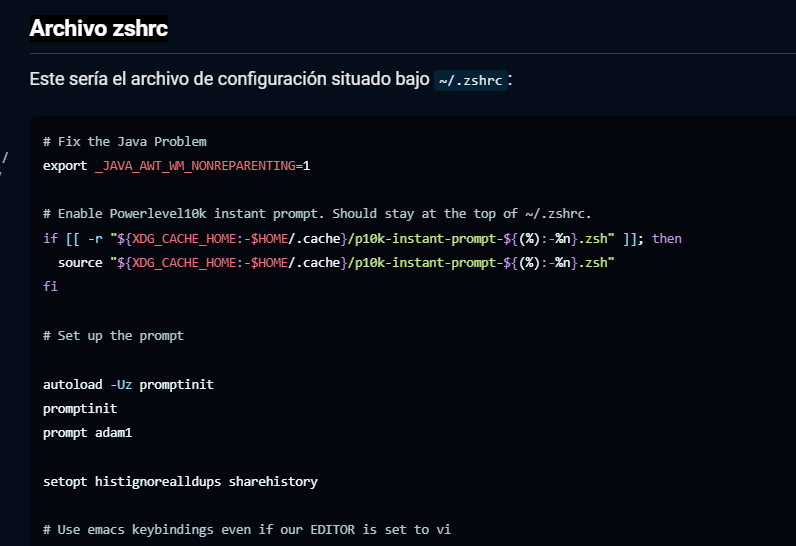
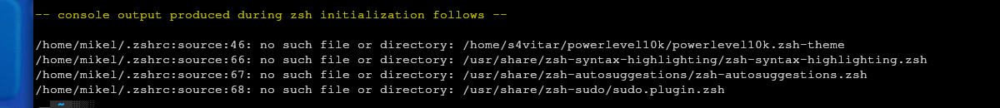

## Instalar ZSH

```bash
pacman -S zsh
```

## Configurar ZSH como SHELL por defecto

Configuramos la zsh como shell por defecto

```bash
sudo usermod --shell /usr/bin/zsh mikel
```

## Cambiamos la configuración entera por esta de la siguiente web

https://s4vitar.github.io/bspwm-configuration-files/



Reiniciamos la terminal y al encender deberíamos ver estos errores, indicando que nos faltan algunos programas.



### Intalamos dos programas con paru
```bash
sudo paru -S zsh-syntax-highlighting zsh-autosuggestions
```

Habilitamos la busqueda de programas y sincronizamos
```bash
sudo pacman -S locate
sudo updatedb
```