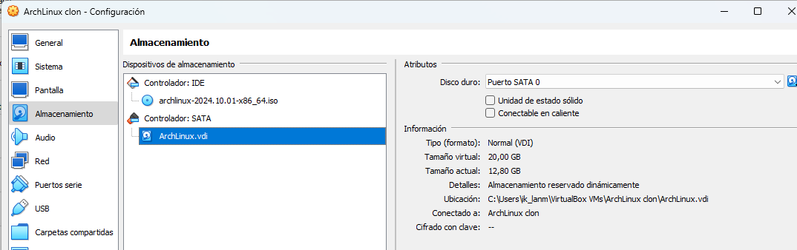
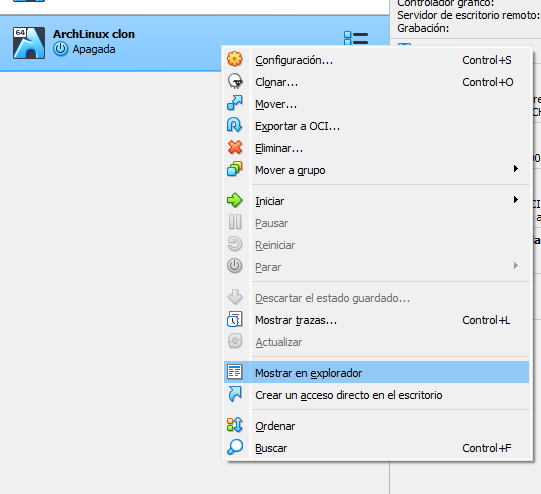

# Crear una imagen de Disco Virtual de Virtual Box

## Encontrar el disco duro virtual

La ubicación está disponible en la información de la configuración de virtual box.



También podemos abrir la ubicación en el menu contextual de la máquina virtual, mostrar en el explorador.



Generalmente la ruta será algo como `C:\Users\ik_lanm\VirtualBox VMs` 

## Ubicar la terminal en la carpeta de instalación de Virtual Box

El programa que necesitamos se encuentra en la carpeta de Virtual Box que esta en `C:\Program Files\Oracle\VirtualBox`

Una vez localizado el programa y el disco del que generar la imagen el comando que usaremos es:

```bash
.\VBoxManage.exe clonehd "C:\Users\ik_lanm\VirtualBox VMs\ArchLinux clon\ArchLinux.vdi"  "C:\Users\ik_lanm\ArchLinux.img" --format RAW
```

- "C:\Users\ik_lanm\VirtualBox VMs\ArchLinux clon\ArchLinux.vdi": Ruta al disco duro virtual
- C:\Users\ik_lanm\ArchLinux.img: Ruta del fichero de salida