# Administrador de Tareas y Monitor de Rendimiento :computer:
- [Administrador de Tareas y Monitor de Rendimiento :computer:](#administrador-de-tareas-y-monitor-de-rendimiento-computer)
  - [Administrador de Tareas](#administrador-de-tareas)
  - [Monitor de rendimiento](#monitor-de-rendimiento)

## Administrador de Tareas

El administrador de tareas es una herramienta de los sistemas operativos Windows en la que podemos:
- Comprobar, inicializar o terminar aplicaciones 
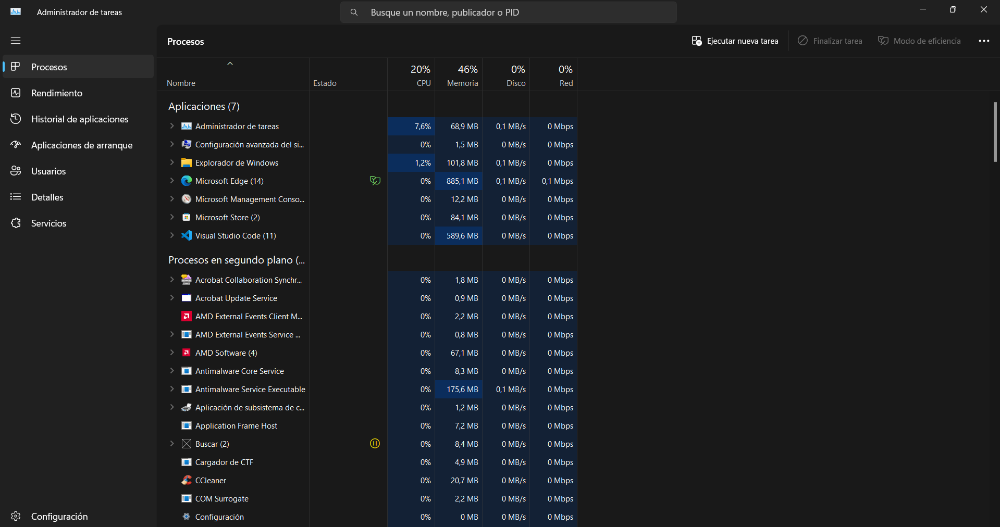
- Comprobar el uso de los distintos componentes del PC
 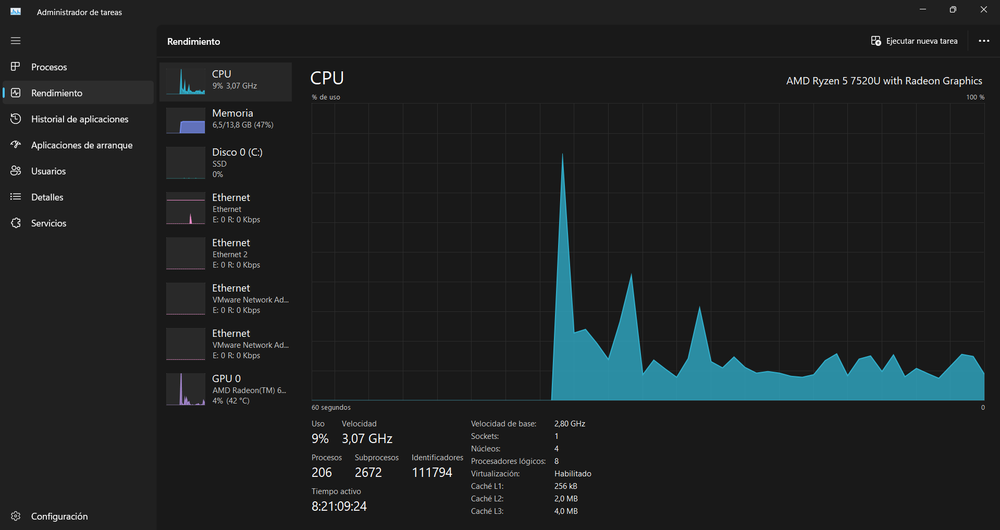
- Ver que aplicaciones y cuanto tiempo de uso han tenido
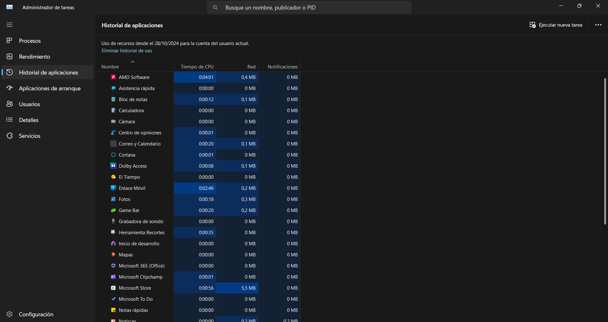
- Habilitar o deshabilitar aplicaciones de arranque
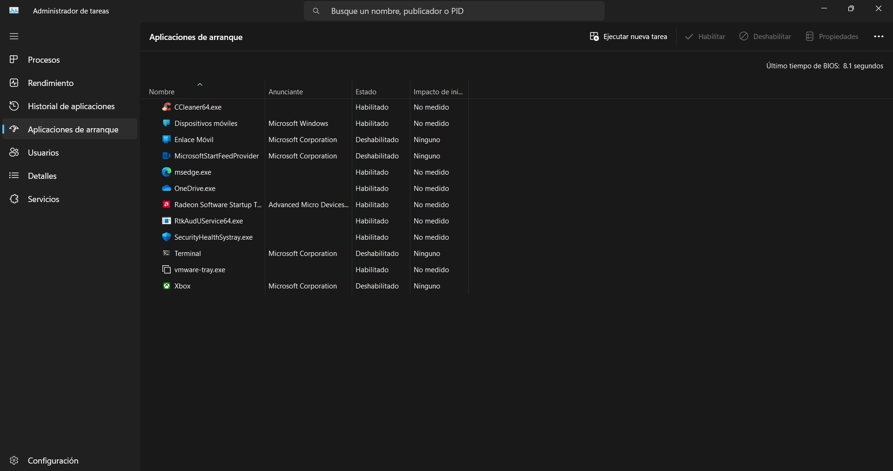
- Ver los usuarios con sesión iniciada y los recursos en uso por los mismos. También podemos administrar usuarios.
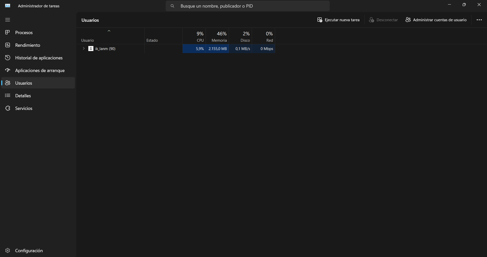
- Ver una versión más detallada de la ventana "Procesos"
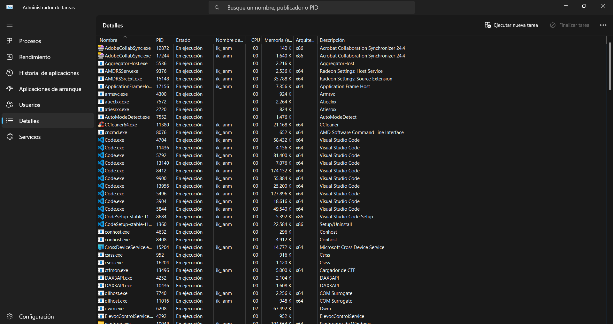
- Comprobar, abrir y cerrar servicios
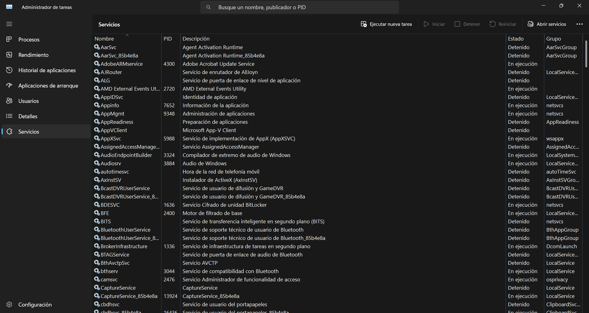

## Monitor de rendimiento

El monitor de rendimiento es una herramienta que permite supervisar, analizar y evaluar el desempeño de un sistema, ya sea un computador, un servidor, una aplicación o una red. Su propósito es identificar posibles problemas, optimizar el rendimiento y garantizar que los recursos se utilicen de manera eficiente.

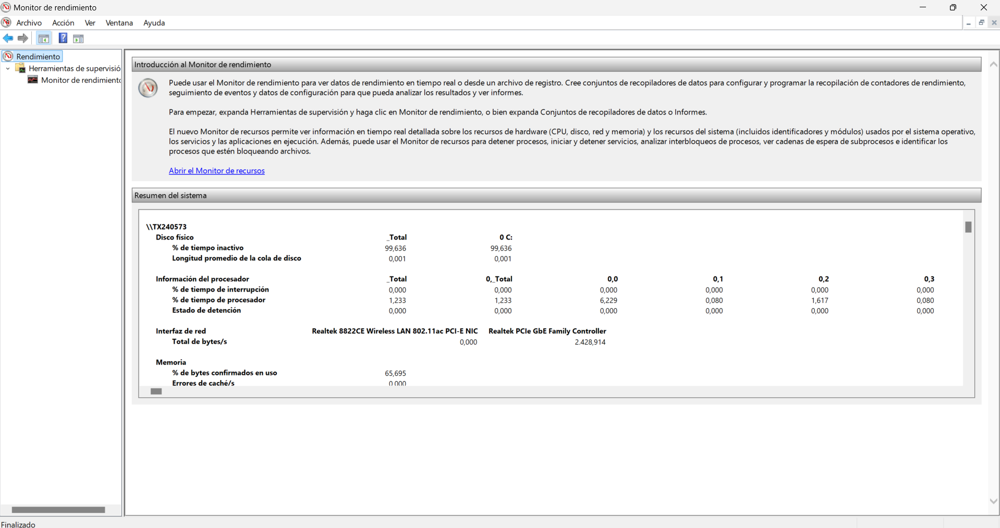
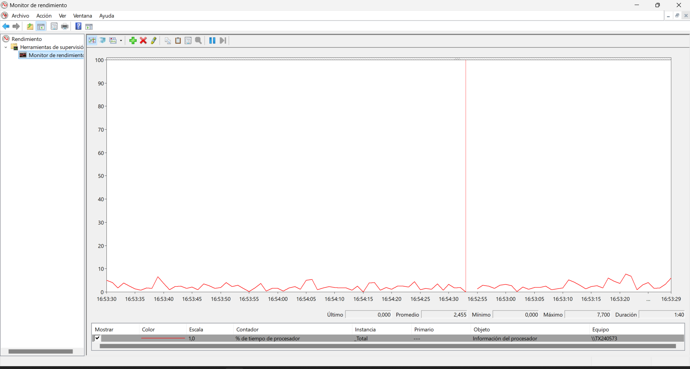

Haciendo click derecho en la pestaña herramientas de supervisión y en ver confiabilidad del sistema, podemos acceder al monitor de confiabilidad donde veremos los errores del sistema y cuando han ocurrido.

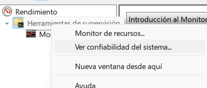
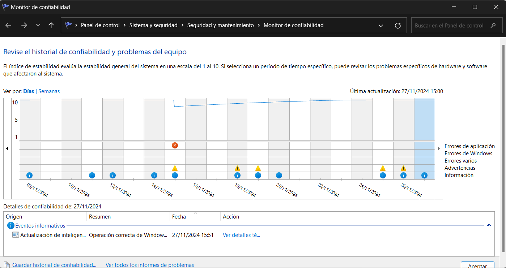

---

[Volver al índice](#administrador-de-tareas-y-monitor-de-rendimiento-computer)