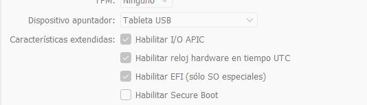
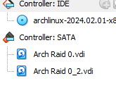
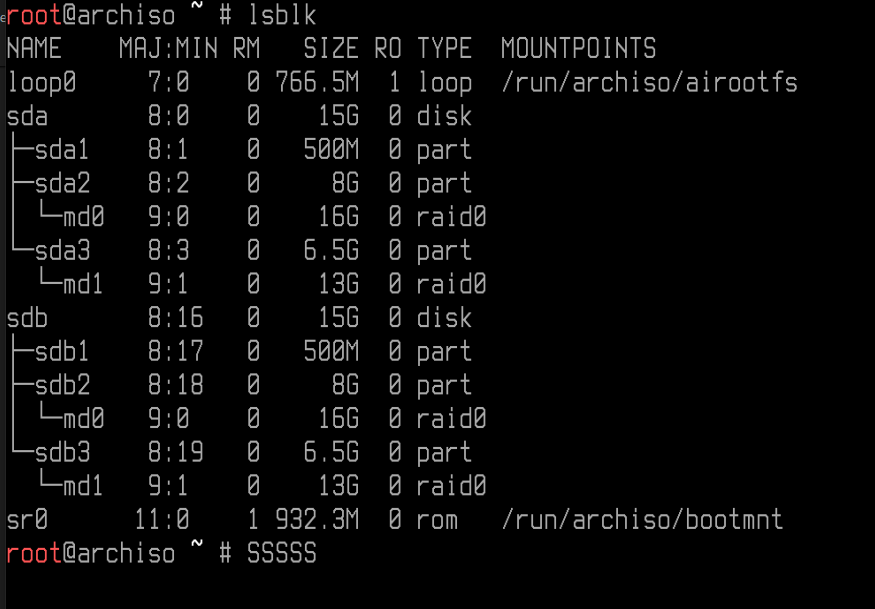
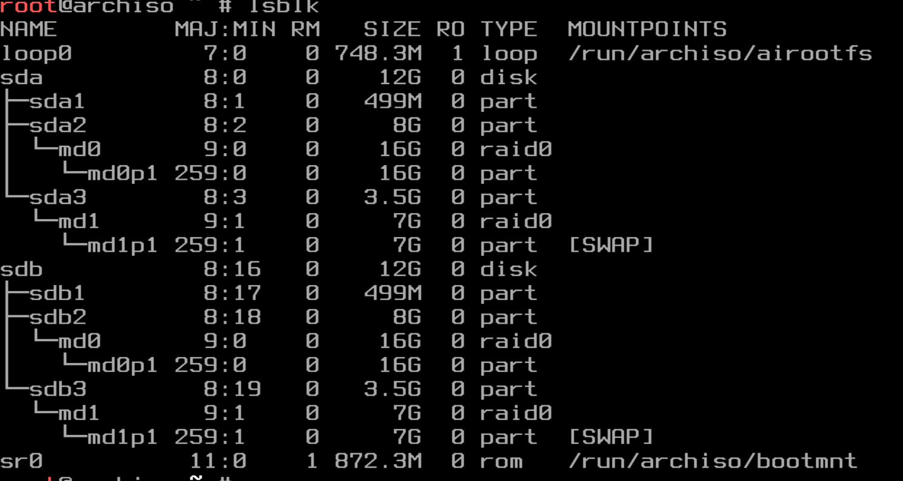
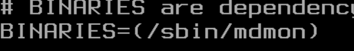
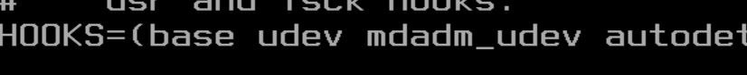
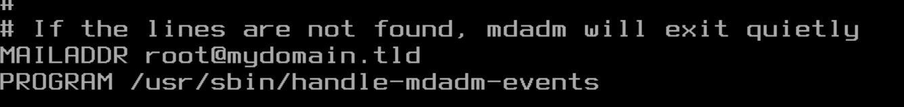

# Instalar ArchLinux en un RAID0

- [Instalar ArchLinux en un RAID0](#instalar-archlinux-en-un-raid0)
- [Configurar el entorno virtual 📦](#configurar-el-entorno-virtual-)
  - [Descargar la ISO 📀](#descargar-la-iso-)
  - [Crear la máquina en VBox 🖥️](#crear-la-máquina-en-vbox-️)
    - [Configurar EFI](#configurar-efi)
    - [Discos duros](#discos-duros)
- [Básicos 👣](#básicos-)
- [Preparar un RAID 0 💽💽](#preparar-un-raid-0-)
  - [Instalar el programa MDADM](#instalar-el-programa-mdadm)
- [Particiones, formato y montaje](#particiones-formato-y-montaje)
  - [Limpiar las tablas de particiones](#limpiar-las-tablas-de-particiones)
  - [Crear particiones 🍕](#crear-particiones-)
  - [Formatear particiones ℹ️](#formatear-particiones-ℹ️)
  - [Montar particiones 🏇](#montar-particiones-)
  - [*Nota: Como la descarga es bastante grande, es un buen momento para hacer una instantánea en VirtualBox una vez finalizada, así si algo sale mal podemos volver a este punto.*](#nota-como-la-descarga-es-bastante-grande-es-un-buen-momento-para-hacer-una-instantánea-en-virtualbox-una-vez-finalizada-así-si-algo-sale-mal-podemos-volver-a-este-punto)
    - [Crear los archivos de configuración fstab y MDADM](#crear-los-archivos-de-configuración-fstab-y-mdadm)
  - [Acceder al sistema 🏠](#acceder-al-sistema-)
- [Configurando el sistema ⚙️](#configurando-el-sistema-️)
  - [Usuarios 👥](#usuarios-)
    - [Contraseña de root 🗝️](#contraseña-de-root-️)
    - [Crear un usuario común 🙍](#crear-un-usuario-común-)
    - [Editar el archivo **sudoers**](#editar-el-archivo-sudoers)
  - [Idiomas 💬](#idiomas-)
    - [Idiomas de los programas](#idiomas-de-los-programas)
    - [Idioma del teclado en la consola ⌨️](#idioma-del-teclado-en-la-consola-️)
  - [Nombre del host](#nombre-del-host)
  - [Modificar algunas configuraciones](#modificar-algunas-configuraciones)
  - [Instalar GRUB ☣️](#instalar-grub-️)
  - [Reiniciar el sistema ♻️](#reiniciar-el-sistema-️)
- [Configurando el sistema - 2 ⚙️](#configurando-el-sistema---2-️)
  - [Configurar servicios para internet 📶](#configurar-servicios-para-internet-)

Referencia de video: https://www.youtube.com/watch?v=fshLf6u8B-w&t=2737s

# Configurar el entorno virtual 📦
## Descargar la ISO 📀

Descarga la ISO desde el sitio web oficial de Arch Linux mediante el siguiente enlace:

[Sitio web oficial de Arch Linux](https://archlinux.org/download/)


## Crear la máquina en VBox 🖥️

Crea una nueva máquina con las siguientes características: <mark style="background: #FF5582A6;">2GB de RAM y dos procesadores.


### Configurar EFI


### Discos duros 

Usaremos 2 discos duros de 12GB cada uno.



# Básicos 👣

Primero, configuraremos el teclado en español para trabajar de manera más cómoda.

```bash
loadkeys es
```

Si necesitas aumentar el tamaño de la letra:

```bash
setfont ter-132b
```

Verifica que tienes conexión a internet haciendo un ping.


# Preparar un RAID 0 💽💽

Con el siguiente comando, podemos ver qué unidades y particiones tenemos. En la imagen inferior se ve que tenemos unidades, y nuestros discos duros serán **sda** y **sdb**.

```bash
lsblk
```

Antes de continuar, verifica que tienes conexión a internet haciendo un ping.


---

Usaremos el programa `sgdisk` para crear las particiones, proporcionando como parámetro la dirección de nuestro disco duro.

```bash
sgdisk -n 1:0:+500M -t 1:ef00 -c 1:"EFI System" /dev/sda
sgdisk -n 2:0:+8G -t 2:fd00 -c 2:"Linux RAID" /dev/sda
sgdisk -n 3:0:0 -t 3:fd00 -c 3:"Linux RAID" /dev/sda
```

*Si te equivocas al crear las particiones, usa `sgdisk -Z /dev/sda` para borrarlas.*

Copia la tabla de particiones del disco `sda` al disco `sdb`:

```bash
sgdisk /dev/sda -R /dev/sdb -G
```

## Instalar el programa MDADM
`mdadm` es un programa para crear y gestionar RAIDs.

Actualiza `pacman` e instala el programa.

```bash
pacman -Sy
```
```bash
pacman -S mdadm
```

Creamos una partición virtual llamada `/dev/md0`. Las particiones anteriores `/dev/sda2` y `/dev/sdb2` se convertirán en `/dev/md0`.

Haremos lo mismo para crear `/dev/md1` a partir de las particiones `/dev/sda3` y `/dev/sdb3`.

Usa los siguientes dos comandos:

```bash
mdadm -Cv /dev/md0 -l0 -n2 /dev/sd[a-b]2
mdadm -Cv /dev/md1 -l0 -n2 /dev/sd[a-b]3
```

El siguiente comando es equivalente al anterior, más largo pero más comprensible:

*`mdadm --create --verbose /dev/md0 --level=0 --raid-devices=2 /dev/sd[a-b]2`*

Prueba el comando `lsblk`.



# Particiones, formato y montaje

## Limpiar las tablas de particiones

```bash
sgdisk -Z /dev/md0
sgdisk -Z /dev/md1
```

## Crear particiones 🍕

Nuestro disco swap será **md0**.

```bash
sgdisk -N 1 -t 1:8300 -c 1:"Linux filesystem" /dev/md0
```
Nuestro disco root será **md1**.

```bash
sgdisk -N 1 -t 1:8200 -c 1:"Linux swap" /dev/md1
```

## Formatear particiones ℹ️

Ahora asignaremos a cada partición su formato correspondiente usando los siguientes comandos.

Partición swap:

```bash
mkswap /dev/md1p1
```
Y para activar el swap:
```bash
swapon /dev/md1p1
```

Partición root:

```bash
mkfs.ext4 /dev/md0p1
```

Partición boot:

```bash
mkfs.fat -F 32 /dev/sda1
```

Asegúrate de que todos los formatos sean correctos escribiendo el comando `lsblk -f`.



## Montar particiones 🏇

Primero montaremos la partición root. <mark style="background: #FFB8EBA6;">Es necesario montarla primero porque boot estará bajo root.</mark>

```bash
mount /dev/md0p1 /mnt
```

Montaremos la partición boot en la carpeta /mnt/boot, ¡siempre después de montar root!

```bash
mkdir /mnt/boot
mount /dev/sda1 /mnt/boot
mkdir /mnt/boot/EFI
```
--- 
Usando `pacstrap`, instalaremos algunos paquetes fundamentales que añadirán muchos archivos conocidos de nuestro sistema Linux, ya que por el momento /mnt está vacío.

```bash
timedatectl set-ntp true

pacstrap /mnt linux linux-firmware nano networkmanager grub efibootmgr mdadm amd-ucode base base-devel
```

Puede que encuentres algún error durante la instalación. Los códigos de descarga a menudo fallan; intenta con el siguiente comando:

```bash
pacman -Sy archlinux-keyring
```

*Nota: Como la descarga es bastante grande, es un buen momento para hacer una <mark style="background: #ABF7F7A6;">instantánea en VirtualBox</mark> una vez finalizada, así si algo sale mal podemos volver a este punto.*
---

### Crear los archivos de configuración fstab y MDADM

El archivo fstab le indica al sistema operativo cómo deben montarse las particiones. De esta forma, al encender el sistema, se montarán automáticamente y no tendremos que repetir los pasos anteriores.

```bash
genfstab -U /mnt > /mnt/etc/fstab
```

Del mismo modo, guardaremos la configuración del RAID, así nuestra configuración actual del RAID se establecerá al iniciar el sistema.

```bash
mdadm --detail --scan --verbose >> /mnt/etc/mdadm-conf
```

## Acceder al sistema 🏠

Con el siguiente comando, entramos en */mnt*. Recuerda que en mnt está montado root, es decir, la raíz de nuestro sistema operativo /.

```bash
arch-chroot /mnt
```

---

# Configurando el sistema ⚙️

## Usuarios 👥

### Contraseña de root 🗝️

Primero, como estamos operando como root, utilizaremos el comando passwd para establecer una nueva contraseña para root.

```bash
passwd
```

---

### Crear un usuario común 🙍

Como sabes, no es adecuado realizar tareas generales como root debido a los grandes riesgos que conlleva. Por lo tanto, crearemos un nuevo usuario y le daremos permisos de root para usar comandos como root si es necesario.

```bash
useradd -m mikel
passwd mikel
```

---

Ahora añadiremos el usuario al grupo *wheel* para que pueda usar *sudo su* o *sudo*, como mencionamos antes.

```bash
usermod -aG wheel mikel
```

- Para ver los grupos de un usuario, utiliza `groups mikel`. Deberían aparecer dos grupos: wheel y mikel (grupo por defecto).
---

### Editar el archivo **sudoers**

El archivo sudoers es un archivo de configuración ubicado en */etc/sudoers*.

Se utiliza para la gestión de seguridad, por ejemplo, para establecer si se solicita o no la contraseña al usar sudo, entre otras cosas.

---

Ahora, instalaremos el paquete sudo usando pacman.

```bash
pacman -S sudo
```

También necesitaremos instalar algunos editores para modificar el archivo; instalaremos nano.

```bash
pacman -S nano
```

---

Abre el archivo sudoers para editarlo:

```bash
nano /etc/sudoers
```

Elimina el comentario de la línea `%wheel ALL=(ALL:ALL) ALL`.

- <mark style="background: #FF5582A6;">Si eliminas el comentario de la línea NOPASSWD, no se solicitará contraseña a los miembros del grupo wheel al usar sudo, pero esto no es muy adecuado desde el punto de vista de la seguridad.</mark>


---

## Idiomas 💬

### Idiomas de los programas

Usando nano, abre el archivo */etc/locale.gen*. Este archivo, como muchos en etc, es para configuración. Tendrá muchos idiomas establecidos internamente, pero atención, la mayoría están comentados.


Nuestro trabajo es eliminar el comentario del español y del inglés.

1. Busca usando `Ctrl + W` *en_US* y elimina el comentario
2. Busca usando `Ctrl + W` *es_ES* y elimina el comentario
3. Guarda y cierra

Finalmente, usaremos el programa locale-gen para generar las palabras de los idiomas establecidos.

```bash
locale-gen
```

### Idioma del teclado en la consola ⌨️

Cuando abrimos el terminal, lo primero que hicimos fue ponerlo en español. Para no tener que hacer esto y que aparezca en español por defecto, crea el siguiente archivo.

```bash
nano /etc/vconsole.conf
```

Escribe `KEYMAP=es` dentro y guarda.

## Nombre del host

```bash
echo mikel-pc > /etc/hostname
echo "127.0.0.1  localhost" > /etc/hosts
echo "::1  localhost" >> /etc/hosts
echo "127.0.0.1  mikel-pc" >> /etc/hosts
```

## Modificar algunas configuraciones

El programa mdadm para RAID requiere añadir algunas configuraciones adicionales.

```bash
nano /etc/mkinitcpio.conf
```



```bash
mkinitcpio -P
```

Elimina el comentario del email:

```bash
nano /etc/mdadm.conf
```


## Instalar GRUB ☣️

GRUB es el gestor de arranque de Linux; ofrece un menú al iniciar el sistema para elegir diferentes modos de arranque.

Cuando instalamos dual boot con Ubuntu/Windows, nos daba la opción de seleccionar qué sistema operativo queríamos iniciar.

```bash
grub-install --boot-directory=/boot --bootloader-id=ArchLinux --target=x86_64-efi --efi-directory=/boot --recheck
```

Crea el archivo de configuración para GRUB:

```bash
grub-mkconfig -o /boot/grub/grub.cfg
```

Duplica la partición boot en el segundo disco:

```bash
umount /dev/sda1
dd if=/dev/sda1 of=/dev/sdb1
```

Añade el segundo disco a la lista de arranque UEFI:

```bash
efibootmgr -c -g -d /dev/sdb1 -p 1 -L "ArchLinux #2" -l "\EFI\ArchLinux\grubx64.efi"
```

---

## Reiniciar el sistema ♻️

En este punto, sal de root con `exit` y usa `shutdown -r` en el contexto del live CD. Ahora, verifica si GRUB se abre y si el sistema arranca correctamente con todas las configuraciones que hemos establecido.

- Si GRUB no se abre y Arch Linux inicia el live CD, presiona `F12` al encender y selecciona el disco duro. Debería aparecer el menú de GRUB.


*Nota: <mark style="background: #ABF7F7A6;">Es un buen momento para hacer una instantánea en VirtualBox una vez finalizado, así si algo sale mal podemos volver a este punto.</mark>*

---

# Configurando el sistema - 2 ⚙️

## Configurar servicios para internet 📶

Primero, si intentamos hacer `ping www.googl.es`, veremos que no tenemos internet.

Esto ocurre porque el servicio de gestión de red no está activado. Por lo tanto, haremos dos cosas:

1. Iniciar el servicio NetworkManager
2. Configurar el servicio para que se inicie automáticamente la próxima vez

```bash
systemctl start NetworkManager.service 
```

```bash
systemctl enable NetworkManager
```

Ahora, el ping debería funcionar; prueba con `ping www.googl.es`.