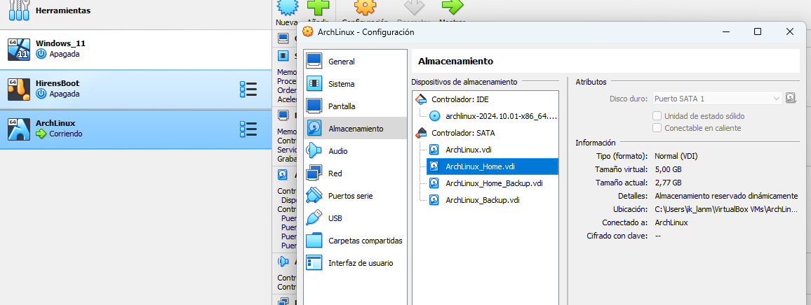
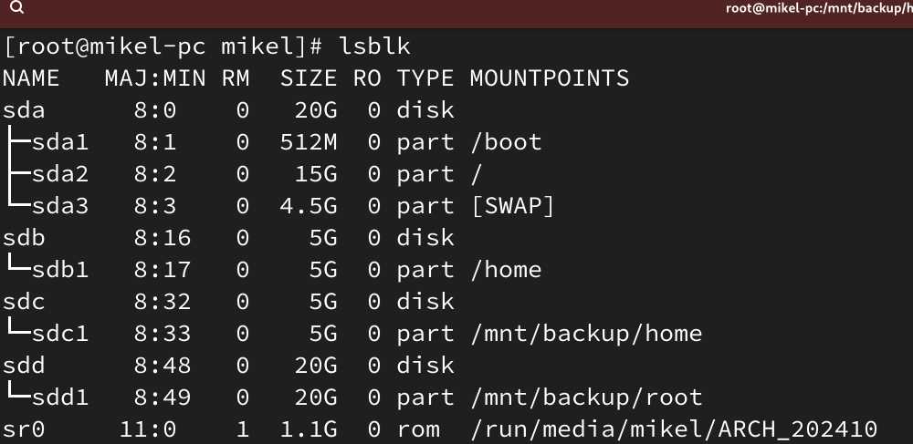
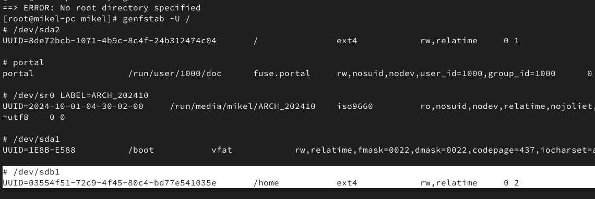

ch·- [Crear disco de partición Home 🏠](#crear-disco-de-partición-home-)
  - [Agregar un disco a la máquina virtual 💽](#agregar-un-disco-a-la-máquina-virtual-)
  - [Crear una partición del disco 🍕](#crear-una-partición-del-disco-)
  - [Formatear el disco en Ext4](#formatear-el-disco-en-ext4)
  - [Montamos el disco de manera temporal 🏇](#montamos-el-disco-de-manera-temporal-)
  - [Copiamos el contenido de home al disco 🪞](#copiamos-el-contenido-de-home-al-disco-)
  - [Desmontamos el disco y lo montamos en home 🧩](#desmontamos-el-disco-y-lo-montamos-en-home-)
  - [Configuramos el archivo fstab](#configuramos-el-archivo-fstab)
- [Configurar el backup automatico 🔒](#configurar-el-backup-automatico-)
  - [Crear un disco para el backup 💽](#crear-un-disco-para-el-backup-)
  - [Añadir y probar el script de backup 📜](#añadir-y-probar-el-script-de-backup-)
  - [Configurar el cronjob ⏱️](#configurar-el-cronjob-️)


# Crear disco de partición Home 🏠

En la siguiente guía vamos a aprender a crear un sistema de backup, que copiara diariamente todos los archivos del directorio home a un disco duro separado.

## Agregar un disco a la máquina virtual 💽

Aquí agregamos un disco de 5GB y encendemos la maquina una vez agregado.

## Crear una partición del disco 🍕

Con el siguiente comando podemos ver qué discos tenemos y sus particiones.

```bash
lsblk
```


Usaremos el programa cfdisk para crear las particiones, dándole como parámetro la dirección de nuestro disco duro que será `/dev/sda` o `/dev/sdb`, ... .

```bash
cfdisk /dev/sdb
```

El primer paso será elegir la etiqueta (label), seleccionaremos **msdos**.


Despues crearemos una única partición con todo el tamaño, primaria y le damos a escribir.

## Formatear el disco en Ext4 

Formateamos la partición así

```bash
mkfs.ext4 /dev/sdb1
```

## Montamos el disco de manera temporal 🏇

Montamos el disco en alguna ruta libre, por ejemplo `/mnt/tmp` para compiar el contenido de home antes de montar el disco en la ruta final que será `/home` 

```bash
mount 
```

## Copiamos el contenido de home al disco 🪞

Usamos el comando rsync para copiar todo el contenido de home al disco duro que está montado en `/mnt/tmp`

```bash
rsync -aAXv /home /mnt/tmp
```

## Desmontamos el disco y lo montamos en home 🧩

```bash
umount /dev/sdb1
```

```bash
mount /dev/sdb1 /home
```

## Configuramos el archivo fstab

Generamos la configuración de montaje usando el comando `genfstab`. Si no tienes el programa puedes instalarlo con `pacman -S arch-install-scripts`

```bash
genfstab -U /
```

Este comando dará una salida parecida a la siguiente, copiaremos e integraremos la linea que hace referencia al disco `/dev/sdb1` en el archivo `/etc/fstab` 



# Configurar el backup automatico 🔒

## Crear un disco para el backup 💽

Siguiendo los pasos de arriba podemos crear, particionar y formatear un nuevo disco para guardar los backups del directorio `home`.

Lo único que montaremos el backup en otra ruta, en esta guía montaremos el disco de backup en `/mnt/backup/home`.

## Añadir y probar el script de backup 📜

Creamos el escript por ejemplo con el nobmre `script_backup.sh` y lo guardamos en alguna ruta, como por ejemplo `/urs/local/bin`.

Finalmente le damos permisos de ejecución con el comando `chmod 755 script_backup.sh` 

```bash
#!/bin/bash

# Ruta de destino del backup
BACKUP_TARGET="/home"
BACKUP_DIR="/mnt/backup/home"
LOG_FILE="$BACKUP_DIR/backup.log"

# Comprobar si la partición de backup está montada
if mountpoint -q "$BACKUP_DIR"; then
    # Ejecutar rsync para hacer el backup del sistema
    rsync -aAXv "$BACKUP_TARGET" "$BACKUP_DIR" > "$LOG_FILE" 2>&1
else
    echo "Error: El directorio de backup no está montado." >> "$LOG_FILE"
fi

```

Podemos comprobar que el script funciona agregando cambios al directorio home, ejecutando el script y verificando que los cambios se reflejan en el disco de backup, esto es, la ruta `/mnt/backup/home`.

## Configurar el cronjob ⏱️

Como root, instalamos `cronie`. 

```bash 
pacman -S cronie
```

Encedemos el servicio

```bash
systemctl start cronie
systemctl enable cronie
```

Añadimos la sentencia que ejecutará el script cada día:
```bash
crontab -e
```
Agregamos al fichero, en este caso cada día a als 16:20 horas se ejecutará el script.

```bash
20 16 * * * /usr/local/bin/script_backup.sh
```

Si no teneos el editor de texto Vim instalado podemos configura nano como editor con el comando: 
```bash
export EDITOR=nano
```

