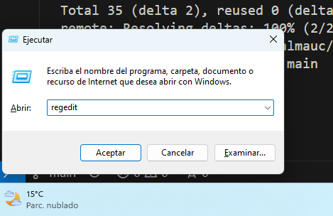
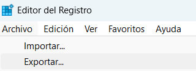

# Editor del Registro del Sistema.
— Ingrid Alicia Villanueva

### Índice:
- [Editor del Registro del Sistema.](#editor-del-registro-del-sistema)
    - [Índice:](#índice)
  - [Qué es el editor del registro](#qué-es-el-editor-del-registro)
  - [Cómo abrirlo](#cómo-abrirlo)
  - [Contenidos internos](#contenidos-internos)
  - [Cuándo se utiliza](#cuándo-se-utiliza)
  - [Cómo se utiliza](#cómo-se-utiliza)

## Qué es el editor del registro
Es una herramienta gráfica que nos permite sondear y editar el registro del sistema operativo de Windows.

## Cómo abrirlo
En Windows 11, pulsamos las teclas `Windows + R` y nos aparecerá un pop-up. En el campo de texto, escribimos `regedit`.

## Contenidos internos
Al entrar, nos encontraremos con cinco carpetas llamadas 'hives' o colmenas. 

- **HKEY_CLASSES_ROOT**: contiene información sobre tipos de archivos y asociaciones.
- **HKEY_CURRENT_USER**: contiene la configuración para el usuario que ha iniciado sesión actualmente.
- **HKEY_LOCAL_MACHINE**: contiene configuraciones para todo el sistema y todos los usuarios. 
- **HKEY_USERS**: contiene configuraciones para todos los usuarios.
- **HKEY_CURRENT_CONFIG**: contiene información sobre el hardware actualmente en uso.

También encontraremos claves, que son contenedores de valores ubicados en una de estas cinco colmenas (cada uno en su colmena pertinente dependiendo de qué parte del PC registren) y los propios valores en sí, que son datos que, al asociarse a claves, transmiten la información para ser utilizada. Esto pueden ser valores hexadecimales, datos binarios o cadenas de información escrita.

## Cuándo se utiliza 
Normalmente se utilzia el editor de registro cuando el PC se bloquea, o, si sospechamos de que un programa (usualmente malware) ha dejado configuraciones dentro, ya que a veces no se borran del registro.

Hay que tener mucho cuidado, ya que es fácil hacer cambios negativos e irreversibles. **Siempre hay que crear una copia de seguridad antes de hacer nada**.

Para crear una copia de seguridad en otra parte del PC, iremos a 'Archivo' y luego a 'Exportar'. Después, seleccionaremos dónde queremos ubicar la copia de seguridad. 

Para activarla, iremos a 'Archivo' y luego a 'Importar', y seleccionaremos la copia de seguridad hecha anteriormente.

## Cómo se utiliza
En general, el editor de registro no va a ser algo que queramos modificar. Podemos crear o eliminar claves y valores, y modificar valores, pero hacerlo manualmente es demasiado complejo tanto en tiempo como en requerimientos de conocimiento. 

Hay apps de asistencia como [CCleaner](https://www.ccleaner.com/es-es) y otros limpiadores que precisamente operan sobre el registro, y entre asistencias de herramientas third-party confiables y asegurarse de mantener la máquina actualizada, es muy difícil que sea necesario meterse al registro. Si lo que queremos es eliminar bloatware, deshacerse de trazas de malware y otras, rebuscar a través del registro manualmente debería ser la última opción.

En caso de que sea necesario meterse, el propio registro de edición incorpora un buscador que permite localizar claves o valores por nombre.

Además, tenemos otros editores de registro como *Registry Editor*, un programa de código abierto descargable en Github, el cual incorpora más funcionalidades y moderniza muchas otras, ya que el editor del registro incorporado de Windows es una herramienta compleja a la que le pesan los años.