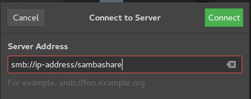
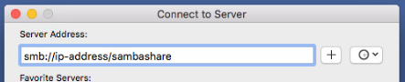

# Instalación y configuración de Samba

#### Definición
Un servidor de ficheros de Samba permite conectar ficheros entre distintos PCs a una misma red. Permite enviar, modificar y sincronizar ficheros a través de PCs funcionando en Windows y Mac OS.

#### Medios necesarios
Un PC con Ubuntu 16.04 LTS
Una red LAN por la que compartir los ficheros

## Proceso de instalación
```sudo apt update```
```sudo apt install samba```

Un ```whereis samba``` nos escupirá ```samba: /usr/sbin/samba /usr/lib/samba /etc/samba /usr/share/samba /usr/share/man/man7/samba.7.gz /usr/share/man/man8/samba.8.gz```

## Proceso de configuración
Ahora que Samba está instalado hay que crear un directorio para que comparta
Creamos una carpeta llamada SambaShare, que después compartiremos
```mkdir /home/<username>/sambashare/```

Ahora hace falta usar Nano para modificar el fichero de configuración de Samba
Run ```sudo nano /etc/samba/smb.conf```

```[sambashare]
    comment = Samba on Ubuntu
    path = /home/username/sambashare
    read only = no
    browsable = yes
```

Ahora reiniciamos para que los cambios hagan efecto

sudo service smbd restart

Y actualizamos el firewall para que no deniegue a Samba

sudo ufw allow samba

## Crear cuentas de usuario
Samba requiere que creemos una cuenta de usuario

```sudo smbpasswd -a username```

## Conectarse al share

En Ubuntu vamos al File Manager, le damos a Connect to Server y metemos esto


En MacOS vamos al Finder, le damos a Go, luego Connect to Server


En Windows abrimos el explorador de archivos y escribimos
```\\ip-address\sambashare```

Ahora se nos pedirán las credenciales que introducimos antes; las metemos y ya podemos usar Samba