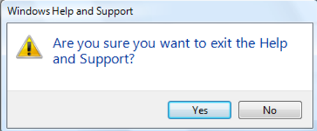
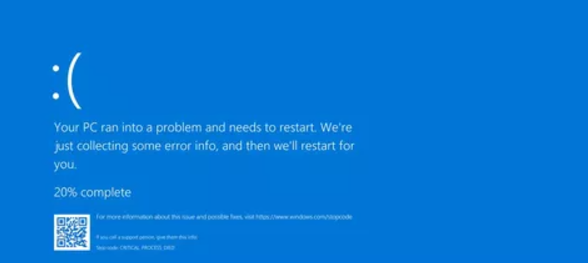
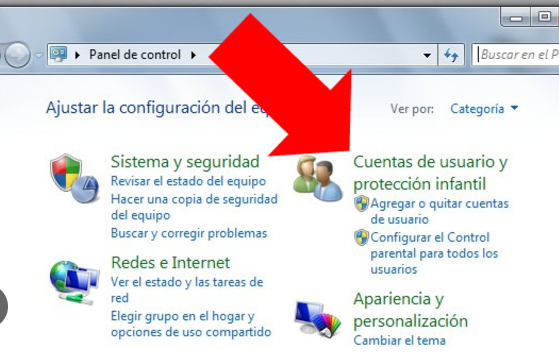

- [Mensajes y usos del sistema](#mensajes-y-usos-del-sistema)
  - [¿Qué es un mensaje del sistema?](#qué-es-un-mensaje-del-sistema)
  - [¿Para qué sirve?](#para-qué-sirve)
  - [¿Que tipos de mensajes del sistema existen?](#que-tipos-de-mensajes-del-sistema-existen)


# Mensajes y usos del sistema 

## ¿Qué es un mensaje del sistema?

Los mensajes del sistema son comunicaciones automáticas que informan al usuario sobre el estado, errores, advertencias o resultados de operaciones realizadas en el sistema. Su objetivo es facilitar la interacción y la resolución de problemas.

## ¿Para qué sirve?

Los mensajes del sistema sirven para informar al usuario sobre el estado de las operaciones, advertir sobre errores o riesgos, confirmar acciones realizadas y guiar en la resolución de problemas o en la toma de decisiones.

**1-Informar al usuario:** Brinda detalles sobre el estado o resultado de una operación.

**2-Confirmar acciones realizadas:** Notifica que una tarea se completó con éxito.

**3-Advertir sobre problemas:** Alerta sobre errores o situaciones que requieren atención inmediata.

## ¿Que tipos de mensajes del sistema existen?


- **Mensajes de error:** Notifican fallos o problemas en el sistema.

- **Mensajes de confirmación:** Verifican y confirman acciones realizadas por el usuario.

- **Mensajes informativos:** Proveen detalles sobre el funcionamiento o estado del sistema.

- **Mensajes de advertencia:** Alertan sobre riesgos o conflictos que requieren intervención.


```bash
echo "¡Atención! El sistema necesita reiniciarse." 
```

***Ventana de advertencia emergente:*** Un ejemplo común son los mensajes que advierten sobre posibles riesgos en el sistema, como ventanas emergentes de precaución al intentar eliminar un archivo importante o al conectar dispositivos externos. Estos diseños suelen incluir un ícono de alerta y un texto explicativo sobre el problema




***Error del sistema operativo:*** Una pantalla con un mensaje clásico como el de "Error 404" cuando no se encuentra una página o recurso, o el icónico mensaje "Pantalla Azul de la Muerte" (Blue Screen of Death) en sistemas Windows, usado para notificar fallos críticos.

 

 
 ***Confirmación de acción:*** Capturas de mensajes que solicitan confirmación del usuario antes de realizar una acción irreversible, como eliminar datos o cambiar configuraciones importantes.




