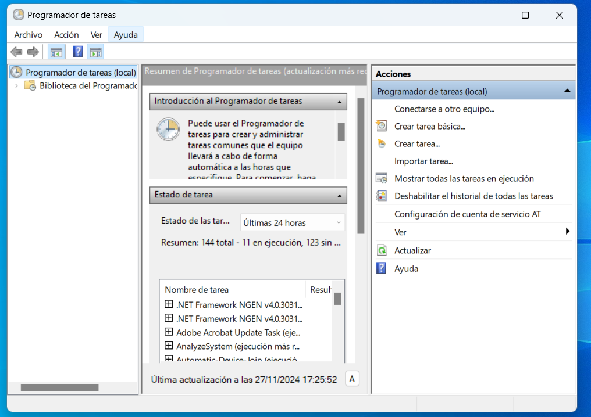
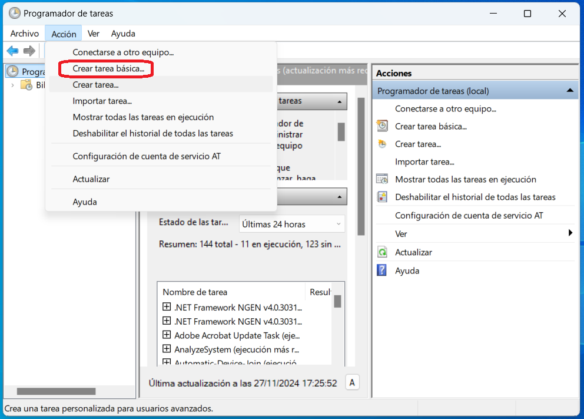
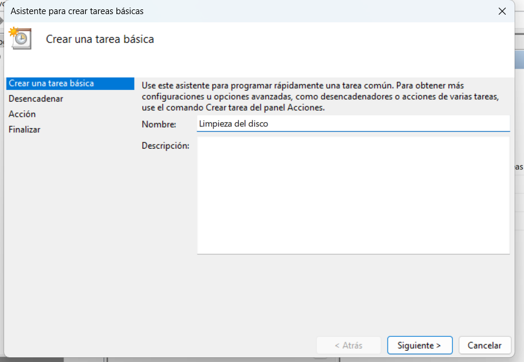
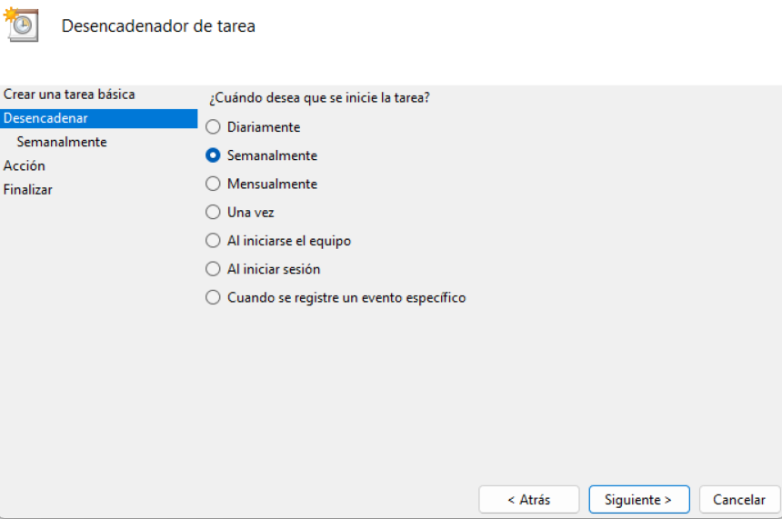
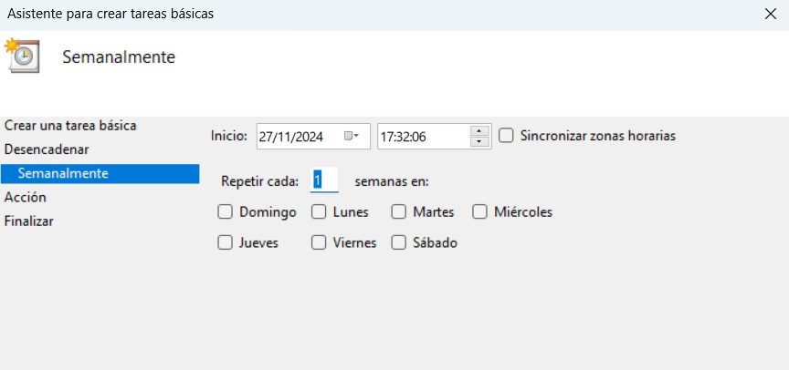
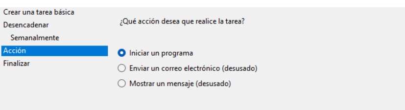
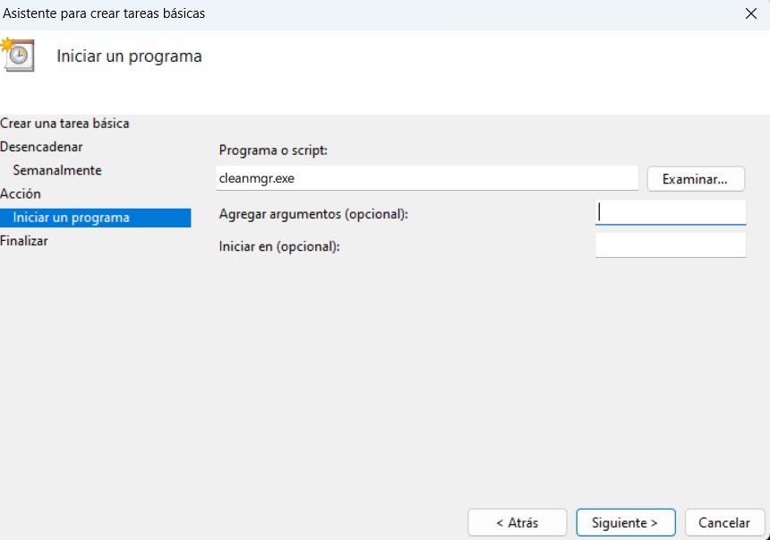

# 🖥️ Programación de Tareas en Windows

- [🖥️ Programación de Tareas en Windows](#️-programación-de-tareas-en-windows)
  - [1️⃣ ¿Qué es?](#1️⃣-qué-es)
  - [2️⃣ ¿Para qué sirve? 🤔](#2️⃣-para-qué-sirve-)
  - [3️⃣ ¿Qué opciones ofrece? 🔧](#3️⃣-qué-opciones-ofrece-)
  - [4️⃣ Ejemplo práctico: Crear una tarea para limpiar el disco automáticamente 🧹](#4️⃣-ejemplo-práctico-crear-una-tarea-para-limpiar-el-disco-automáticamente-)
    - [📝 Objetivo:](#-objetivo)
    - [🔧 Pasos:](#-pasos)

La **Programación de Tareas en Windows** es una herramienta que permite automatizar procesos y tareas en tu sistema operativo, optimizando tiempo y esfuerzo. 🌟

---

## 1️⃣ ¿Qué es?
El **Programador de Tareas** es una aplicación de Windows que te permite planificar la ejecución automática de programas, scripts o acciones específicas. Es útil para evitar procesos manuales repetitivos o realizar mantenimiento automáticamente. ⚙️

---

## 2️⃣ ¿Para qué sirve? 🤔
Sirve para:
- 🗂️ **Automatizar tareas repetitivas**: como respaldos, limpieza del sistema, actualizaciones, etc.
- 🕒 **Ejecutar programas o scripts en horarios específicos**.
- 📋 **Responder a eventos del sistema**: por ejemplo, abrir un programa al iniciar sesión.
- 🚀 **Optimizar procesos administrativos**: como generar informes automáticamente.
- 💻 **Monitorear y mantener tu sistema de manera eficiente**.

---

## 3️⃣ ¿Qué opciones ofrece? 🔧
El Programador de Tareas incluye diversas funcionalidades:
- ⏰ **Programar horarios**: Diarios, semanales, mensuales o al iniciar el sistema.
- 🛠️ **Acciones personalizadas**: Ejecutar programas, comandos o scripts como `.bat` o `PowerShell`.
- ⚡ **Eventos del sistema**: Activar tareas cuando ocurre algo específico (como conectar un USB).
- 🔒 **Condiciones adicionales**:
  - Ejecutar solo si el equipo está encendido o en modo inactivo.
  - Detener tareas si el equipo usa batería.
  - Solo iniciar si hay conexión a la red.
- 📜 **Historial**: Registrar cada ejecución para monitorear resultados.

---

## 4️⃣ Ejemplo práctico: Crear una tarea para limpiar el disco automáticamente 🧹

### 📝 Objetivo:
Configurar el Programador de Tareas para ejecutar la herramienta de limpieza de disco semanalmente.

### 🔧 Pasos:
1. **Abrir el Programador de Tareas**:
   - Presiona `Windows + S`, escribe **"Programador de Tareas"** y selecciona la aplicación. 🔍

2. **Crear una nueva tarea**:
   - En el menú de la derecha, selecciona **"Crear Tarea Básica"**.

3. **Dar un nombre y descripción**:
   - Escribe un nombre (por ejemplo, "Limpieza del disco 🧼").
   - Añade una descripción opcional.

4. **Seleccionar el desencadenador**:
   - Elige cuándo deseas que se inicie la tarea:
     - 🗓️ **Semanalmente**: Configura el día y la hora deseados.

5. **Configurar la acción**:
   - Selecciona **"Iniciar un programa"**.
   - En el campo de programa o script, escribe: `cleanmgr.exe`.
   - (Opcional) Añade parámetros como `/sagerun:1` para configuraciones predefinidas.

6. **Revisar y finalizar**:
   - Verifica los detalles y haz clic en **"Finalizar"**. ✅

7. **(Opcional) Personalizar detalles avanzados**:
   - Haz clic derecho en la tarea creada y selecciona **Propiedades** para ajustar opciones como:
     - Ejecutar con privilegios de administrador. 🔐
     - Cambiar condiciones de red o estado de batería. ⚡

