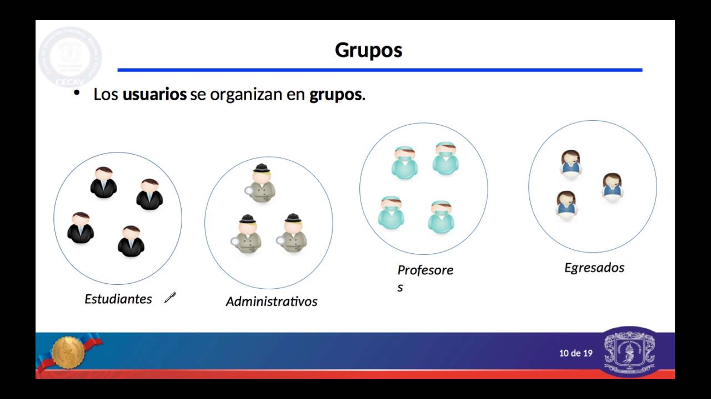
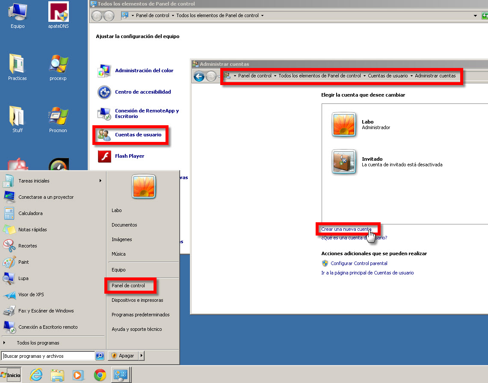
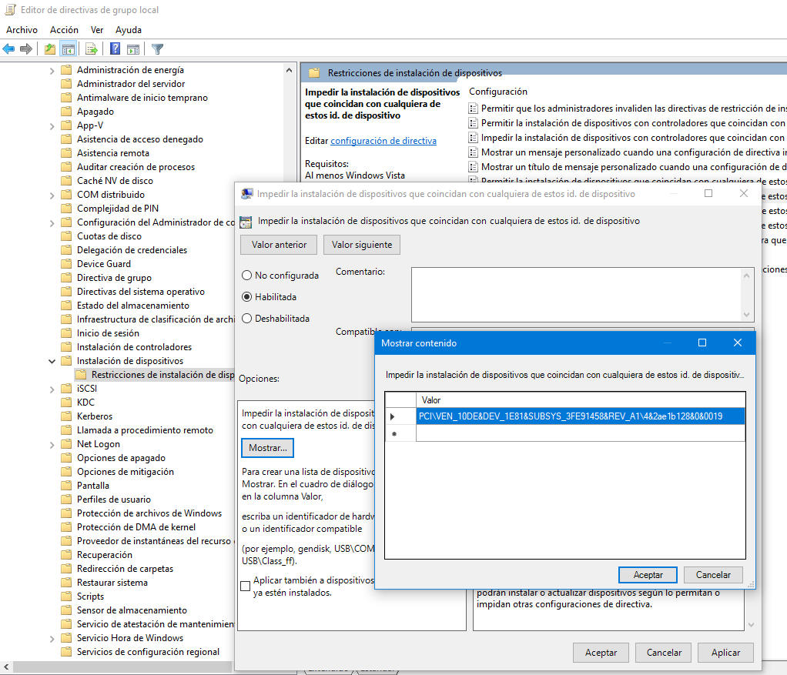

# USUARIOS Y GRUPOS:

- [USUARIOS Y GRUPOS:](#usuarios-y-grupos)
  - [Qué es?](#qué-es)
    - [Usuarios: :bust\_in\_silhouette:](#usuarios-bust_in_silhouette)
    - [Grupos:  :busts\_in\_silhouette:](#grupos--busts_in_silhouette)
  - [Para que sirven?](#para-que-sirven)

## Qué es?

### Usuarios: :bust_in_silhouette:

Un usuario es una cuenta que permite a una persona o proceso iniciar sesión y acceder a recursos del sistema, como archivos, carpetas, aplicaciones y configuraciones. Cada usuario puede tener configuraciones personalizadas y niveles de seguridad y de los cuales existen los siguientes tipos: Administrador, usuario estandar, invitado.

Forma de Gestionar un usuario desde administrador de equipo para ponerle contraseñas y darle seguridad.

### Grupos:  :busts_in_silhouette:
Los grupos de  son una manera de recopilar cuentas de usuario, cuentas de equipo y otros grupos en unidades administrables.

Los forman varios usuarios

aqui podermos ver diferentes tipos de grupos 

## Para que sirven?
Una cuenta de usuario permite cargar una determinada configuración en el ordenador. Por ejemplo, a qué carpetas tiene acceso o qué fondo de escritorio ha elegido. En el caso de ordenadores compartidos, se debe crear un usuario para cada persona que lo utilice. y Una cuenta de grupo tiene siempre uno o varios administradores que gestionan quien (o que usuarios) y con qué permisos acceden a los distintos servicios del grupo. Un grupo puede asociarse a un ente universitario (un servicio, departamento, curso...)

diferentes tipos de usuario

sirven para dar seguridad y distribucion de informacion