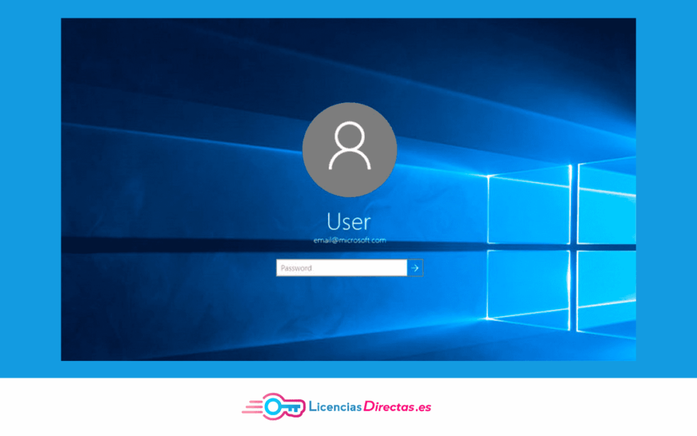
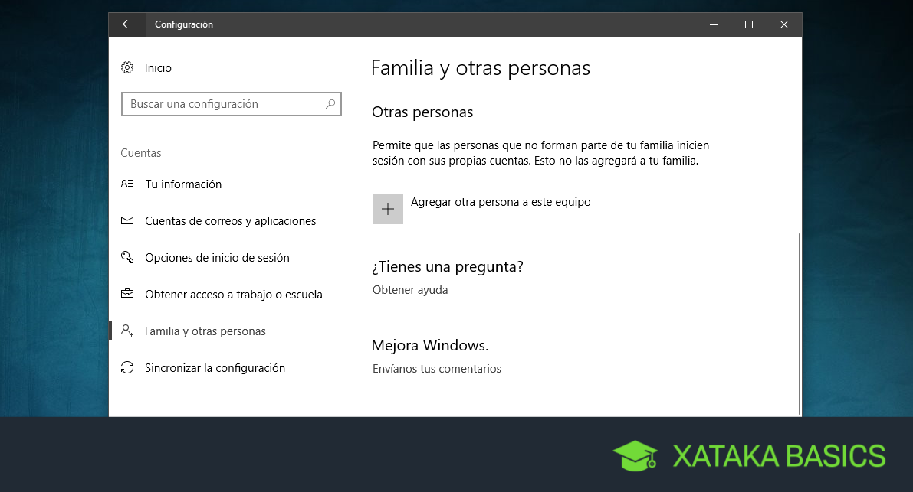
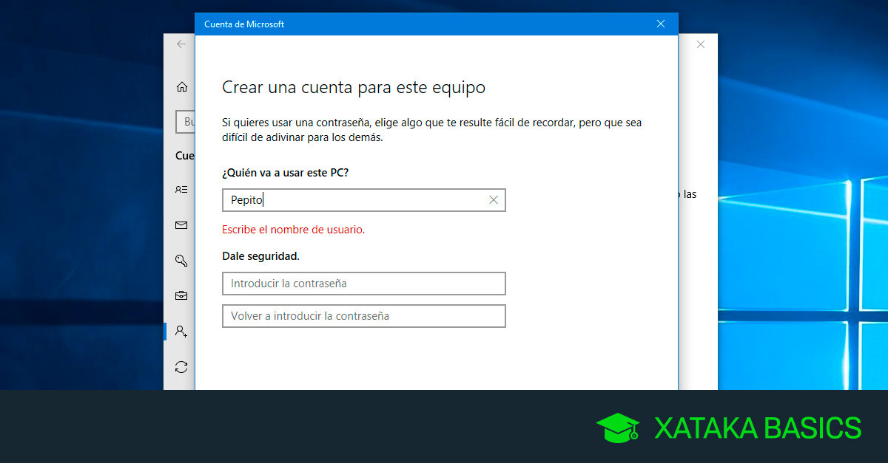
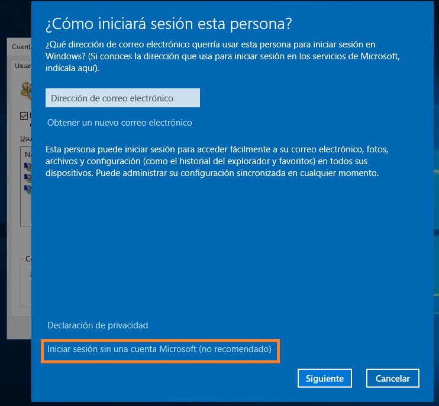
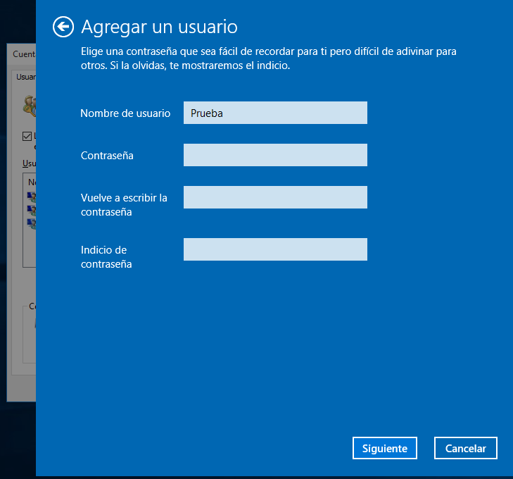
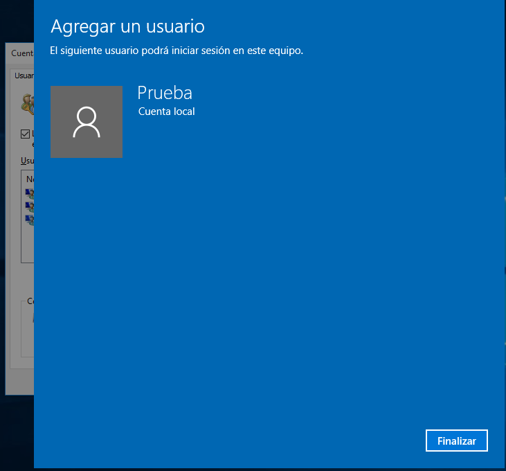

# USUARIOS Y GRUPOS

- [USUARIOS Y GRUPOS](#usuarios-y-grupos)
  - [Qué es?](#qué-es)
    - [Usuarios:](#usuarios)
    - [Grupos:](#grupos)
  - [Para que sirven?](#para-que-sirven)
  - [Opciones que ofrecen: :computer:](#opciones-que-ofrecen-computer)
    - [Cuentas de Usuario:](#cuentas-de-usuario)
    - [Grupos:](#grupos-1)
  - [Como crear cuenta de Usuario](#como-crear-cuenta-de-usuario)

## Qué es?

### Usuarios:

Un usuario es una cuenta que permite a una persona o proceso iniciar sesión y acceder a recursos del sistema, como archivos, carpetas, aplicaciones y configuraciones. Cada usuario puede tener configuraciones personalizadas y niveles de seguridad y de los cuales existen los siguientes tipos: Administrador, usuario estandar, invitado.

Forma de Gestionar un usuario desde administrador de equipo para ponerle contraseñas y darle seguridad.

### Grupos: 
Los grupos de  son una manera de recopilar cuentas de usuario, cuentas de equipo y otros grupos en unidades administrables.

Los forman varios usuarios

aqui podermos ver diferentes tipos de grupos 

## Para que sirven?  
 permite cargar una determinada configuración en el ordenador. Por ejemplo, a qué carpetas tiene acceso o qué fondo de escritorio ha elegido. En el caso de ordenadores compartidos, se debe crear un usuario para cada persona que lo utilice. y Una cuenta de grupo tiene siempre uno o varios administradores que gestionan quien (o que usuarios) y con qué permisos acceden a los distintos servicios del grupo. Un grupo puede asociarse a un ente universitario (un servicio, departamento, curso...)

diferentes tipos de usuario sirven para dar seguridad y distribucion de informacion

 
## Opciones que ofrecen: :computer:

### Cuentas de Usuario: 
Crear, eliminar usuarios, Cambio de contraseñas, habilitar o desabilitar cuentas, modificar propiedades.
### Grupos:
Crear o eliminar grupos, añadir o quitar ususarios de un grupo, ver las propiedades del grupo, permisos de acceso.

## Como crear cuenta de Usuario

1. Acceder a la configuración de usuarios
Haz clic en el botón de Inicio ylConfiguración (e
Configuración , síCuentas .

2. Agregar un nuevo usuario
En el panel de Cuentas ,Familia y otros usuarios .
En la sección Otros usuarios , hAgregar otra persona a esta PC .

3. Configurar la cuenta
Se abrirá una ventana para ingresar el correo electrónico de la persona. Si no deseas usar una cuenta de Microsoft, selecciona No tengo la información de inicio de sesión de esta persona yAgregar un usuario sin cuenta de Microsoft .

4. En la casilla Nombre de usuario, escribes el nombre con el cual identificarás tu nueva cuenta y la contraseña, la cual es opcional pero recomendada. Si ingresas contraseña, te recomendamos, deja una pista que solo tú reconozcas en la casilla Indicio de contraseña.
Clic en Siguiente.

verificacion del proceso dar clic en finalizar.

