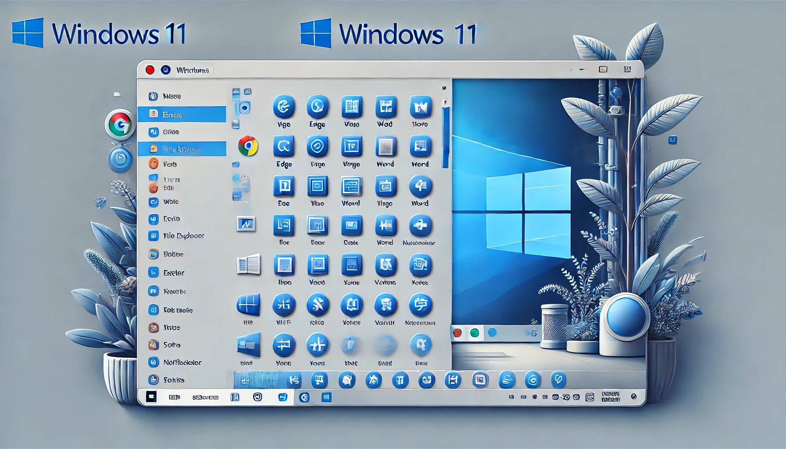
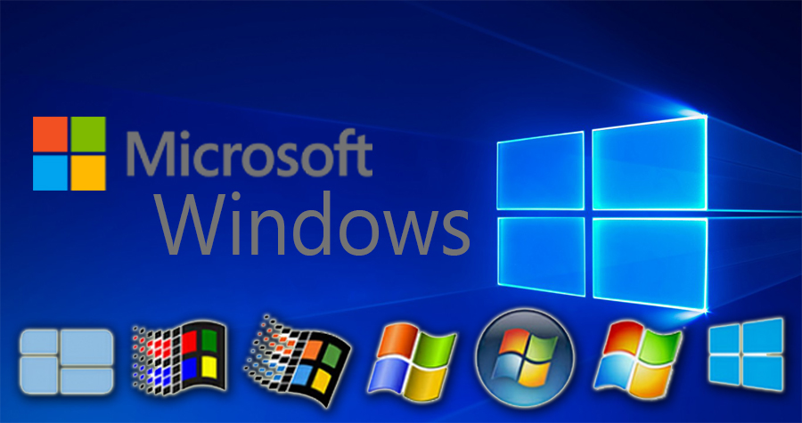
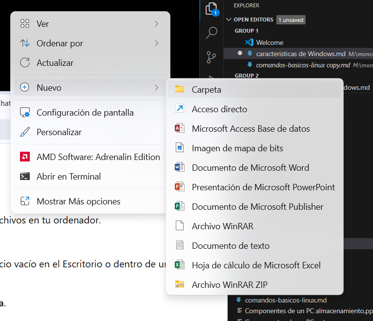
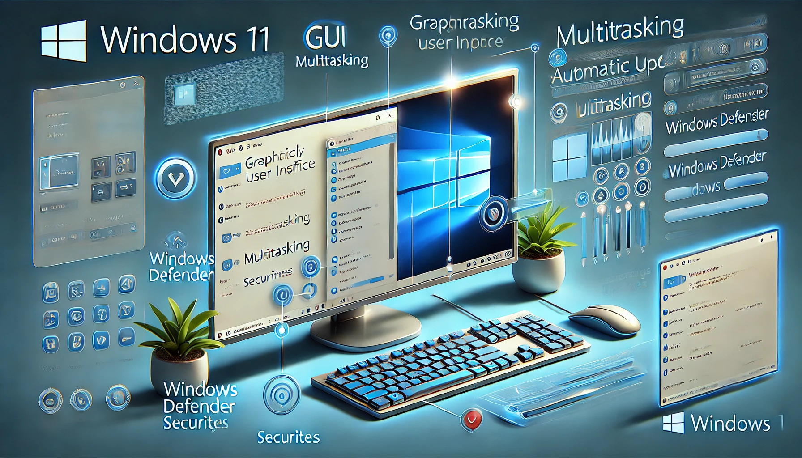

- [**Caracteristicas de Windows**](#caracteristicas-de-windows)
  - [¿Que es ?](#que-es-)
  - [¿ Para qué sirve Windows ?](#-para-qué-sirve-windows-)
  - [Operaciones comunes en Windows y como hacerlas](#operaciones-comunes-en-windows-y-como-hacerlas)
    - [1 Crear y organizar carpetas](#1-crear-y-organizar-carpetas)
      - [- Paso1:](#--paso1)
      - [- Paso2:](#--paso2)
      - [- Paso3:](#--paso3)
    - [2 Buscar archivos o aplicaciones :](#2-buscar-archivos-o-aplicaciones-)
        - [Cómo hacerlo:](#cómo-hacerlo)
    - [3 Conexión a una red Wi-Fi :](#3-conexión-a-una-red-wi-fi-)
        - [Cómo hacerlo:](#cómo-hacerlo-1)
    - [4 Tomar capturas de pantalla](#4-tomar-capturas-de-pantalla)
        - [Cómo hacerlo:](#cómo-hacerlo-2)
  - [Características principales de Windows](#características-principales-de-windows)
      - [1 Interfaz gráfica (GUI):](#1-interfaz-gráfica-gui)
      - [2 Multitarea:](#2-multitarea)
      - [3 Compatibilidad:](#3-compatibilidad)
      - [4 Seguridad:](#4-seguridad)
      - [5 Actualizaciones automáticas:](#5-actualizaciones-automáticas)
      - [6 Centro de Configuración:](#6-centro-de-configuración)

#            **Caracteristicas de Windows**

## ¿Que es ?
Windows es un sistema operativo desarrollado por Microsoft, diseñado para gestionar los recursos de hardware y software de un ordenador. Desde su lanzamiento inicial en 1985, ha evolucionado para ofrecer una interfaz gráfica de usuario (GUI) fácil de usar y una amplia compatibilidad con aplicaciones y dispositivos.

## ¿ Para qué sirve Windows ? 

Windows permite a los usuarios:

- Ejecutar programas y aplicaciones.
  
- Administrar archivos, carpetas y discos.          
  
- Conectarse a redes, como internet.
  
- Configurar dispositivos periféricos (impresoras, cámaras, etc.).
  
- Disfrutar de entretenimiento multimedia (música, videos, juegos).
  

- Es una herramienta esencial tanto para usuarios personales como profesionales.

## Operaciones comunes en Windows y como hacerlas 

### 1 Crear y organizar carpetas 
#### - Paso1: 
- Hz clic derecho en un espacio vacío en el Escritorio o dentro de una carpeta 
 #### - Paso2: 
- selecciona Nuevo>Carpeta 

#### - Paso3:
- Escribe un nombre para la carpeta y presiona Enter
  
  

  ### 2 Buscar archivos o aplicaciones :

  - Windows incluye una barra de búsqueda para encontrar rápidamente lo que necesitas.

##### Cómo hacerlo:

 - Haz clic en el icono de lupa o presiona la tecla Windows + S.
- Escribe el nombre del archivo, aplicación o configuración que buscas.

### 3 Conexión a una red Wi-Fi :

##### Cómo hacerlo:

- Haz clic en el icono de red en la barra de tareas (parte inferior derecha).
- Selecciona tu red Wi-Fi de la lista.
- Haz clic en Conectar e introduce la contraseña, si es necesario.
  

### 4 Tomar capturas de pantalla

Ideal para guardar una imagen de lo que ves en tu pantalla.

##### Cómo hacerlo:

- Presiona Windows + Shift + S para abrir la herramienta de recorte.
- Selecciona el área que deseas capturar.
- La captura se copiará automáticamente al portapapeles y puedes pegarla en aplicaciones como Paint o Word.
  
  

 ## Características principales de Windows

 #### 1 Interfaz gráfica (GUI):
- Diseño amigable con ventanas, íconos y menús fáciles de usar.

#### 2 Multitarea:
- Permite ejecutar varias aplicaciones simultáneamente.

#### 3 Compatibilidad:
- Funciona con una gran variedad de hardware y software.

#### 4 Seguridad:
- Incluye herramientas como Windows Defender, cortafuegos y control de cuentas de usuario.

#### 5 Actualizaciones automáticas:
- Mantiene el sistema actualizado con las últimas funciones y parches de seguridad.

#### 6 Centro de Configuración:
- Consolida las opciones para personalizar el sistema y gestionar dispositivos conectados.

