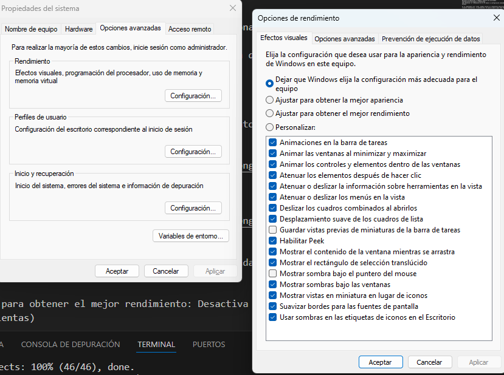

# Configuracion avanzada del sistema
   
autor: bilal                  

1. **¿Qué es la configuración avanzada del sistema?**
   
La configuración avanzada del sistema es una sección o herramienta dentro de un software, sistema operativo o dispositivo, que permite ajustar parámetros más complejos y específicos. Estas configuraciones están destinadas a usuarios que tienen conocimientos técnicos o requieren modificar el funcionamiento estándar del sistema para optimizarlo, personalizarlo o solucionar problemas.

**Ejemplos comunes:**

En Windows, la configuración avanzada del sistema permite gestionar rendimiento, variables de entorno, configuración de hardware, perfiles de usuario, etc.
En un software, como un servidor o base de datos, las configuraciones avanzadas pueden incluir puertos, seguridad, scripts de automatización, entre otros.

1. ¿**Por qué sirve?**
Esta configuración sirve para:

- Optimizar el rendimiento: Ajustar configuraciones para obtener un rendimiento superior (por ejemplo, asignación de recursos en un sistema operativo).

- Personalización avanzada: Permite adaptar el sistema a necesidades específicas (como resolución de pantalla o límites de memoria en programas especializados).

- Solución de problemas: Diagnosticar y reparar errores que no se pueden resolver con opciones básicas.
- Compatibilidad: Configurar para que funcione con hardware o software adicionales.

1. **¿Qué opciones ofrece**?
Las opciones varían dependiendo del sistema, pero aquí tienes ejemplos de funciones comunes en configuraciones avanzadas:

**Sistemas operativos (Windows, Linux, macOS):**
Gestión de recursos (CPU, RAM, almacenamiento).
Configuración de variables de entorno.
Ajustes de inicio del sistema (Boot Settings).
Configuración de usuarios y permisos.
Modificación del registro del sistema (Windows Registry en Windows).

**Hardware:**
Overclocking (ajuste de velocidad del procesador o GPU).
Configuración avanzada de BIOS/UEFI.
Ajustes de voltaje, frecuencias y perfiles de ventilación.

**Software especializado:**
Configuración de acceso remoto.
Reglas de firewall o puertos abiertos.
Opciones de depuración o logging (registro de actividad).
Configuración de plugins o extensiones.
Cómo optimizar el rendimiento de tu PC desde la configuración avanzada del sistema en Windows

Si tu computadora está lenta, puedes ajustar el rendimiento desactivando efectos visuales innecesarios. A continuación, te explico paso a paso cómo hacerlo:

**Paso 1:** Abrir la Configuración Avanzada del Sistema

Presiona Windows + R para abrir la ventana de Ejecutar.
Escribe sysdm.cpl y presiona Enter.
Esto abrirá la ventana de "Propiedades del Sistema".

**Paso 2**: Acceder a las Opciones Avanzadas
En la ventana de "Propiedades del Sistema", selecciona la pestaña que dice Opciones avanzadas.
Bajo el apartado "Rendimiento", haz clic en el botón que dice Configuración....

**Paso 3:**
**Ajustar los efectos visuales**

Aparecerá una ventana llamada "Opciones de rendimiento". Ve a la pestaña Efectos visuales.

**Tienes varias opciones:**
.Dejar que Windows elija la configuración más adecuada: El sistema decide según tu hardware.

.Ajustar para obtener el mejor rendimiento: Desactiva todos los efectos visuales (ideal para PC lentas)

.Personalizar: Puedes elegir qué efectos dejar activados (como sombras o animaciones) y desactivar los demás.
Si seleccionas Ajustar para obtener el mejor rendimiento, todos los efectos se desactivarán automáticamente.

**Paso 4:** Guardar los cambios

Haz clic en Aplicar y luego en Aceptar para guardar los cambios.
Reinicia tu computadora para que los ajustes surtan efecto.
**¿Qué cambios notarás?**
Menos animaciones y efectos visuales (las ventanas se abrirán y cerrarán sin transiciones).
Aumento en el rendimiento, especialmente en computadoras con recursos limitados.

