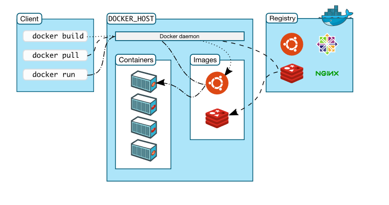

# DOCKER

- [DOCKER](#docker)
  - [Qué es docker](#qué-es-docker)
  - [El entorno de docker](#el-entorno-de-docker)
  - [Contenedores](#contenedores)
    - [Características clave de un contenedor:](#características-clave-de-un-contenedor)
    - [Comparativa con máquinas virtuales:](#comparativa-con-máquinas-virtuales)
  - [Imágenes](#imágenes)
    - [Ejemplo de Dockerfile](#ejemplo-de-dockerfile)
    - [Explicación del ejemplo:](#explicación-del-ejemplo)
    - [Construcción de la imagen](#construcción-de-la-imagen)
    - [Ejecución de la imagen](#ejecución-de-la-imagen)
    - [Sintaxis básica de un Dockerfile](#sintaxis-básica-de-un-dockerfile)
    - [Diferencia entre `CMD` y `RUN`:](#diferencia-entre-cmd-y-run)
  - [Volúmenes](#volúmenes)
    - [Características clave de un volumen:](#características-clave-de-un-volumen)
    - [Ventajas frente a usar directorios del host (`-v` con rutas absolutas):](#ventajas-frente-a-usar-directorios-del-host--v-con-rutas-absolutas)
    - [Tipos de volúmenes:](#tipos-de-volúmenes)
    - [Comando para crear un volumen nombrado:](#comando-para-crear-un-volumen-nombrado)
    - [Ejemplo de uso con un volumen nombrado:](#ejemplo-de-uso-con-un-volumen-nombrado)
    - [Diferencia clave entre volumen y bind mount:](#diferencia-clave-entre-volumen-y-bind-mount)
  - [Puertos](#puertos)
    - [Conceptos clave sobre los puertos en Docker](#conceptos-clave-sobre-los-puertos-en-docker)
    - [Sintaxis básica de mapeo de puertos:](#sintaxis-básica-de-mapeo-de-puertos)
    - [Modos de publicación de puertos](#modos-de-publicación-de-puertos)
    - [Comprobación de los puertos usados](#comprobación-de-los-puertos-usados)
    - [Reglas importantes sobre puertos:](#reglas-importantes-sobre-puertos)
  - [Docker compose](#docker-compose)
- [Práctica](#práctica)
  - [Crear un contendor Nginx](#crear-un-contendor-nginx)
    - [Explicación de los parámetros:](#explicación-de-los-parámetros)
    - [Qué hace este comando:](#qué-hace-este-comando)
    - [Resultado:](#resultado)
    - [Ejecutar contenedor con wordpress](#ejecutar-contenedor-con-wordpress)

## Qué es docker

Docker es una plataforma de software que permite automatizar el despliegue, la ejecución y la gestión de aplicaciones en contenedores. Un contenedor es una unidad ligera y autónoma que empaqueta todo lo necesario para ejecutar una aplicación: el código, las bibliotecas, las dependencias y el entorno de ejecución. Esto asegura que la aplicación funcione de manera consistente, sin importar en qué sistema operativo o entorno se esté ejecutando.

## El entorno de docker



- Contendores
- Imágenes
- Volúmenes
- Puertos
- Registro de imagenes
- El daemon
- El host

## Contenedores

Un **contenedor** es una unidad de software que empaqueta una aplicación y todas sus dependencias necesarias para que funcione de manera coherente en cualquier entorno. Esto incluye el código de la aplicación, bibliotecas, configuraciones, herramientas y cualquier otra cosa que la aplicación necesite para ejecutarse correctamente.

### Características clave de un contenedor:

1. **Aislamiento**:
   Un contenedor proporciona un entorno aislado para ejecutar una aplicación. Esto significa que la aplicación y sus dependencias están separadas del sistema operativo anfitrión y de otros contenedores. Cada contenedor tiene su propio espacio de nombres para recursos como el sistema de archivos, red y procesos, lo que impide que los contenedores interfieran entre sí.

2. **Ligereza**:
   Los contenedores son más livianos que las máquinas virtuales tradicionales, porque no requieren un sistema operativo completo para cada instancia. En su lugar, comparten el mismo núcleo del sistema operativo del host, pero operan de forma independiente en su propio espacio aislado. Esto hace que los contenedores sean más eficientes en cuanto a recursos, como memoria y CPU.

3. **Portabilidad**:
   Los contenedores permiten que las aplicaciones se ejecuten de la misma manera en cualquier lugar, ya sea en tu máquina local, en un servidor de desarrollo, en la nube o en un centro de datos. Esto se debe a que el contenedor incluye todo lo necesario para ejecutar la aplicación, asegurando que la configuración del sistema no afecte al funcionamiento de la aplicación.

4. **Rapidez**:
   Los contenedores son muy rápidos de iniciar y detener en comparación con las máquinas virtuales, porque no necesitan arrancar un sistema operativo completo. Esto permite que se desplieguen aplicaciones de manera más rápida y eficiente.

### Comparativa con máquinas virtuales:

En comparación con las **máquinas virtuales (VM)**, los contenedores son más livianos porque no tienen que ejecutar un sistema operativo completo. Mientras que cada máquina virtual requiere su propio sistema operativo, los contenedores comparten el mismo núcleo del sistema operativo subyacente (pero están aislados), lo que reduce significativamente el consumo de recursos y mejora la eficiencia.

En resumen, un contenedor es una forma eficiente, ligera y portable de ejecutar aplicaciones en entornos aislados, asegurando que estas aplicaciones funcionen de manera consistente en cualquier entorno.

## Imágenes

Una imagen de Docker es un paquete liviano y ejecutable que incluye todo lo necesario para ejecutar una aplicación: código, bibliotecas, dependencias y configuraciones. Es el blueprint (plano) o la plantilla de un contenedor Docker.

En términos simples:

1. **Base del contenedor**: Una imagen es el punto de partida para crear contenedores, que son instancias ejecutables de esa imagen.
2. **Sistema de archivos aislado**: Contiene un sistema de archivos completo, como si fuera una máquina virtual, pero más eficiente porque comparte el núcleo del sistema operativo.
3. **Inmutable**: Una vez creada, no se puede modificar. Cualquier cambio que se haga genera una nueva versión de la imagen.

Las imágenes suelen construirse a partir de un archivo llamado `Dockerfile`, que describe los pasos para configurar el entorno y la aplicación. 

Dime si necesitas más detalle o quieres que continúe explicando cómo funciona con ejemplos.

Un **Dockerfile** es un archivo de texto que contiene las instrucciones para construir una imagen Docker. Esencialmente, es una receta que especifica el entorno, dependencias y pasos necesarios para que una aplicación funcione dentro de un contenedor.

### Ejemplo de Dockerfile
Aquí tienes un ejemplo básico para construir una imagen que sirve una página web usando Nginx:

**Dockerfile:**
```dockerfile
# 1. Imagen base
FROM nginx:latest

# 2. Copiar archivos locales al contenedor
COPY ./mi_web /usr/share/nginx/html

# 3. Exponer el puerto que usará la aplicación
EXPOSE 80

# 4. Comando por defecto al ejecutar el contenedor
CMD ["nginx", "-g", "daemon off;"]
```

### Explicación del ejemplo:
1. **`FROM`**:
   - Define la imagen base sobre la cual construirás tu propia imagen.
   - En este caso, `nginx:latest` es una imagen oficial de Nginx.

2. **`COPY`**:
   - Copia archivos o carpetas desde el sistema de archivos del host (tu máquina) al contenedor.
   - Aquí se copian los archivos locales de `./mi_web` al directorio `/usr/share/nginx/html` del contenedor (donde Nginx sirve sus páginas).

3. **`EXPOSE`**:
   - Declara el puerto en el que la aplicación escucha dentro del contenedor.
   - Esto no publica el puerto, solo informa que la aplicación usa ese puerto.

4. **`CMD`**:
   - Especifica el comando por defecto que ejecutará el contenedor cuando se inicie.
   - En este caso, se asegura de que Nginx siga ejecutándose en modo no bloqueante (`daemon off`).

### Construcción de la imagen
Usa el comando `docker build` para crear una imagen a partir del Dockerfile:

```bash
docker build -t mi_imagen_nginx .
```

- **`-t mi_imagen_nginx`**: Especifica el nombre de la imagen.
- **`.`**: Indica que el `Dockerfile` está en el directorio actual.

### Ejecución de la imagen
Inicia un contenedor basado en la imagen que acabas de construir:

```bash
docker run -d -p 8080:80 --name mi_contenedor_web mi_imagen_nginx
```

### Sintaxis básica de un Dockerfile
| **Instrucción** | **Descripción**                                                                                   |
|------------------|---------------------------------------------------------------------------------------------------|
| `FROM`           | Especifica la imagen base (obligatoria y debe ser la primera línea).                             |
| `RUN`            | Ejecuta comandos durante la construcción de la imagen (instalación de paquetes, configuración).  |
| `COPY`           | Copia archivos o carpetas desde el host al sistema de archivos del contenedor.                   |
| `ADD`            | Similar a `COPY`, pero también descomprime archivos y admite URLs.                               |
| `WORKDIR`        | Establece el directorio de trabajo dentro del contenedor.                                        |
| `EXPOSE`         | Declara los puertos utilizados por la aplicación.                                                |
| `CMD`            | Especifica el comando por defecto al ejecutar el contenedor.                                     |
| `ENTRYPOINT`     | Similar a `CMD`, pero permite agregar argumentos al comando por defecto.                         |
| `ENV`            | Establece variables de entorno dentro del contenedor.                                           |
| `ARG`            | Define variables durante el proceso de construcción.                                             |

### Diferencia entre `CMD` y `RUN`:
- **`RUN`**: Se usa para ejecutar comandos al construir la imagen (como instalar dependencias).
- **`CMD`**: Define qué comando se ejecutará cuando el contenedor se inicie.


## Volúmenes

Un volumen en Docker es un método para almacenar datos persistentes que los contenedores pueden usar incluso después de haber sido eliminados. Es una solución ideal para gestionar datos porque es independiente del ciclo de vida de un contenedor y más eficiente que usar carpetas en el sistema de archivos del host.

### Características clave de un volumen:
1. **Persistencia**: Los datos almacenados en un volumen no desaparecen cuando se elimina el contenedor que lo utiliza.
2. **Independencia del contenedor**: Un volumen puede ser reutilizado por múltiples contenedores, lo que facilita compartir datos.
3. **Gestión eficiente**: Docker administra los volúmenes y puede almacenarlos fuera de los límites del sistema de archivos principal del contenedor.
4. **Flexibilidad**: Se pueden montar volúmenes en cualquier ruta dentro del contenedor.

### Ventajas frente a usar directorios del host (`-v` con rutas absolutas):
- Mayor portabilidad: Los volúmenes son gestionados directamente por Docker, lo que evita problemas de compatibilidad con sistemas operativos.
- Seguridad: Docker controla los permisos y el acceso a los volúmenes.

### Tipos de volúmenes:
1. **Volúmenes anónimos**: Se crean automáticamente cuando no se especifica un nombre. Docker los administra pero son más difíciles de identificar.
2. **Volúmenes nombrados**: Puedes asignarles un nombre específico, lo que facilita su gestión y reutilización.
3. **Bind mounts**: Montan un directorio específico del host directamente dentro del contenedor (menos portátiles).

### Comando para crear un volumen nombrado:
```bash
docker volume create mi_volumen
```

### Ejemplo de uso con un volumen nombrado:
```bash
docker run -d -p 8080:80 --name web_contenedor -v mi_volumen:/usr/share/nginx/html nginx
```

docker run -d -p 8080:80 --name nginex_gatos -v gatos:/usr/share/nginx/html nginx

### Diferencia clave entre volumen y bind mount:
| **Volumen**                          | **Bind mount**                              |
|--------------------------------------|---------------------------------------------|
| Administrado por Docker              | Depende de una ruta absoluta en el host     |
| Más seguro y portable                | Menos portable (puede variar según el SO)   |
| Ideal para almacenamiento persistente| Útil para desarrollo y pruebas rápidas      |

## Puertos

Los puertos en Docker son fundamentales para que los contenedores puedan comunicarse con el mundo exterior (tu máquina anfitriona u otros servicios). Cuando ejecutas un contenedor, este puede incluir aplicaciones que escuchan en determinados puertos (como un servidor web, una base de datos, etc.), y Docker permite mapear esos puertos del contenedor a los puertos del host.

### Conceptos clave sobre los puertos en Docker

1. **Puerto del contenedor**: 
   - Es el puerto dentro del contenedor donde la aplicación está escuchando.
   - Ejemplo: Un servidor Nginx escucha en el puerto 80 dentro del contenedor.

2. **Puerto del host**: 
   - Es el puerto de tu máquina anfitriona que mapeas al puerto del contenedor para que otros dispositivos puedan acceder.
   - Ejemplo: Mapeas el puerto 80 del contenedor al puerto 8080 de tu host.

3. **Mapeo de puertos (`-p`)**: 
   - La opción `-p` permite especificar la relación entre el puerto del host y el puerto del contenedor.

### Sintaxis básica de mapeo de puertos:
```bash
docker run -p [puerto_host]:[puerto_contenedor] [imagen]
```

Por ejemplo:
```bash
docker run -p 8080:80 nginx
```
En este caso:
- El puerto 80 del contenedor (donde Nginx escucha) será accesible desde el puerto 8080 de la máquina anfitriona.

### Modos de publicación de puertos

1. **Mapeo específico (`-p`)**: 
   - Especifica exactamente qué puertos del host están conectados a los del contenedor.
   - Ejemplo: `-p 3000:80`.

2. **Mapeo automático (`-P`)**: 
   - Asigna automáticamente puertos del host disponibles a los puertos expuestos del contenedor.
   - Ejemplo: `docker run -P nginx` (asigna un puerto aleatorio del host al puerto 80 del contenedor).

3. **Exposición interna (`EXPOSE` en Dockerfile)**:
   - Informa a Docker de que una aplicación dentro del contenedor utiliza un puerto, pero no lo publica automáticamente.
   - Ejemplo en un `Dockerfile`:
     ```dockerfile
     EXPOSE 80
     ```

### Comprobación de los puertos usados
Puedes verificar los puertos que está utilizando un contenedor con el comando:

```bash
docker ps
```

Esto mostrará algo como:
```
CONTAINER ID   IMAGE   COMMAND       PORTS                   NAMES
abc123         nginx   "nginx -g..." 0.0.0.0:8080->80/tcp    web_contenedor
```

El mapeo `0.0.0.0:8080->80/tcp` indica que el puerto 8080 del host está enlazado al puerto 80 del contenedor.

### Reglas importantes sobre puertos:
1. **No puedes mapear el mismo puerto del host a más de un contenedor**.
   - Ejemplo: Dos contenedores no pueden usar el puerto 8080 en el host al mismo tiempo.
2. **Puedes usar diferentes puertos del host para el mismo puerto del contenedor**.
   - Ejemplo: 
     - Contenedor A: `-p 8080:80`
     - Contenedor B: `-p 8081:80`

## Docker compose


# Práctica

## Crear un contendor Nginx

Este comando sirve para crear un contendor de nginx.

```bash
docker run -d -p 8080:80 --name mi_contenedor nginx
```

### Explicación de los parámetros:
| **Parámetro**          | **Descripción**                                                                 |
|-------------------------|---------------------------------------------------------------------------------|
| `docker run`            | Inicia un nuevo contenedor a partir de una imagen.                             |
| `-d`                    | Ejecuta el contenedor en modo *desacoplado* (en segundo plano).                |
| `-p 8080:80`            | Mapea el puerto 80 del contenedor al puerto 8080 del host (sistema local).     |
| `--name mi_contenedor`  | Asigna un nombre al contenedor, en este caso, `mi_contenedor`.                 |
| `nginx`                 | Especifica la imagen a usar, en este caso, la imagen oficial de Nginx.         |

### Qué hace este comando:
1. Descarga la imagen de Nginx si no está en tu máquina.
2. Crea y ejecuta un contenedor basado en esa imagen.
3. Expone el puerto 80 del contenedor (donde Nginx sirve contenido) en el puerto 8080 de tu máquina local.
4. Nombra el contenedor `mi_contenedor`.

### Resultado:

Si visitas `http://localhost:8080` en tu navegador, deberías ver la página de bienvenida de Nginx. 

### Ejecutar contenedor con wordpress

```bash
docker run -d --name wordpress -p 8080:80 -e WORDPRESS_DB_HOST=db -e WORDPRESS_DB_USER=ik_lanm -e WORDPRESS_DB_PASSWORD=0081 -e WORDPRESS_DB_NAME=wordpress wordpress
```