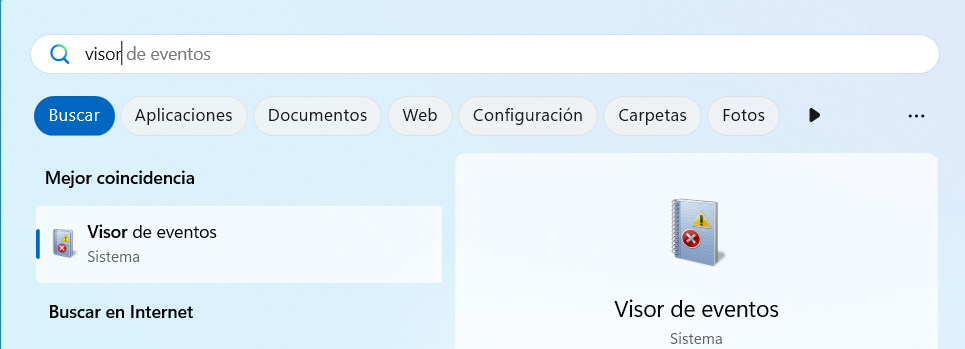
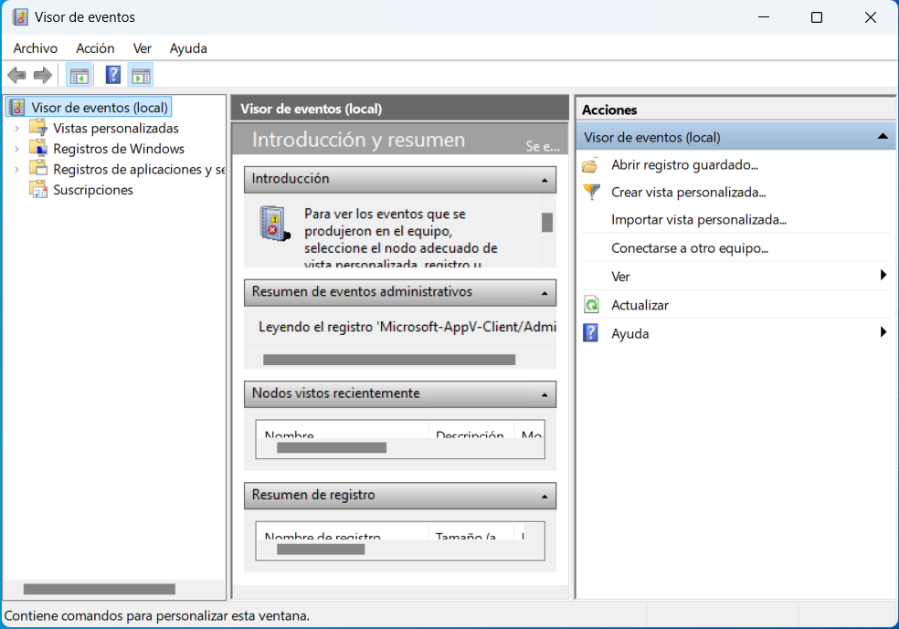
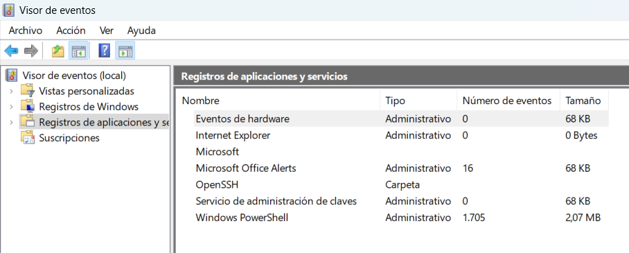
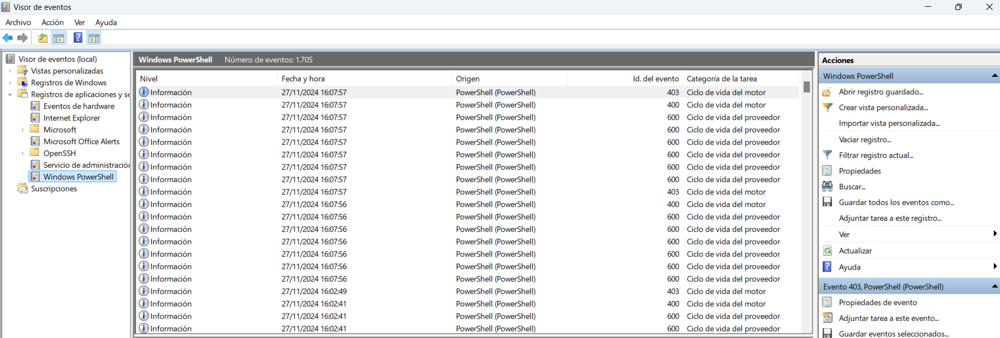

# Eventos del Sistema

$$Autor: Josue$$

- [Eventos del Sistema](#eventos-del-sistema)
  - [*¿Qué es?*](#qué-es)
  - [*¿Para qué sirve?*](#para-qué-sirve)
  - [*¿Qué opciones ofrece?*](#qué-opciones-ofrece)
  - [*¿Cómo acceder al Visor de Eventos en Windows 11?*](#cómo-acceder-al-visor-de-eventos-en-windows-11)

---

## *¿Qué es?*

Los ***eventos del sistema*** en Windows 11 son registros que documentan las actividades que ocurren dentro del sistema operativo. Estos eventos se generan automáticamente por Windows y por las aplicaciones o servicios que se ejecutan en el sistema.

---

## *¿Para qué sirve?*

1. **Diagnóstico de problemas:** Ayuda a identificar y resolver fallos del sistema o aplicaciones.
   
2. **Auditorías de seguridad:** Rastrea accesos al sistema para mejorar la seguridad.
   
3. **Monitoreo del rendimiento:** Identifica advertencias o errores relacionados con el hardware o el software.
   
4. **Solución de fallos críticos:** Determina las causas de reinicios inesperados o pantallas azules (BSOD).

---

## *¿Qué opciones ofrece?*

1. **Eventos de información:**
Indican que una acción ha sido completada correctamente. Por ejemplo, la conexión de un dispositivo o la finalización de un servicio.

2. **Advertencias:**
Alertan sobre problemas potenciales que no son críticos pero que podrían causar problemas si no se abordan. Por ejemplo, espacio en disco bajo.

3. **Errores:**
Representan problemas graves que han impedido que una operación se complete correctamente. Por ejemplo, un servicio que no se pudo iniciar.

4. **Eventos críticos:**
Son problemas serios que generalmente requieren atención inmediata, como un error de sistema que provoca un reinicio inesperado.

5. **Auditorías de seguridad (éxito o fracaso):**
Se generan cuando se registran acciones relacionadas con la seguridad, como intentos de inicio de sesión exitosos o fallidos.

---

## *¿Cómo acceder al Visor de Eventos en Windows 11?* 

1. Haz clic en el botón Inicio y escribe ***Visor de eventos***.

2. Selecciona la aplicación para abrirla.

3. Explora las categorías de registros en el panel izquierdo, como ***Sistema, Aplicación o Seguridad***.

4. Haz clic en un evento para ver más detalles.

5. A continuación entra en la carpeta de eventos de ***Aplicaciones y servicios*** y en el panel derecho selecciona la opción de ***Filtrar registro actual***  

