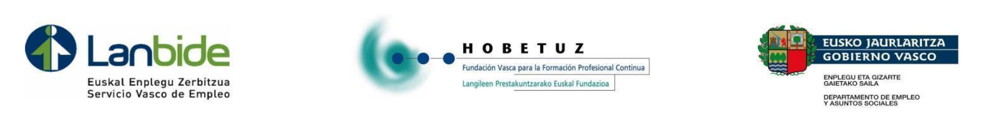

# Examen de Explotación de Dispositivos

- [Examen de Explotación de Dispositivos](#examen-de-explotación-de-dispositivos)
- [Parte práctica (6 puntos)](#parte-práctica-6-puntos)
  - [Enunciado](#enunciado)
    - [Crear un servicio web de Nginx con Docker (3 puntos)](#crear-un-servicio-web-de-nginx-con-docker-3-puntos)
    - [Análisis de los eventos del sistema (1 puntos)](#análisis-de-los-eventos-del-sistema-1-puntos)
    - [En una maquina virtual de Windows, crear un Script de Windows que arranque un servicio (3 puntos)](#en-una-maquina-virtual-de-windows-crear-un-script-de-windows-que-arranque-un-servicio-3-puntos)
    - [En una maquina virtual de Windows, crea un punto de restauración (2 puntos)](#en-una-maquina-virtual-de-windows-crea-un-punto-de-restauración-2-puntos)
    - [En una máquina virtual de Linux o en un contenedor de linux, crea un un servicio con Samba (6 puntos)](#en-una-máquina-virtual-de-linux-o-en-un-contenedor-de-linux-crea-un-un-servicio-con-samba-6-puntos)
  - [Evaluación Parte Práctica](#evaluación-parte-práctica)
    - [Documentación](#documentación)
    - [Diagrama](#diagrama)
- [Parte teórica (4 puntos)](#parte-teórica-4-puntos)

# Parte práctica (6 puntos)

*La parte práctica tiene un total de 6 puntos. Se ha de elegir y realizar tareas para obtener puntuación. En caso de superar el total de puntos se sumarán los puntos extra a la parte teórica si es posible, divididos entre 5.*

## Enunciado 

En la empresa familiar, conservas Etxanobe, se ha decidido modernizar la infraestructura de la empresa. Se ha decidido contratar a un técnico para que realice la modernización de la infraestructura. Además quieren crear un servicio web para que sus clientes puedan ver Se ha de realizar las siguientes tareas:

### Crear un servicio web de Nginx con Docker (3 puntos)

1. Crea un servicio web de Nginx con Docker. (0.8 puntos)
2. Crea un archivo index.html con un mensaje de bienvenida. (0.5 puntos)
3. Mapea apear el puerto 80 del contenedor al puerto 8080 del host (0.2 puntos)
4. Documenta el proceso. (0.75 puntos)
5. Crea un diagrama pequeño de la arquitectura. (0.75 puntos)

### Análisis de los eventos del sistema (1 puntos)

1. Accede al Visor de Eventos y encuentra un evento reciente relacionado con la seguridad del sistema (por ejemplo, intentos fallidos de inicio de sesión, puedes crear tu uno fallando una sesión).  (0.5 puntos)
2. Documenta el proceso. (0.5 puntos)

### En una maquina virtual de Windows, crear un Script de Windows que arranque un servicio (3 puntos)

1. Se ha de arrancar un servicio de Windows al inciar el sistema. (0.75 puntos)
2. Personalización del Sistema: Cambia la configuración para que Windows muestre archivos ocultos y las extensiones de los archivos. (0.75 puntos)
3. Documenta el proceso.(0.75 puntos)
4. Crea un diagrama pequeño de la arquitectura que incluya los cambios de configuración realizados. (0.75 puntos)

### En una maquina virtual de Windows, crea un punto de restauración (2 puntos)

1. Crea un punto de restauración en una máquina virtual de Windows. (0.5 puntos)
2. Optimización del Arranque: Desactiva un programa no esencial para el arranque del sistema (sin deshabilitar programas de seguridad o del sistema).  (0.5 puntos)
3. Documenta el proceso al detalle. (1 punto)

### En una máquina virtual de Linux o en un contenedor de linux, crea un un servicio con Samba (6 puntos)

1. Crea un servicio de Samba en una máquina virtual de Linux o en un contenedor de Linux.
2. Crea un usuario y comparte una carpeta.
3. Crea diferentes usuarios y asigna permisos a los usuarios. (al menos 2, alumno y profesor)
4. Crea diferentes grupos y asigna permisos a los grupos. (al menos 2, alumnos y profesores)
5. Crea 3 carpetas compartidas, una para todos(solo lectura alumnos), otra para alumnos y otra para profesores.
6. Documenta el proceso.
7. Crea un diagrama de la arquitectura que incluya la máquina virtual o contenedor de Linux, los usuarios, los grupos y las carpetas compartidas.

## Evaluación Parte Práctica

Los puntos están asignados a cada tarea y se evaluaran como logrado o no logrado. En las tareas de documentación y diagrama se valorarán los siguientes aspectos:

### Documentación

Se ha de documentar el proceso de forma clara y concisa. Se ha de utilizar markdown para la documentación.

1. Crea una carpeta para el examne con tu nombre.
2. Se han de guardar todos los docuementos del examen en esa carpeta.
3. El examen ha de documentarse en markdown.
4. Se ha de utilizar los elementos básico de markdown.
   1. Índice (TOC)
   2. Títtulos, subtítulos, ...
   3. Enlaces
   4. Bolques de código
   5. Imagenes

### Diagrama

1. Se ha realizado utilizando excalidraw.
2. Se ha de adjuntar el archivo fuente de excalidraw a la carpeta del proyecto.
3. Se ha de exportar a formato png.
4. Se ha transmitido el mensaje de forma clara.
5. Se ha respetado algún estilo y jerarquía en el diagrama..

# Parte teórica (4 puntos)

Preguntas tipo test

