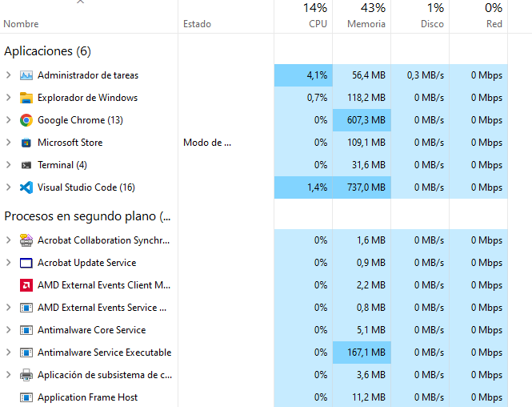
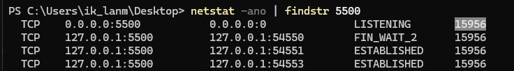
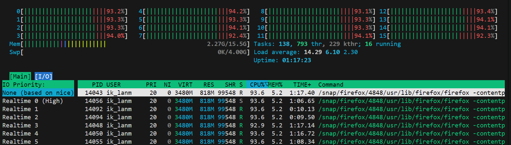

# Gestión de procesos

## Gestion de procesos en Windows

Los procesos en windows se muestran en el  Administrador de Tareas desde donde podemos visualizar el uso de los recursos del sistema y parar procesos si quisieramos.




### Descubrir un proceso por puerto 

A veces, hay procesos que no aparecen en la lista pero estan bloqueados y queremos eliminarlos. Por ejemplo un servicio que no se ha cerrado bien.

Si conocemos el puerto que utiliza el servicio.

```bash
netstat -ano | finstr 3000
```



### Eliminar un proceso por ID

```bash
taskkill /F /PID 15956
```

## Gestion de procesos en linux

Para ver una especie de administrador de tareas en linux podemos usar los siguientes comandos.


```bash
top
```

```bash
htop
```



### Eliminar un proceso en linux

```bash
killid id
```