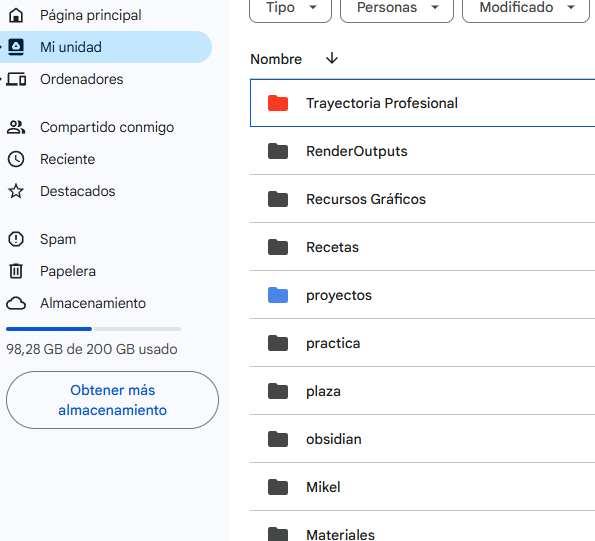
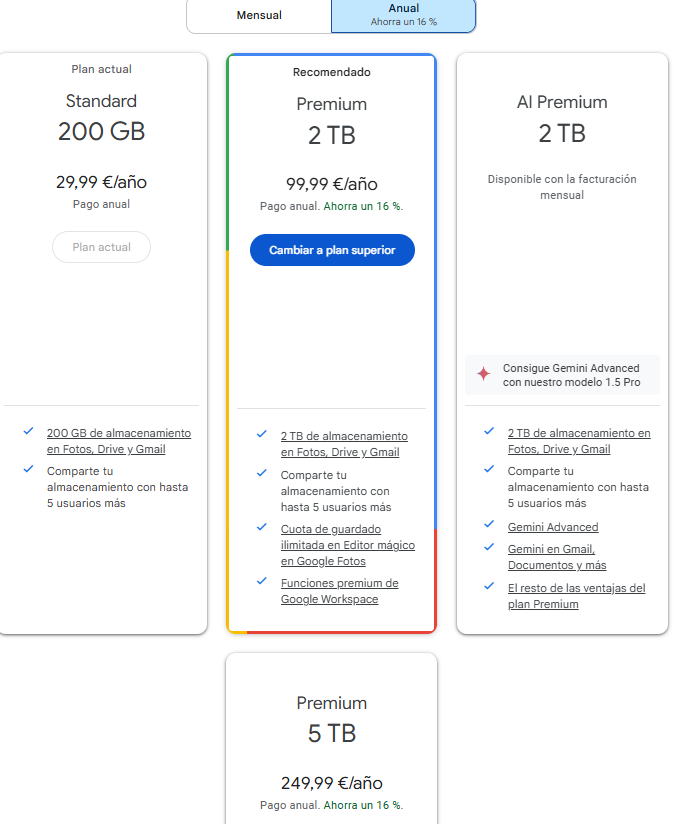
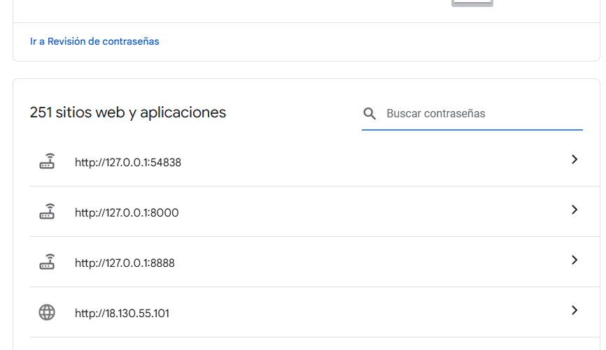
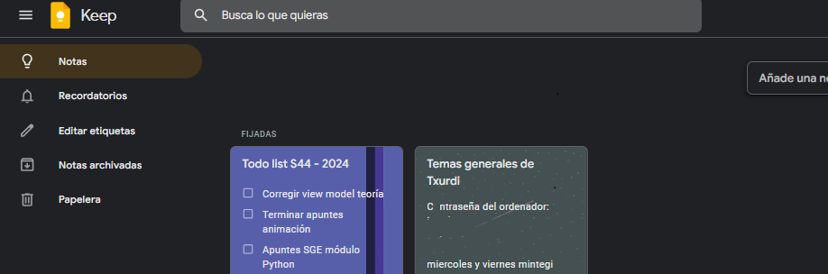
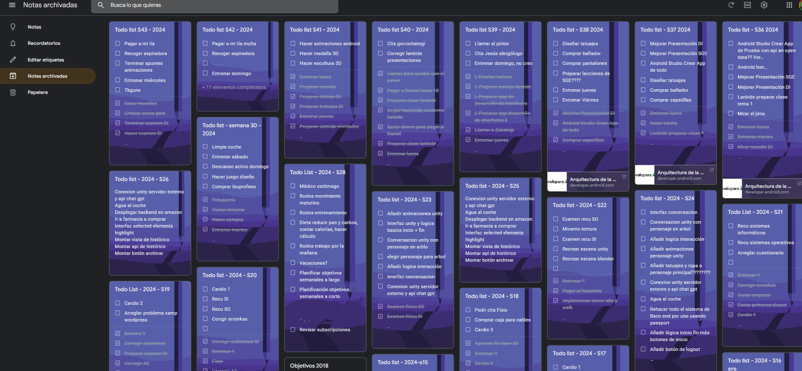
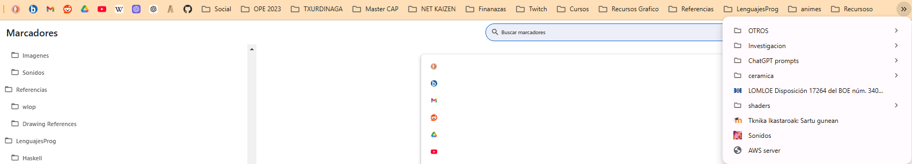
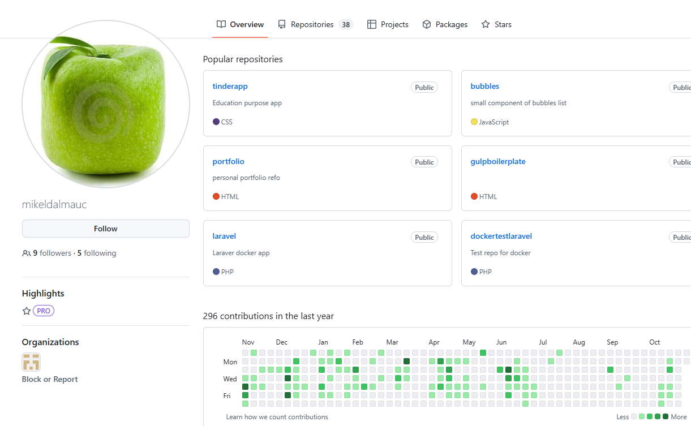

- [¿Qué es un sistema de información?](#qué-es-un-sistema-de-información)
- [¿Para qué necesitamos un sistema de información?](#para-qué-necesitamos-un-sistema-de-información)
- [Descripción de tres sistemas de información distintos:](#descripción-de-tres-sistemas-de-información-distintos)
  - [Una biblioteca](#una-biblioteca)
  - [Una empresa de paquetería](#una-empresa-de-paquetería)
  - [Un estudiante de medicina](#un-estudiante-de-medicina)
- [¿Por qué es importante tener un buen sistema de información que se ajuste a nuestras necesidades?](#por-qué-es-importante-tener-un-buen-sistema-de-información-que-se-ajuste-a-nuestras-necesidades)
- [Mi sistema de información](#mi-sistema-de-información)
  - [Qué tipo de información guardo](#qué-tipo-de-información-guardo)
  - [Cómo y dónde guardo la información](#cómo-y-dónde-guardo-la-información)

## ¿Qué es un sistema de información?

Un sistema de información es un conjunto organizado de recursos humanos, tecnológicos y procedimentales que interactúan para recopilar, procesar, almacenar y distribuir información. Su objetivo es apoyar las actividades y decisiones dentro de una organización o para un individuo, facilitando el manejo eficiente de datos y transformándolos en información útil.

## ¿Para qué necesitamos un sistema de información?

Necesitamos sistemas de información para:

- **Optimizar procesos:** Automatizan tareas repetitivas y mejoran la eficiencia operativa.
- **Tomar decisiones informadas:** Proporcionan datos precisos y oportunos que respaldan la planificación y estrategia.
- **Mejorar la comunicación:** Facilitan el flujo de información entre diferentes departamentos o personas.
- **Gestionar recursos eficientemente:** Ayudan en el control y seguimiento de recursos financieros, humanos y materiales.
- **Adaptarse al entorno:** Permiten responder rápidamente a cambios en el mercado o en las necesidades internas.

## Descripción de tres sistemas de información distintos:

---

### Una biblioteca

 **Características:**
   - **Catálogo digital:** Base de datos con información sobre libros, revistas y otros materiales.
   - **Sistema de préstamo:** Registro y control de préstamos y devoluciones.
   - **Interfaz de usuario:** Búsqueda avanzada por autor, título, género, etc.
   - **Integración con sistemas externos:** Acceso a bases de datos y recursos en línea.

 **Ventajas:**
   - **Acceso rápido a información:** Facilita la localización y reserva de materiales.
   - **Eficiencia en la gestión:** Automatiza procesos de registro y seguimiento.
   - **Mejora la experiencia del usuario:** Ofrece servicios en línea y reduce tiempos de espera.

 **Desventajas:**
   - **Costos de implementación y mantenimiento:** Requiere inversión en software y hardware.
   - **Necesidad de capacitación:** Personal y usuarios deben aprender a usar el sistema.
   - **Dependencia tecnológica:** Fallos en el sistema pueden interrumpir el servicio.

 **Información que guardan:**
   - **Datos bibliográficos:** Títulos, autores, ISBN, categorías.
   - **Registros de usuarios:** Información de contacto, historial de préstamos.
   - **Estadísticas de uso:** Frecuencia de préstamos, material más consultado.

---

### Una empresa de paquetería

 **Características:**
   - **Sistema de rastreo en tiempo real:** Monitoreo de paquetes durante todo el proceso de envío.
   - **Gestión logística:** Planificación de rutas y horarios de entrega.
   - **Integración con clientes:** Notificaciones y actualizaciones automáticas.
   - **Análisis de datos:** Evaluación de eficiencia y rendimiento operativo.

 **Ventajas:**
   - **Transparencia:** Clientes pueden seguir sus envíos en tiempo real.
   - **Optimización de recursos:** Mejora en la planificación y reducción de costos.
   - **Mejora del servicio al cliente:** Respuesta rápida y eficaz a consultas y problemas.

 **Desventajas:**
   - **Altos costos iniciales:** Inversión significativa en tecnología y capacitación.
   - **Riesgos de seguridad:** Posibilidad de ciberataques o filtración de datos sensibles.
   - **Complejidad del sistema:** Necesidad de mantenimiento constante y actualizaciones.

 **Información que guardan:**
   - **Datos de envío:** Origen, destino, contenido, peso.
   - **Información de clientes:** Nombres, direcciones, detalles de contacto.
   - **Historial de entregas:** Tiempos, incidencias, confirmaciones de recepción.

---

### Un estudiante de medicina

 **Características:**
   - **Plataformas educativas en línea:** Acceso a clases virtuales, webinars y foros de discusión.
   - **Aplicaciones de gestión personal:** Organizadores de estudio, calendarios, recordatorios.
   - **Bases de datos médicas:** Acceso a investigaciones, artículos y casos clínicos.
   - **Herramientas interactivas:** Simuladores anatómicos y software de diagnóstico.

 Ventajas:
   - **Acceso a información actualizada:** Mantiene al día con los últimos avances médicos.
   - **Flexibilidad en el aprendizaje:** Estudia a su propio ritmo y horario.
   - **Mejora en la organización:** Gestiona tareas y exámenes de manera eficiente.

 Desventajas:
   - **Sobrecarga de información:** Riesgo de abrumarse con exceso de datos.
   - **Necesidad de autodisciplina:** Requiere gestión efectiva del tiempo.
   - **Dependencia tecnológica:** Problemas técnicos pueden interrumpir el aprendizaje.

 **Información que guardan:**
   - **Notas y materiales de estudio:** Apuntes, presentaciones, resúmenes.
   - **Cronograma académico:** Fechas de exámenes, entregas y prácticas.
   - **Progreso educativo:** Calificaciones, evaluaciones y feedback.

---

## ¿Por qué es importante tener un buen sistema de información que se ajuste a nuestras necesidades?

Un sistema de información adaptado a nuestras necesidades es esencial porque:

- **Maximiza la eficiencia:** Evita redundancias y optimiza el uso de recursos.
- **Reduce errores:** Procesos automatizados disminuyen la posibilidad de fallos humanos.
- **Facilita la toma de decisiones:** Proporciona datos precisos y relevantes.
- **Mejora la satisfacción:** Tanto de clientes como de usuarios internos, al ofrecer soluciones efectivas.
- **Promueve la adaptabilidad:** Permite responder rápidamente a cambios y nuevas demandas.

Un sistema inadecuado puede conducir a ineficiencias, pérdida de oportunidades y costos adicionales. Por ello, es fundamental invertir en sistemas que realmente apoyen y potencien nuestras actividades específicas.

## Mi sistema de información

### Qué tipo de información guardo

Guardo información de caracter variado pero, mayormente se encuadra en uno de los siguientes ámbitos:
- Documentos personales (títulos, informes, copias del DNI, padrón, seguros y otros documentos) 💳
- Proyectos de mi carrera educativa, trabajos y apuntes.📖
- Proyecto artísticos, tableros de imágenes, archivos de photoshop, blender.🎨
- Proyectos de software. 📔
- Fotos y vídeos 🖼️
- Enlaces 🔗
- Contraseñas, contactos, correos, etc 🀄
- Notas semanales para gestionar mis tareas 🗒️
  
### Cómo y dónde guardo la información

- **Google Drive**: En google drive guardo todos mis apuntes antiguos, trabajos, documentos privados. Proyectos artísticos, archivos photoshop o blender, vídeos y fotos personales. Los archivos son privados y son accesibles tanto desde cualquier navegador como desde mi equipo personal en el que tengo sincronizado todo el contenido de la nube. Uso colores y guardo la información en carpetas. El precio por 200GB es de 30€/año.
  
Vista general:

Tarifas:

- **Google Fotos**: Similar a drive, se sincroniza con mi teléfono móvil y entra dentro de la misma tarfia de 200GB. Es más práctico y cómodo para almacenar fotos. Aunque estas fotos están en mi dispositivo movil, no conisdero este como un lugar apropiado para guardarlas.
  
- **Google Contacts**: Para guardar contactos, se sincroniza automáticamente al cambiar de dispositivo, al igual que las contraseñas.

- **Google, Gestor de contraseñas**: También utilizo google para que guarde mis contraseñas y a veces las genero con google también, actualmente tengo 251!

- **Google, Notas**: Uso google keep para hacer listas de tareas semanales que voy archivando a medida que pasan las semanas. Mantengo algunas fijadas como la nota de la semana u otras con información relevante y actual.

- **Google, enlaces**: Un elemento muy importante de mi sistema de información son mis enlaces, que se me sincronizan cada vez que inicio sesión en un navegador de google chrome, tengo muchos y bien organizados por carpetas. Los que más uso están a la izquierda, suelo usar solo el icono sin texto, luego los actuales por ejemplo ahora los de txurdinaga están una carpeta a la izquierda también y los enlaces dentro de las carpetas si contienen un texto corto que describe que enlace es.

- **GitHub**: En GitHub guardo proyectos de software en forma de repositorios y cada vez más apuntes y documentos, usando el lenguaje markdown. Es gratis y permite manter una gestíon de versiones eficaz, es público por lo que no es apropiado para información privada o para archivos grandes como documentos photoshop o blender. Puedo acceder a esta información desde cualquier navegador o clonarla en cualquier equipo que tenga github. Actualmente dispongo de 38 repositorios públicos.

   1. Explica porque es apropiado para tí, si crees que puede mejorar y como lo podrías mejorar