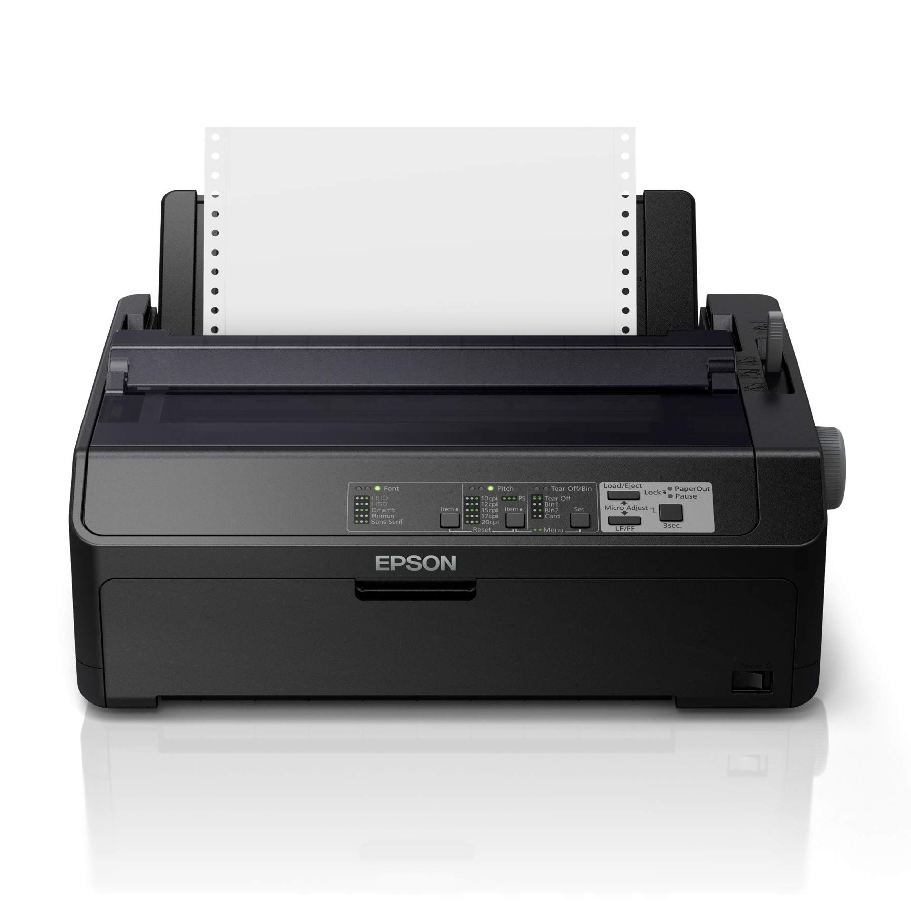
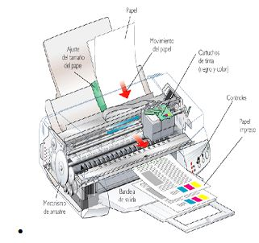

# 🖨️ Impresora Matricial (Dot Matrix)

## 🌐 Referencia de Interés
- [Historia de Impresoras Matriciales](https://www.profesionalreview.com/2021/10/02/impresora-matricial-que-es/)

## 🛒 Referencia Comercial
- [Impresora Matricial Epson LX-350 en Amazon](https://www.amazon.es/Epson-DR000103-LX-350-Impresora-matricial/dp/B00AC3S18S/ref=asc_df_B00AC3S18S?mcid=58f88d63dbc43123b1fb974876a88005&tag=googshopes-21&linkCode=df0&hvadid=699690028245&hvpos=&hvnetw=g&hvrand=1741630754448173325&hvpone=&hvptwo=&hvqmt=&hvdev=c&hvdvcmdl=&hvlocint=&hvlocphy=9219525&hvtargid=pla-631862899820&psc=1&gad_source=1)
## 🖼️ Imagen Representativa
Impresora Matricial 

## 📐 Diagrama Técnico
Diagrama Técnico Impresora Matricial

## 📝 Descripción
La impresora matricial, también conocida como impresora de punto, es un tipo de impresora de impacto que forma caracteres y gráficos golpeando una matriz de puntos contra una cinta entintada, dejando una marca sobre el papel. 

## 📅 Fecha de Invención
- 🕰️ Invención: Década de 1970
- 🚀 Popularización: Principios de 1980

## 📊 Ventajas y Desventajas

### 👍 Ventajas
- Bajo costo de impresión 💲
- Capacidad para imprimir copias múltiples mediante papel carbón 📄
- Resistente y duradera 💪
- Eficaz para imprimir formularios y documentos de varias capas 📋
- Bajo costo de mantenimiento 🔧

### 👎 Desventajas
- Calidad de impresión baja 📉
- Ruido alto durante la impresión 🔊
- Velocidad de impresión lenta 🐌
- Impresión en color limitada o inexistente 🌈
- Resolución gráfica limitada 📏
