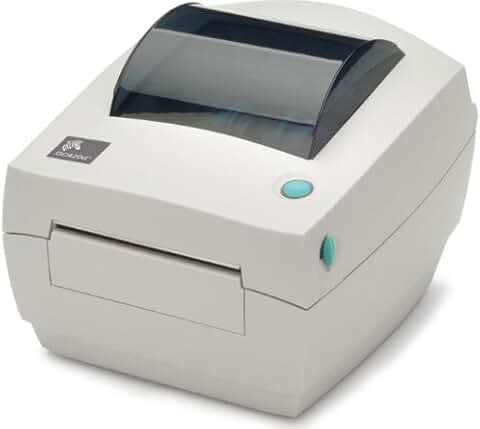
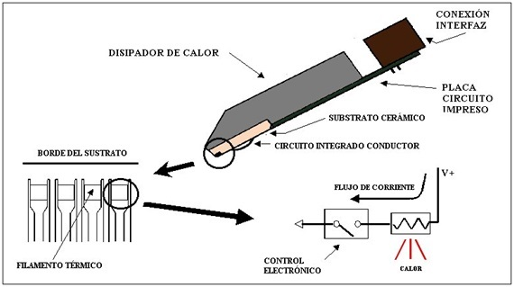

# Impresora de transferencia térmica

Se usan sobre todo para imprimir tickets y cosas pequeñas, y son de tamaño reducido. Comunes en negocios pequeños y demás.

Se inventó en los Años 70.

 

[impresora de etiquetas brother](https://www.brother.es/impresoras-etiquetas-y-recibos/impresoras-de-etiquetas-sobremesa/impresoras-etiquetas-volumen-impresion-medio-y-resistente)

[Producto en amazon](https://www.amazon.es/Zebra-GX420d-escritorio-mu%C3%B1equeras-Conectividad/dp/B07YQGV1XK?dib=eyJ2IjoiMSJ9.8jOADZvdQRckwr64enwNl0LwE-ZSK_x9MTqvgSbeSBaYRyFczkTnUKgImrxxu5Qg98EQy45YnwhcQlnMIxBDksezrczSWwccCYCo4iKWo5g-sn_n2Hroz9QRLHJgh7fjf1BYRHJGzAUCWt8OUwYJ_crw5yoQ02S1MM524QrIrCXFaI5w8C3Po6EovoKbivj9U4BIZJMaWh2nTBqFz9sGZes32O9PqNKFtKd5U66fqJI6f534dIBeIgyjiAArrvcB8iaBI2DsZr2D5hNumfeMgvDqHBnVIgjz7Q6umnnJPD0._2GKLapnhquB61ETKFiaqv3Py9dHEHSJdTqNGhm3d70&dib_tag=se&keywords=impresora+termica+zebra&nsdOptOutParam=true&qid=1733846218&sr=8-6)

# Diagrama

4: 

# Ventajas y desventajas.

- **Ventajas:** pequeñas, bajo coste, muy rápidas; 

- **desventajas:** olor intenso, baja durabilidad, monocromáticas, requieren papel especial.

Imprime en formato de tickets o recibos.