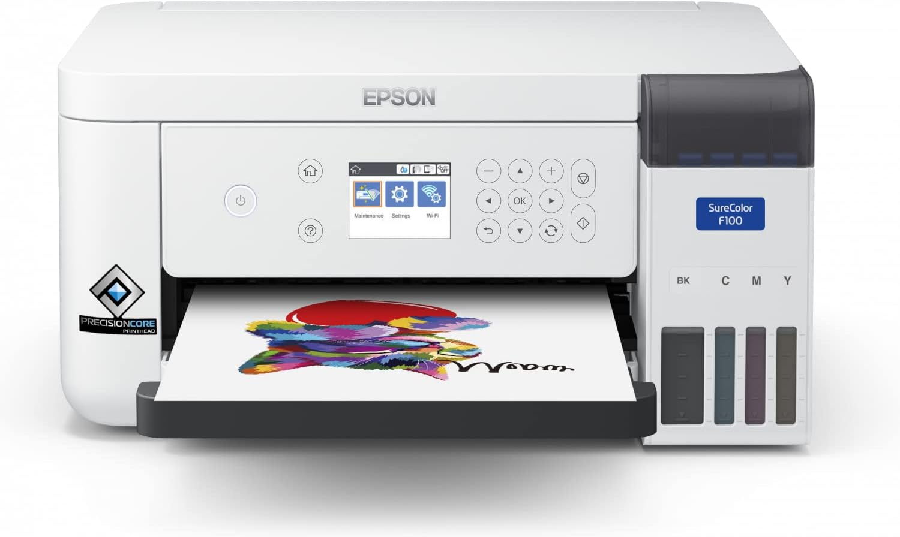
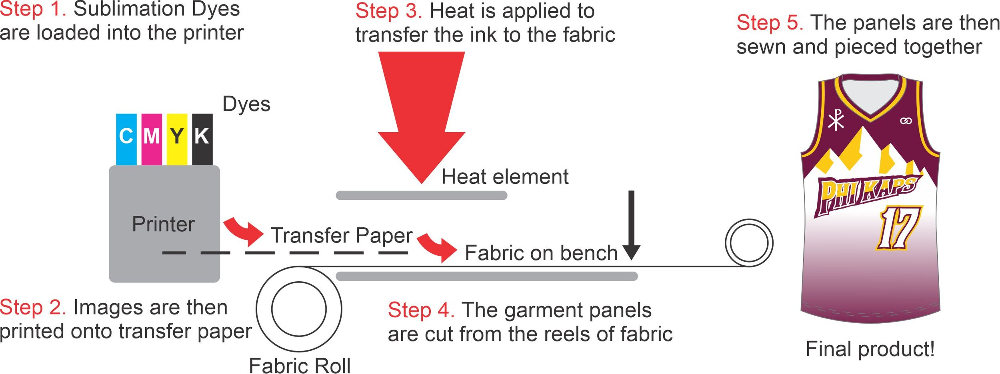

# Impresora de sublimación de tinta 

La impresión por sublimación utiliza calor y presión para transferir diseños a diferentes materiales. Es ideal para personalizar ropa, tazas, y otros objetos recubiertos de polímeros. Puedes encontrar información detallada en [Tecno Simple](https://tecno-simple.com/) y [Printful](https://www.printful.com/es).

Un modelo comercial popular es la Epson SureColor F100, disponible en plataformas como Amazon. Puedes ver sus características y adquirirla [aquí](https://www.amazon.es/Impresora-sublimaci%C3%B3n-SureColor-SC-F100-transferencia/dp/B09RF9C4RF?__mk_es_ES=%C3%85M%C3%85%C5%BD%C3%95%C3%91&crid=89L83ZAEDMSO&dib=eyJ2IjoiMSJ9.RVvCnRastJOiUXDcIPylb8eXltHaWwGQDYV7SVWI3PYOMjlv8vAAp94AjN_nVT72larO7xcydDWp7WzxSo8vO1mw8hTdaVCcU-sjLN75acviIvETHor9u3HW8lDJpzY4iVPvICdP3fIqWOl48mF3HoDBkwTvX83Fys5re0k4P54GWD9XFm-Wkz2tbu_ylScLc4YIV2NEivrigQXMQfuL13DnBaNHf-D6VE7LvsT084zVt6KwoAR_uFPO814iH5F2xMPe9wP8UbNioAwaWK5rmxq35BjVcJOor1xbnU_2RrM.hGfVZglMlX7bmWcBJLbowUVXPo_4iWb-fyAmL_cK9tU&dib_tag=se&keywords=epson+sublimacion&nsdOptOutParam=true&qid=1733843997&sprefix=epson+sublimacion%2Caps%2C161&sr=8-8).

### Diagrama Técnico

### Descripción

Una impresora de sublimación utiliza tintas especiales que, mediante calor, pasan de estado sólido a gaseoso sin convertirse en líquido. Estas tintas se integran químicamente con los materiales, creando impresiones de alta calidad y duraderas. Es ideal para personalizar productos de poliéster o superficies recubiertas de polímeros, como tazas, camisetas o fundas de almohadas.

El uso de la sublimación en impresión se popularizó en los años 80. Aunque no hay una fecha exacta, este método se hizo comercialmente viable en la década de los 90, con avances tecnológicos que lo optimizaron.

### Ventajas y Desventajas
- **Ventajas:**
    - Alta calidad y durabilidad.
    - Diseños a todo color y sin bordes visibles.
    - Resistente al agua y a la decoloración.
    - Ideal para personalización en pequeñas cantidades.

- **Desventajas:**
    - No compatible con materiales oscuros o de algodón puro.
    - Proceso más lento en comparación con otras técnicas.
    - Costos iniciales elevados por los equipos requeridos.
---
[⬅️ Volver al inicio](#impresora-de-sublimación-de-tinta)