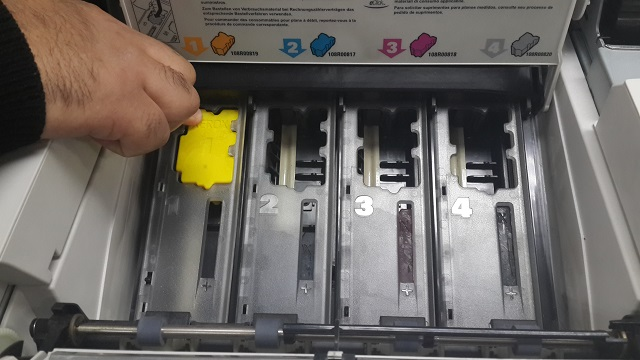
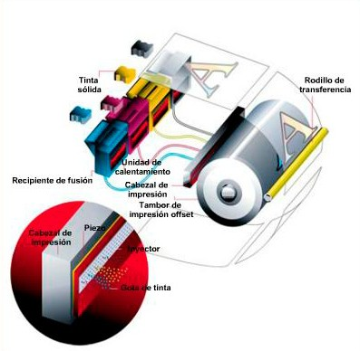
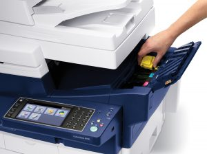

# Impresora de tinta sólida (solid ink)

###### brother HL-L3240CDW Laser LED Solid Ink

--- 

##### Historia :
1991 - Primera impresora comercial:

Tektronix lanzó la primera impresora de tinta sólida, la Phaser III. Esta impresora estaba dirigida principalmente a mercados profesionales y de oficina, gracias a su capacidad para producir impresiones de alta calidad en color.

##### Presente :

Tektronix continuó produciendo un par de modelos más a lo largo de la década de 1990 antes de que, en 2000, Xerox comprara la división de impresión de la empresa y, con ella, los derechos de la tecnología de tinta sólida.

---

## Que es una impresora de tinta sólida  ?

- Las impresoras de tinta sólida son un tipo de impresora que imprimen por transferencia termal utilizando barras sólidas de color.

- La tinta se calienta y alimenta una cabeza de impresión que, a su vez, distribuye la tinta en un tambor engrasado, por el cual pasa el papel y hace que la imagen se transfiera.

---

### Ventajas :
- El precio inicial y coste de las copias es similar al de las impresoras láser. Se utilizan como impresoras a color en las oficinas por la alta calidad a la hora de imprimir transparencias y otros medios no porosos y por su gran velocidad de impresión.

- La tinta no es tóxica, por lo que son más ecológicas que las impresoras de cartuchos de tinta y de tóner.
### Desventajas :
- Consumen mucha energía y hay que esperar a que se caliente la máquina para usarla

---

##### Pagína comercial :
https://www.amazon.es/HL-L3240CDW-L%C3%A1ser-LED-s%C3%B3lido-INK/dp/B0CJV67GT7

##### Pagína de interes :

https://www.consumoteca.com/electronica/impresora-de-tinta-solida/