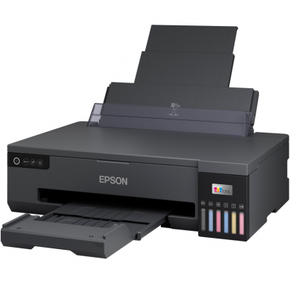
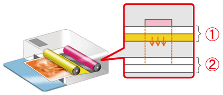

La impresora fotográfica dedicada, basada en tecnologías como inkjet (chorro de tinta) o sublimación de tinta, está diseñada para imprimir fotografías con calidad profesional. Estos dispositivos son utilizados por fotógrafos, estudios y usuarios domésticos que buscan resultados de alta calidad para álbumes, eventos o negocios de impresión instantánea.

Descripción:
Las impresoras fotográficas dedicadas como la Canon Selphy CP1300 (sublimación térmica) y modelos similares ofrecen impresión compacta y rápida, con funciones como conectividad inalámbrica, durabilidad de hasta 100 años de las impresiones en álbumes, y compatibilidad con aplicaciones móviles. Estas impresoras permiten tamaños desde tarjetas pequeñas hasta postales de 4x6 pulgadas.

Por otro lado, en tecnología de sublimación térmica, como la Citizen CX-02, se utiliza transferencia térmica para producir imágenes con gran estabilidad de color y resistencia a la decoloración, ideal para fotografía de eventos o kioscos fotográficos​
ARKIPLOT
​
FUJIFILM
​
CANON MÉXICO
.

Fecha de Invención:
La tecnología inkjet fue desarrollada comercialmente en los años 70, mientras que la sublimación térmica apareció en el mercado en las décadas de 1980 y 1990, adaptándose luego para impresión fotográfica.
Ventajas y Desventajas:
Ventajas:

Alta calidad fotográfica con colores vibrantes y precisión de detalles.
Modelos portátiles y fáciles de usar.
Durabilidad de las impresiones frente a la decoloración.
Compatibles con smartphones y cámaras para impresión instantánea.
Desventajas:

Costos elevados en consumibles (papel y tintas específicas).
Limitaciones en el tamaño máximo de impresión.
Velocidad de impresión relativamente lenta en algunos casos​
ARKIPLOT
​
FUJIFILM
​
CANON MÉXICO
.
Ejemplos Comerciales:
Canon Selphy CP1300 (impresora compacta de sublimación): Enlace a Canon​
CANON MÉXICO
.
Fujifilm ASK-400: Diseñada para negocios fotográficos, impresión rápida en pequeño formato Más detalles aquí​
FUJIFILM
.
Recursos Adicionales:
Diagramas y detalles técnicos suelen estar disponibles en los manuales de usuario proporcionados por los fabricantes, como Canon y Fujifilm.