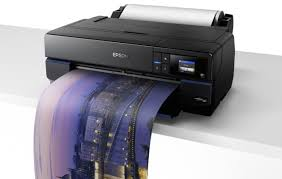

Impresora  Fotografica delicada

Tecnología
Método de impresión
Impresora de inyección de tinta de 6 colores
Configuración inyectores
180 Inyectores negro, 900 Inyectores por color
Tamaño máximo gota
1,5 pl
Impresión
Number of colours
6 colour
Velocidad de impresión ISO/IEC 24734
8 páginas/minuto Monocromo, 8 páginas/minuto Color
Velocidad de impresión
22 páginas/minuto Monocromo (Papel Normal 75 g/m²), 22 páginas/minuto Color (Papel Normal 75 g/m²), 25 segundos por foto de 10 x 15 cm (Epson Premium Glossy Photo Paper)

