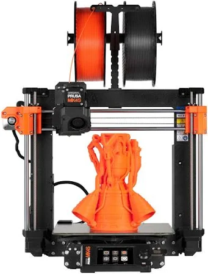

1. Referencia de internet a pagina de interes sobre esta impresora.
   2. Referencia a impresora comercial, p.e. enlace de amazon a una impresora de este tipo o pagina de fabricante.
   3. Imagen representativa de la impresora nombrar la imagen con el numero y el nombre de la impresora.
   4. Diagrama tecnico de la impresora.
   5. Descripción de la impresora.
   6. Fecha de invención (si es posible) sino fecha de aparición en el mercado sino fecha aproximada.
   7. Ventajas y desventajas.

   # Enlaces
   
   1: [Explicación breve de la impresión FDM](https://www.3dnatives.com/es/fdm-o-sla-impresion-3d-131220172/)
   2: [Enlace de Amazon a una impresora 3D FDM](https://www.amazon.es/Flashforge-Adventurer-5M-accionamiento-Desmontable/dp/B0CH9K2KWQ?source=ps-sl-shoppingads-lpcontext&ref_=fplfs&psc=1&smid=A2PEMQJE1RM53F&gQT=1)
   3: 

   # Diagrama

   4: 

   # Descripción

   5: Depositan filamento fundido que luego se endurece para formar figuras en 3D. Son las más conocidas.

   # Fecha de invención/patente/salida al mercado
   6: 1988

   # Ventajas y desventajas

   **Ventajas:** precisas, capacidad 3D, gran soporte de la comunidad.
   
   **Desventajas:** caras, lentas, difíciles de mantener, requieren conocimiento de programas complejos para operarse (Blender, etc.)

