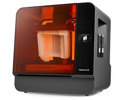
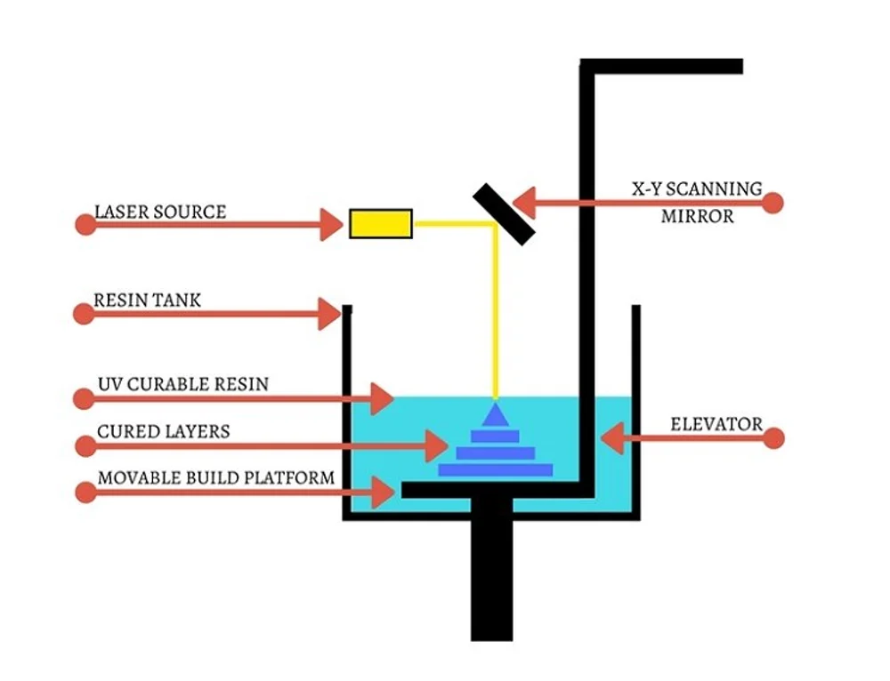

### Impresora 3D SLA (Estereolitografía)

*[Pagina de Interes](https://erycop.com/estereolitografia-sla/)*

*[Pagina Comercial](https://www.prusa3d.com/es/producto/prusa-core-one/?country=ES&currency=eur&utm_source=google&utm_medium=cpc&utm_campaign=ES-ES_Search_Shopping_Brand&utm_id=20686082374&gad_source=1&gclid=CjwKCAiA6t-6BhA3EiwAltRFGEu42qE9G-TCusp1OCxWNhBpkqut6lOybEvkGVYSZKXktDea_MVXSRoC1q4QAvD_BwE)*

## Descripción:

La estereolitografía es un proceso de impresión 3D por «polimerización en tanque»: se vierte una resina líquida y fotosensible en un contenedor (o tanque) y la luz UV interactúa con la resina para polimerizarla (endurecerla o solidificarla) 
de forma selectiva.

## Año de Invención:
La estereolitografía (SLA) es la primera tecnología de impresión 3D comercializada, creada por Chuck Hull, cofundador y director de Tecnología de 3D Systems, en 1980. Utiliza un láser ultravioleta para curar con precisión secciones transversales de fotopolímeros, convirtiéndolos de líquidos en sólidos.

## Ventajas

 ### 1. Velocidad: 
   una de las principales ventajas del proceso es que, dependiendo de la pieza que necesites, es su velocidad, ya que el curado es rápido.  El tiempo exacto que tardará dependerá del tamaño, la complejidad y el grosor de las capas de la pieza.  Después de cargar tu CAD, te podemos enviar las piezas en tan solo un día. Esto también lo hace ideal para generar fijaciones de herramientas, que a veces pueden ser una idea tardía y pilla por sorpresa a los ingenieros de fabricación.  El SLA puede ayudar a superar estos descuidos con la creación rápida de accesorios y fijaciones.

### 2. Rentable: 
también puede ser un proceso muy rentable para desarrollar modelos de bajo coste pero precisos.  Esto lo hace ideal para prototipos cosméticos que te ayuden a detectar fallos de diseño antes de pasar a la creación de prototipos más costosos o a la fabricación final.  Para los proyectos adecuados, sobre todo del sector médico, también es una buena opción para la fabricación de tiradas cortas de piezas y permite obtener plazos de entrega rápidos.

### 3. Precisión: 
el SLA es famoso por fabricar piezas extremadamente lisas que pueden incluso rivalizar con el moldeo por inyección.  Se consiguen tolerancias extremadamente buenas para las características de hasta +/- 0,05 mm en los ejes X e Y y de 0,13 mm en el eje Z.  Y con los nuevos materiales, como nuestros propios MicroFineTM Green and Grey, se pueden conseguir piezas de micro resolución, quizás para productos de medicina o de electrónica de consumo.

### 4. El escalado es sencillo

Aunque el tiempo que se tarda en fabricar una pieza puede depender de su tamaño y existen limitaciones de tamaño máximo, es fácil escalar una pieza, ya que el proceso se basa en el CAD.

### 5. Ensamblajes a presión

Al poder tomar los modelos directamente del CAD, se pueden crear montajes basados en muchos componentes que se pueden encajar para formar una pieza más grande.  Esto permite comprobar el ensamblaje y, si hay que hacer modificaciones, cambiar o reimprimir rápidamente el diseño, por lo que es ideal para las pruebas de forma y ajuste.

## Desventajas

### Elección del material

Debido a la naturaleza del curado, para la estereolitografía solo hay un número limitado de materiales.  Además, como ya te habrás dado cuenta, al utilizar un láser UV para curar la resina, las piezas son fotosensibles, por lo que no son adecuadas para aplicaciones de exterior.

Esto también podría afectar a otras características de tus prototipos o piezas.  En otros procesos de impresión 3D, como el sinterizado selectivo por láser, se puede utilizar una gama más amplia de resinas  técnicas que, por lo general, serán más duraderas para fabricara piezas más resistentes. Y lo mismo ocurre con otras características, por lo que si necesitas una mayor resistencia al calor y química, puede que para ti sea más adecuado otro material que utilice una tecnología diferente.
