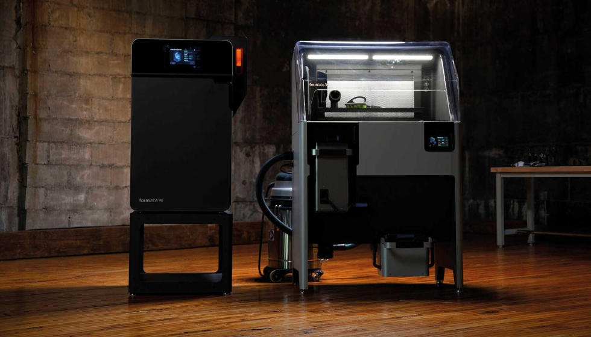
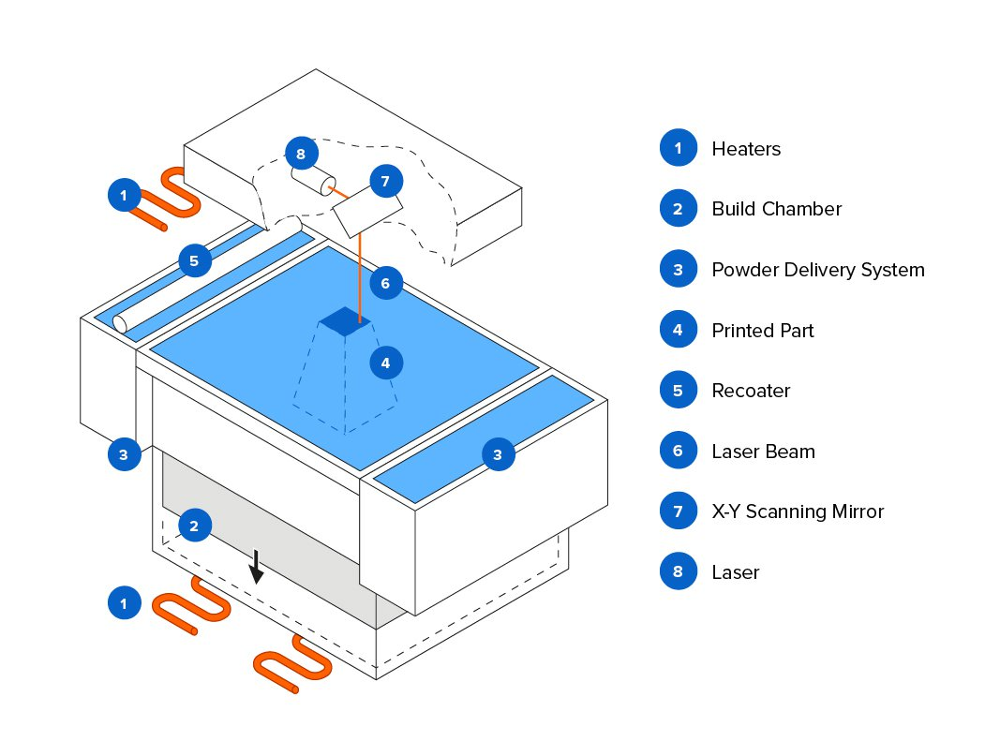

# 🖨️ Impresora 3D SLS (Sinterizado Selectivo por Láser)

## 🌐 Referencia de Interés
- [Guía Técnica de Impresión SLS](https://formlabs.com/es/blog/que-es-sinterizado-selectivo-laser/?srsltid=AfmBOorwTcVJo_wbDQWF5PEoU2M7WIEjCo5BXiGRe2GN7iBwA2Cik4JB)

## 🛒 Referencia Comercial
- [Impresora EOS P 396 en Página del Fabricante](https://it3d.com/tienda/colido-x3045/?gad_source=1&gclid=CjwKCAiAjeW6BhBAEiwAdKltMtY8AM46JIyE_jJLeaISA98nFkkutck5PmIW4IZu9iwsTC152HSkFhoCMYwQAvD_BwE)

## 🖼️ Imagen Representativa
Impresora SLS

## 📐 Diagrama Técnico
Diagrama Técnico Impresora SLS 

## 📝 Descripción
La impresora 3D SLS (Sinterizado Selectivo por Láser) es una tecnología de fabricación aditiva que utiliza un láser de alta potencia para fundir selectivamente partículas de polvo, generalmente de materiales como nylon, metal, vidrio o cerámica. El láser sinteriza las partículas de polvo punto por punto, capa por capa, creando objetos tridimensionales complejos sin necesidad de estructuras de soporte.

## 📅 Fecha de Invención
- 🕰️ Invención: 1987 por Dr. Carl Deckard en la Universidad de Texas
- 📜 Patente: 1989
- 🚀 Comercialización masiva: Década de 2000

## 📊 Ventajas y Desventajas

### 👍 Ventajas
- Alta libertad de diseño geométrico 🔷
- Capacidad de producir piezas con geometrías complejas 🧩
- No requiere estructuras de soporte 🏗️
- Amplia variedad de materiales utilizables 🌈
- Excelente resistencia mecánica de las piezas 💪
- Ideal para prototipado rápido y producción de series cortas 🚀

### 👎 Desventajas
- Costo elevado de equipamiento 💸
- Alto consumo de energía ⚡
- Acabado superficial menos suave 📉
- Proceso más lento comparado con otras tecnologías 🐌
- Requiere post-procesamiento para mejorar acabado 🔧
- Manejo de polvo requiere precauciones de seguridad 🚨
- Limitaciones en tamaño de impresión 📏