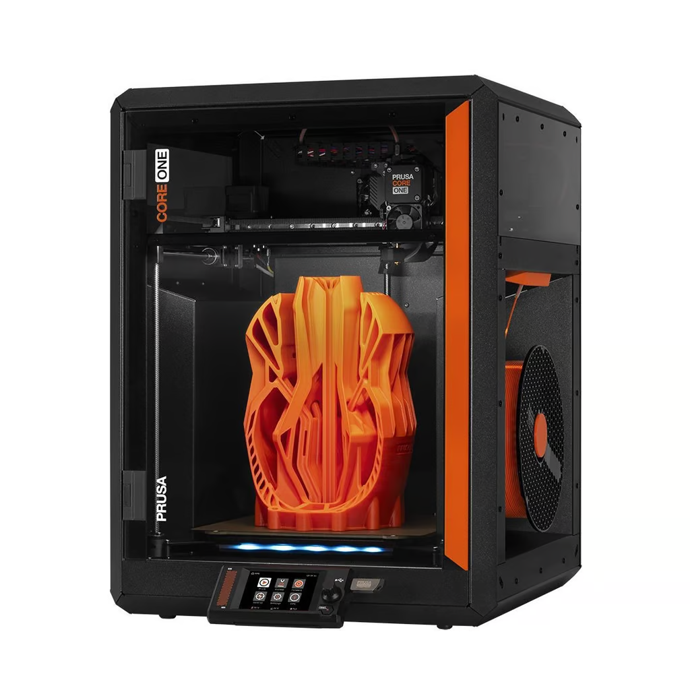
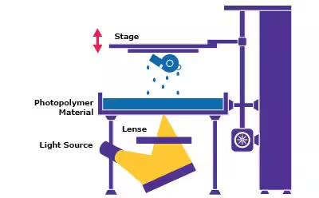
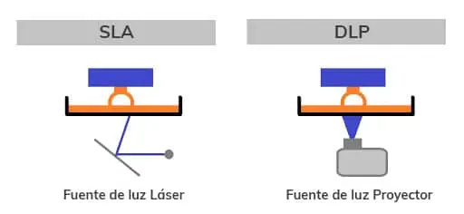
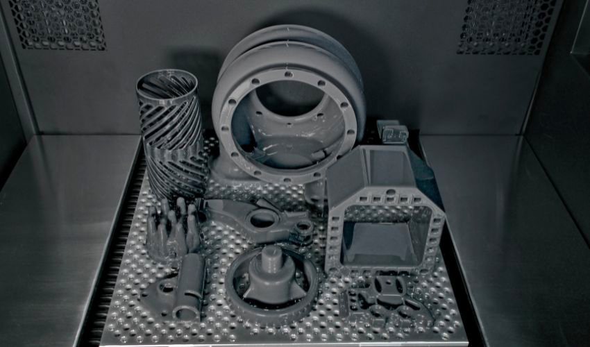

# Impresora 3D DLP (Procesamiento Digital de Luz)

###### Prusa CORE One

---
## ¿Qué es el procesamiento digital de luz (DLP)?

El DLP (procesamiento digital de luz) es una tecnología de impresión 3D utilizada para producir de forma rápida piezas de fotopolímero. Es muy similar a la SLA con una diferencia significativa: mientras que las máquinas de SLA utilizan un láser que traza una capa, una máquina de DLP utiliza una fuente de luz proyectada para curar toda la capa a la vez. La pieza se forma capa a capa.

 - #### para que se utilizan :
   - a impresión DLP puede utilizarse para imprimir artículos con diseños de resina extremadamente intrincados, como juguetes, moldes de joyería, moldes dentales, estatuillas y otros objetos con detalles finos. Al curar toda la capa a la vez, es mucho más rápida que la SLA.  

---

## Historia de la impresión DLP :

Aunque la primera descripción de una impresora 3D fue publicada en 1964 por el autor de ciencia ficción Arthur C. Clarke, no fue hasta 1987 cuando se desarrolló el proceso de estereolitografía o SLA. Poco después le siguió la impresión DLP, que a menudo se compara con la impresión SLA. El procesamiento digital de luz se desarrolló originalmente en 1987.

---

## Ventajas e inconvenientes del DLP (procesamiento digital de la luz)

La tecnología DLP es popular por su alta velocidad de impresión, aunque en el proceso se sacrifica la precisión. Solo utiliza fotopolímeros, que suelen emitir olores que pueden ser problemáticos en un entorno de oficina.

##### Pagína comercial :
https://www.prusa3d.com/es/producto/prusa-core-one/?country=ES&currency=eur&utm_source=google&utm_medium=cpc&utm_campaign=ES-ES_Search_Shopping_Brand&utm_id=20686082374&gad_source=1&gclid=CjwKCAiA6t-6BhA3EiwAltRFGDVO-tYCwteztHO_lPsxtlanCwC8xq3-3AR_J_Nb6sWFEFM_kjoXWhoCoiIQAvD_BwE

##### Pagína de interes :
https://markforged.com/es/resources/learn/3d-printing-basics/3d-printing-processes/what-is-digital-light-processing-dlp
