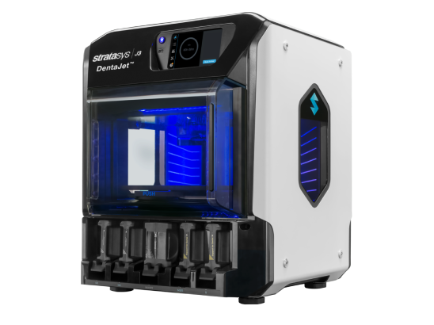
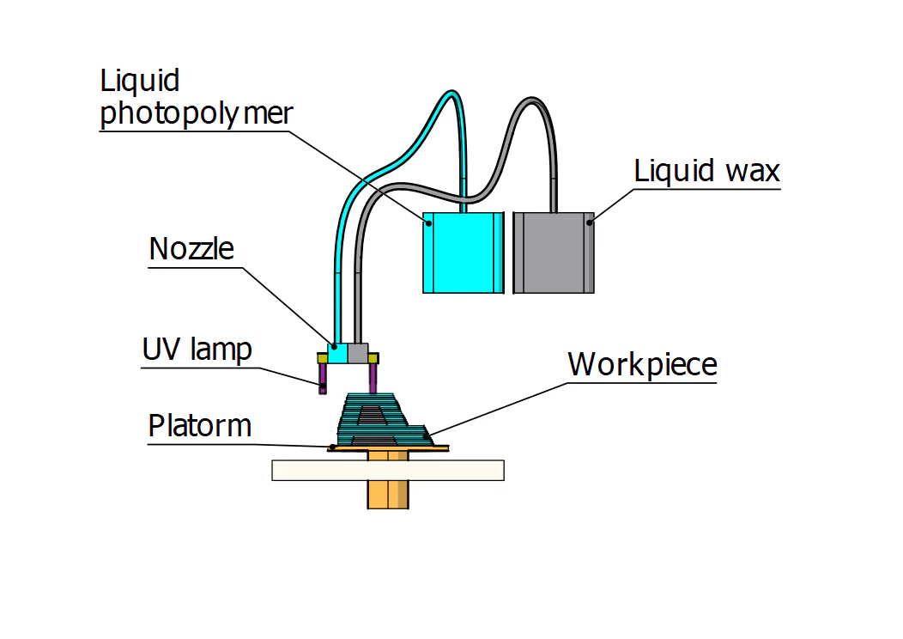

# Impresora 3D PolyJet

*[Página de interés](https://xometry.pro/es/articulos/impresion-3d-polyjet-tecnologia/)*

*[Comercial](https://www.machineseeker.es/stratasys-objet260+connex3/i-15145918?srsltid=AfmBOorGAQW_On9YmQ9DFFnxfPPvN5FT5rcsn3hyrKvJtxKoJpH6QQLYDbg)*

## Descripción

La impresión 3D PolyJet es una tecnología avanzada que crea rápidamente piezas precisas utilizando fotopolímeros, luz UV y cabezales de inyección de tinta. Logra precisión mediante capas de resinas para formar materiales digitales. El proceso comienza con un modelo CAD transformado en un formato imprimible.

## Diagrama Técnico

## Fecha de lanzamiento

 La tecnología PolyJet se introdujo por primera vez en el año 2000 con el lanzamiento de la impresora 3D Quadra.

## Ventajas y desventajas 

### Ventajas

1. Producción de lotes fácil y rápida

2. Excelente precisión dimensional y resolución

3. Menos desperdicio de material

### Desventajas 

1. Tecnología cara

2. Uso de estructuras de soporte

3. Materiales limitados para imprimir