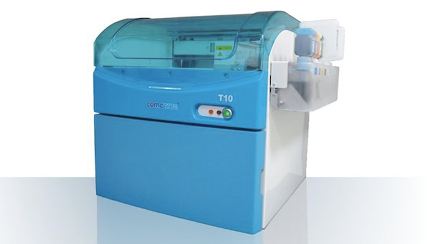
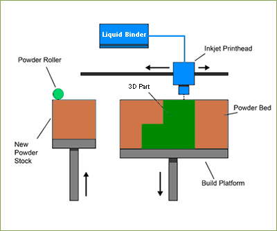

# Impresora 3D Blinder Jetting
## Referencia de interés
[Binder Jetting, la tecnología de impresión 3D que está transformando los métodos de producción](https://www.3dnatives.com/es/binder-jetting-desktop-metal-181120222/#!)
### Referencia Comercial
[Inyección de aglutinante](https://www.youtube.com/watch?v=9-S_KamGPlI)
#### Imagen representativa de la Blinder Jetting

##### Diagrama técnico

###### Descripción y fecha de invención
Las impresoras 3D binder jetting usan un agente aglutinante líquido para fusionar capas de polvo de metal, cerámica, piedra, madera u otros materiales, logrando piezas complejas con rapidez y precisión.
Esta tecnología se inventó en 1993 en el MIT, inicialmente para trabajar con cerámica

###### Ventajas y desventajas de la Blinder Jetting
Las máquinas BJ ofrecen varias ventajas, como rentabilidad, tiempo de respuesta rápido y alta resolución. Sin embargo, también tienen varios inconvenientes, como una selección limitada de materiales, requisitos de posprocesamiento y un control de tolerancia limitado.

[:arrow_left: Volver](../Impresoras.md)