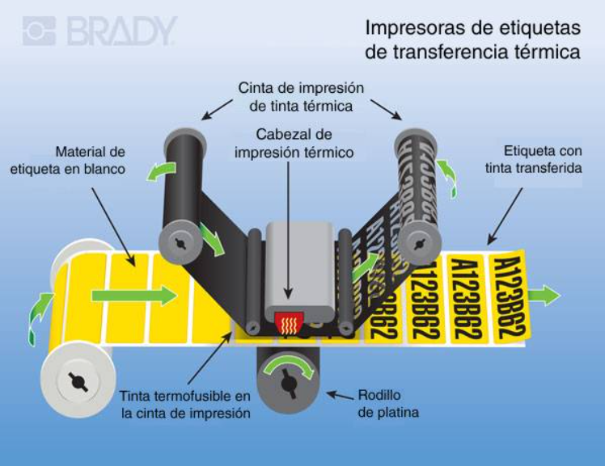
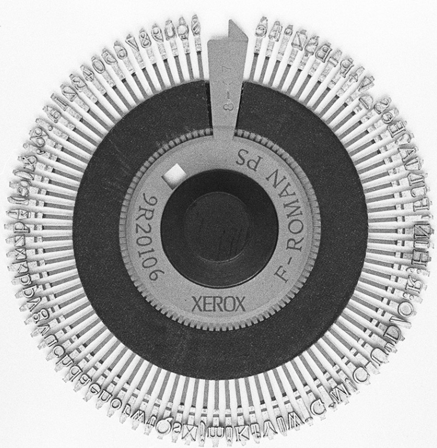
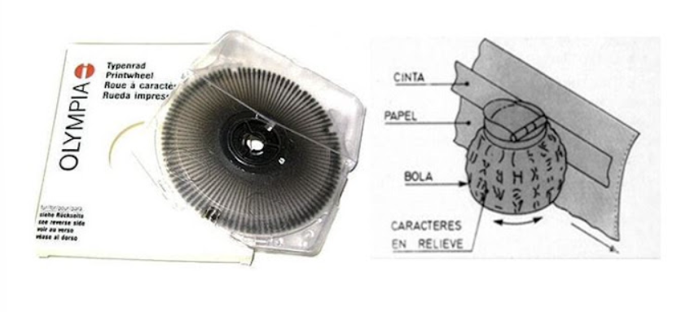

# Documentación de Tipos de Impresoras

## Lista de Impresoras

- ### Impresora de margarita (Daisy Wheel)

- ### Impresora térmica directa

- ### Impresora doméstica (generalmente inkjet)

- ### Impresora fotográfica profesional (alta calidad, inkjet o sublimación)

- ### Plotter (para planos, diseños CAD y gran formato).

# **Introduciré:**

## Presentaré cinco modelos.

# 1 La impresora térmica

 - La impresora térmica directa es un tipo de impresora que utiliza calor para producir imágenes o texto en papel sensible al calor, como el papel térmico. Se emplea comúnmente en aplicaciones como recibos, etiquetas y boletos, ya que es rápida y económica. Sin embargo, la impresión no es permanente, ya que el papel puede desvanecerse con el tiempo o bajo condiciones de calor.
 
 - [Impresora térmica directa](https://www.rajapack.es/maquinas-sistemas-embalaje/impresoras-termicas-rotuladoras-dymo/impresora-termica-directa_skuIZD420D.html?priceVAT=true&utm_campaign=GA_PLA_GEN_Medium)
- [una empesa comercial.](https://satpcs.com/soporte-tecnico-online/impresoras-pos/index.html)

- [referencia a un diagrama técnico.](https://satpcs.com/soporte-tecnico-online/impresoras-pos/index.html)

## Fecha de invención/aparición 
- ### The first known use of thermal printer was in 1966

## Ventajas

-  ### Los costes por copia son muy bajos porque no consume más que el propio papel

## Desventajas 

- La impresión térmica solamente posibilita la impresión en monocromo color negro, y únicamente en los modelos más recientes mediante un papel especial adicionalmente en rojo o azul.
La velocidad de impresión oscila habitualmente entre 100 y 206 mm/s.
La durabilidad de la impresión es relativamente baja porque el desgaste del papel, en particular en ambientes con temperaturas altas, hace que se borre el texto escrito en el mismo y huelen fatal al ser quemados

## Referencias

[link Referencias]( http://www.merriam-webster.com/dictionary/thermal%20printer). 

# 2 Impresora de margarita (Daisy Wheel)
 
 -  **Impresora de margarita** (Daisy Wheel) un tipo de impresora que produce texto de alta calidad, a veces conocida como impresora de calidad de carta (letter-quality printer) - en contraste con las impresoras matriciales de alta calidad, que imprimen con "casi calidad de carta" (near letter quality, NLQ). Había también, y aún existen, máquinas de escribir basadas en el mismo principio.

- [Impresora de margarita (Daisy Wheel)](https://impresoras-adgs.blogspot.com/2015/10/impresoras-de-impacto.html)

- [una empesa comercial.](https://www.mediamarkt.es/es/product/_Impresora%20multifunci%C3%B3n%20-%20HP%20DeskJet%202821e,%20Wi-Fi%C2%AE,%20USB,%20Color,%20Copia,%20Esc%C3%A1ner,%20Recuperaci%C3%B3n%20autom%C3%A1tica,%20HP%20+,%20Blanco-1564820.html?gad_source=1&gclid=Cj0KCQiAsOq6BhDuARIsAGQ4-zjLQOLkkW4MzhTujlmwWg4yV5_AqTiC9EC3s63GDV3HlWDLIWBBc2MaAmz2EALw_wcB&gclsrc=aw.ds&utm_campaign=rt_shopping_generic_sp_na_MMHP-ES-S-G-CAT-PLA-PMAX-INFORMATICA.LASER&TANK-HP&utm_medium=cpc&utm_source=google)

- [referencia a un diagrama técnico.](https://es.slideshare.net/slideshow/impresoras-by-guillamet-bardi/10085458)

- **1.photo**

- **2.photo**

 

