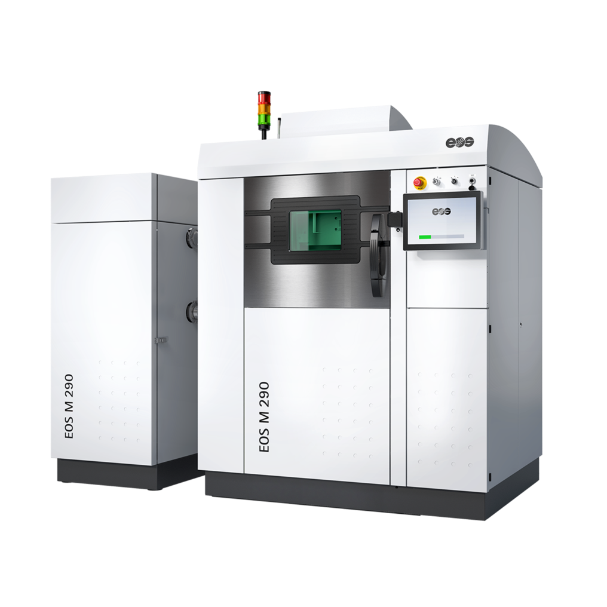
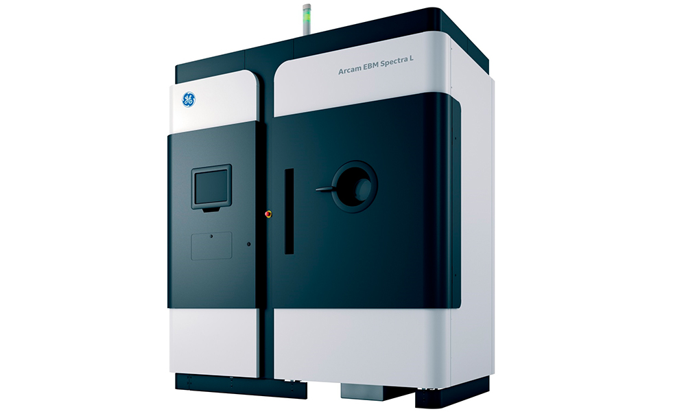
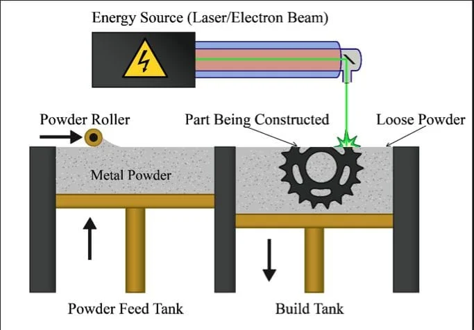
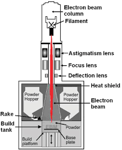

# Impresora 3D Metálica (DMLS, EBM) 
La impresión 3D metálica se basa en la fabricación aditiva, un método que permite construir objetos capa por capa utilizando polvos metálicos y fuentes de energía específicas. Dos de las tecnologías más destacadas en este campo son la Sinterización Directa de Metales por Láser (DMLS) y la Fusión por Haz de Electrones (EBM). Ambas técnicas ofrecen alta precisión, resistencia y son ideales para sectores como el aeroespacial y la medicina. A continuación, se profundiza en sus características y diferencias.

Para más detalles sobre las tecnologías DMLS y EBM, visita la guía de impresión metálica en [EOS](https://www.eos.info/) y el sitio especializado 3Dnatives.

Un ejemplo destacado de tecnología DMLS es la EOS M 290, utilizada ampliamente en la fabricación de piezas metálicas.

 Para la tecnología EBM, destaca la Arcam EBM Spectra L. 

Puedes encontrar más información en sus páginas oficiales:

[EOS M 290](https://www.eos.info/)
[Arcam EBM Spectra L](https://www.3dmaquinser.com/productos/spectra-l/)

### Diagrama Técnico

*Diagrama técnico de una impresora DMLS*

*Diagrama técnico de una impresora EBM*

### Descripción

#### DMLS (Direct Metal Laser Sintering):
Este método utiliza un láser de alta potencia para fusionar selectivamente capas de polvo metálico en una cámara cerrada. Ideal para crear piezas con alta precisión y densidad, es ampliamente usado en la industria aeroespacial y médica para fabricar componentes personalizados y complejos. 

***Patentada en los años 90 por EOS.***

#### EBM (Electron Beam Melting):
En este proceso, un haz de electrones funde polvo metálico en una cámara de vacío. La tecnología EBM es particularmente útil para materiales resistentes como el titanio y se utiliza en aplicaciones que requieren piezas de alto rendimiento mecánico.

***Introducida comercialmente por Arcam en 1997​***

 

## Ventajas y Desventajas
##### ***DMLS:***
- **Ventajas:**
    - Alta resolución y precisión geométrica.
    - Aplicable a una amplia gama de aleaciones metálicas.
- **Desventajas:**
    - Requiere soportes para estructuras complejas.
    - Necesita una atmósfera controlada de gas inerte.
##### ***EBM:***
- **Ventajas:**
    - Excelente para materiales de alto punto de fusión.
    - Proceso más rápido para piezas grandes.
- **Desventajas:**
    - Limitado a ciertos metales (como titanio).
    - Requiere un entorno de vacío completo, lo que incrementa los costos.
---
[⬅️ Volver al inicio](#impresora-3d-metálica-dmls-ebm)
