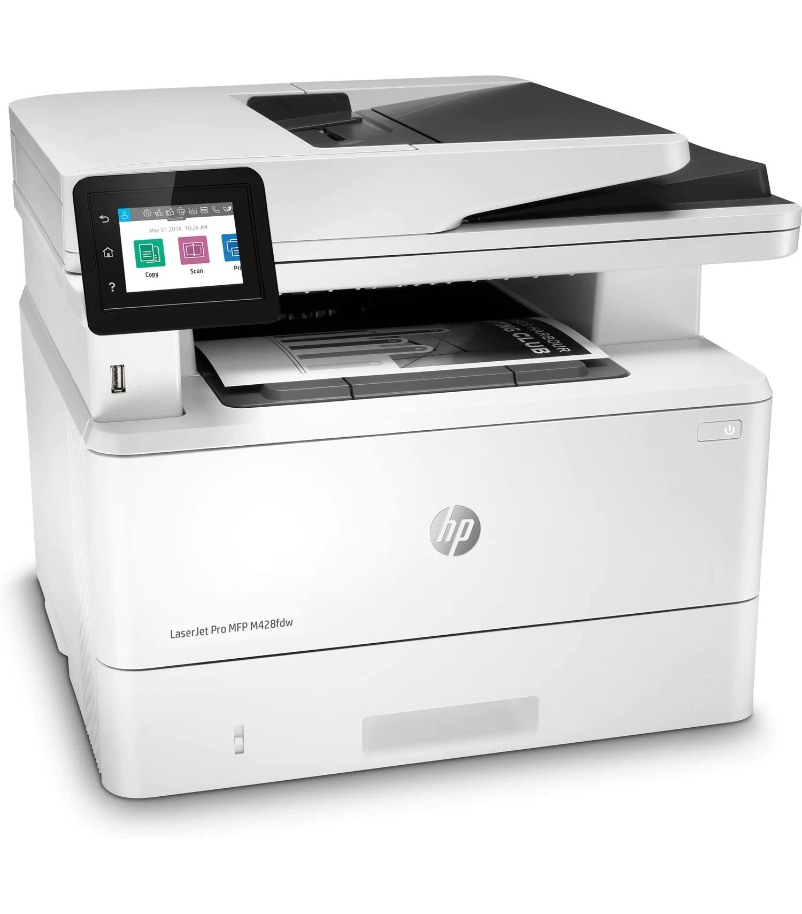
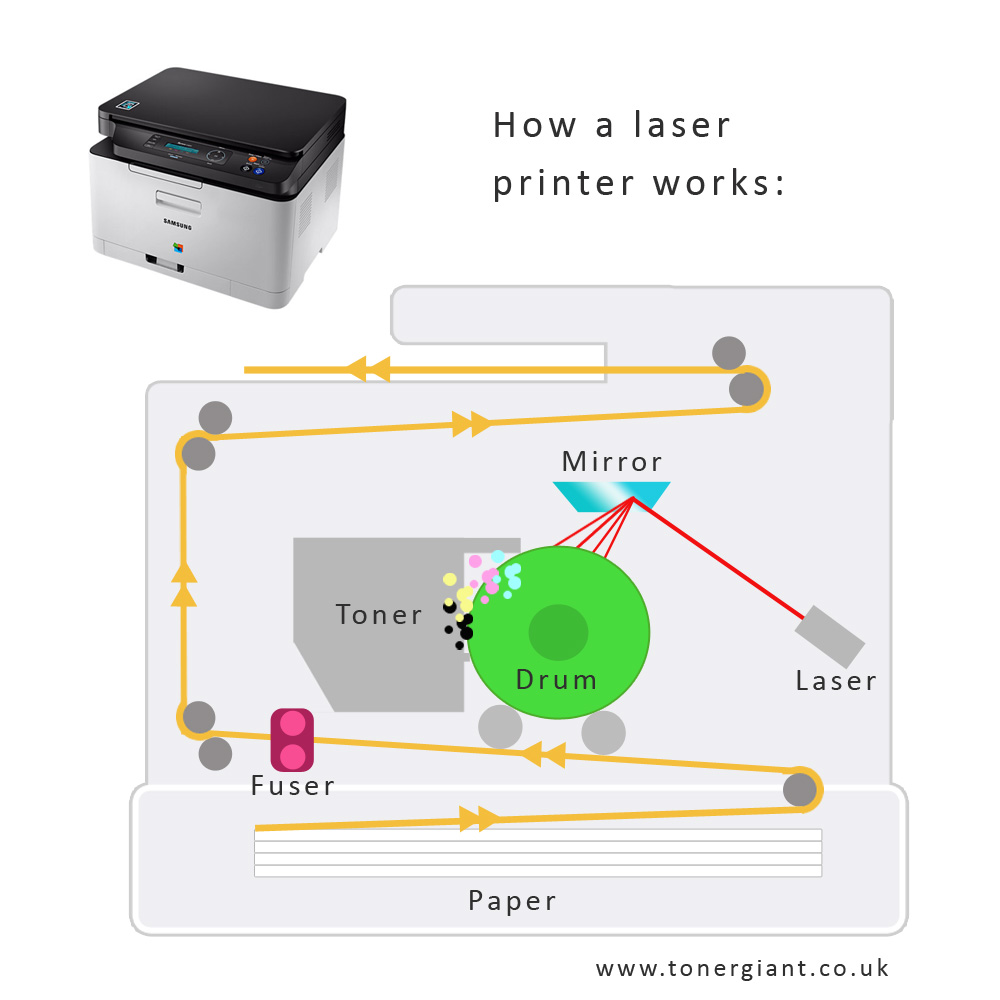

# Impresora de oficina o empresarial (láser, multifunción)

Las impresoras láser multifunción son una herramienta esencial en oficinas y entornos empresariales por su capacidad para combinar funciones como impresión, escaneo, copiado y, en algunos casos, fax. Estas impresoras se destacan por su rapidez, fiabilidad y costos operativos bajos, lo que las convierte en la opción preferida para el trabajo diario en oficinas.

Para obtener más información sobre impresoras láser multifunción y sus características, puedes visitar [PCMag](https://www.pcmag.com/) o [HP](https://www.hp.com/) para una guía detallada de sus productos.

Un ejemplo destacado es la HP LaserJet Pro MFP M428fdw, una impresora láser multifunción de alto rendimiento diseñada para empresas pequeñas y medianas. Más detalles y opciones de compra están disponibles en su [página oficial](https://www.hp.com/).

## Diagrama Técnico

### Descripción

La impresora láser multifunción combina varias funcionalidades en un solo dispositivo: impresión, escaneo, copiado y, a veces, envío de faxes. Funciona utilizando un láser que carga eléctricamente un tambor para atraer el tóner, que luego se transfiere al papel y se fija mediante calor. Es ideal para entornos de oficina gracias a su rapidez, calidad de impresión profesional y capacidad para manejar grandes volúmenes de trabajo.

Las impresoras láser fueron inventadas por Gary Starkweather en 1969 mientras trabajaba en Xerox, con el primer modelo comercial lanzado en 1977. Las versiones multifunción comenzaron a popularizarse a finales de los años 90.

### Ventajas y desventajas
- ***Ventajas:***
    - Alta velocidad de impresión.
    - Costos operativos bajos por página.
    - Multifuncionalidad en un solo dispositivo.
    - Excelente calidad de impresión, especialmente para textos.
- ***Desventajas:***
    - Mayor costo inicial en comparación con impresoras de inyección de tinta.
    - No ideal para impresiones de alta calidad en color o fotografías.
    - Requiere más espacio en oficinas pequeñas.
  ---
 [⬅️ Volver al inicio](#impresora-de-oficina-o-empresarial-láser-multifunción)