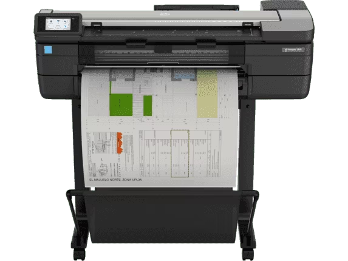
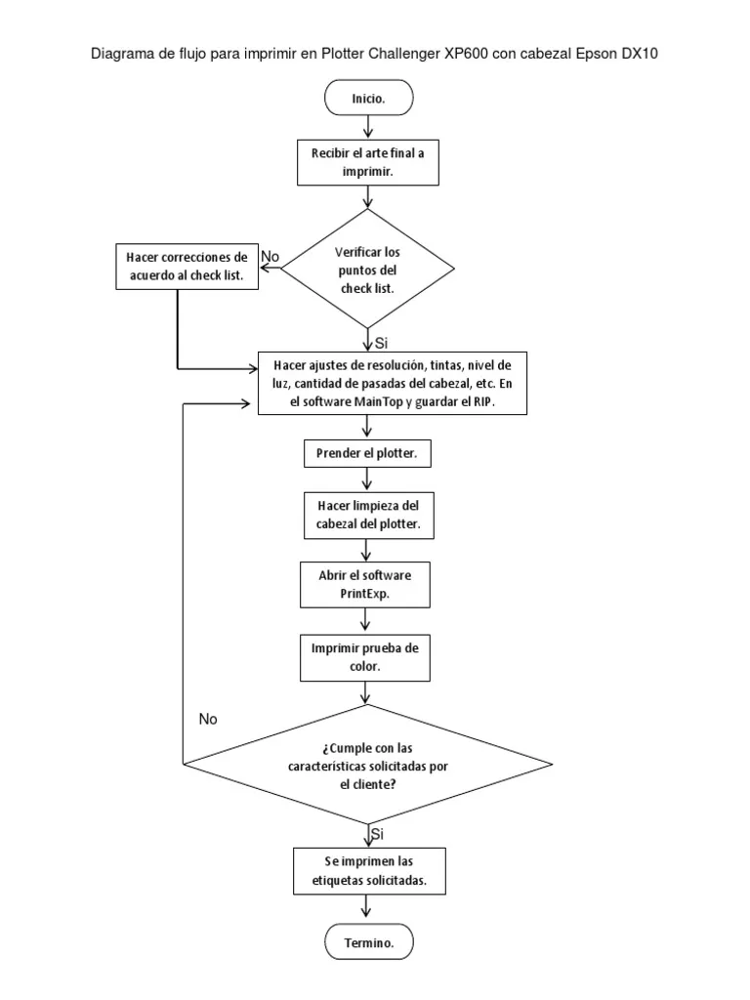

# Impresora industrial/comercial de gran formato (plotter)
## Referencia de interés
[Impresoras de gran formato](https://www.ricoh.es/productos/impresoras-de-produccion/impresoras-gran-formato/)
### Referencia Comercial
[Para arquitectos, ingenieros, profesionales de construcción y SIG](https://www.hp.com/es-es/printers/large-format/designjet-technical-plotters.html)
#### Imagen representativa de un Plotter

##### Diagrama técnico

###### Descripción y fecha de invención
Un plotter de impresión, también llamado impresora de gran formato, se utiliza para imprimir desde un plano hasta una fotografía de gran tamaño, pasando por cartelería y rotulación de todo tipo.
El primer Plotter fue inventado en 1953 por Remington-Rand. Se utilizó junto con la computadora UNIVAC para crear dibujos técnicos. En la década de 1970, los Plotters eran el único medio para reproducir imágenes de alta resolución desde computadoras.
###### Ventajas y desventajas de un Plotter
Ventajas 
Pueden trabajar en hojas de papel muy grandes manteniendo una alta resolución.
Pueden imprimir en una amplia variedad de materiales planos, incluidos madera contrachapada, aluminio, chapa de acero, cartón y plástico.
Permiten dibujar el mismo patrón miles de veces sin degradación de la imagen.

Desventajas 
Son bastante grandes en comparación con una impresora tradicional.
Son mucho más costosos que una impresora tradicional.