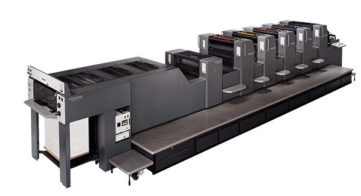
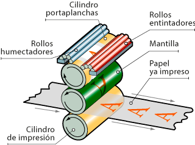

# Impresora offset digital (industrial)

*[Página de interés](https://tecnographic.net/impresion-digital-offset-que-es/#elementor-toc__heading-anchor-2)*

*[Comercial](https://www.exapro.es/man-roland-304-p240304214/)*

## Descripción

La impresión digital offset es un proceso avanzado utilizado en el sector de las artes gráficas que combina elementos de la impresión offset y la impresión digital. Se basa en el uso de una plancha y una mantilla adaptadas a una prensa de impresión para reproducir imágenes en diferentes soportes.

## Diagrama Técnico

## Fecha de Lanzamiento

La impresión digital comenzaró a utilizarse a principios de la década de 1990. La idea de crear una prensa de impresión digital comenzó con el desarrollo de la computadora.

## Ventajas y Desventajas 

### Ventajas

1. Alta calidad de impresión

2. Gran variedad de materiales

3. Economía en tirajes pequeños

### Desventajas 

1. Costo por unidad

2. Calidad fotográfica

3. Limitaciones de tipos de papel