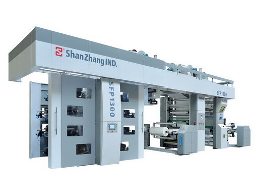
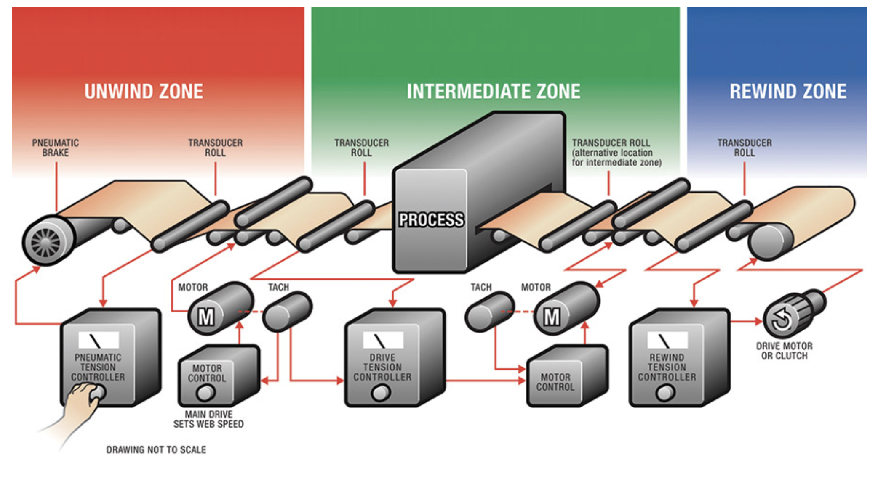

# Impresora de flexografía digital (industrial)
## Referencia de interés
[Flexografía digital: ¡El Boom!](https://www.elempaque.com/es/noticias/flexografia-digital-el-boom)
### Referencia Comercial
[ASTERFLEX-HD – Impresora flexográfica](https://www.bobst.com/ptes/productos/post-impresion-flexografica/impresoras-flexograficas/descripcion-general/machine/masterflex-hd/)
#### Imagen representativa de la impresora de flexografía digital

##### Diagrama técnico

###### Descripción y fecha de invención
La flexografía es un sistema de impresión directo (la plancha transfiere directamente la tinta al soporte) y principalmente rotativo (con rodillos y material en bobinas de distintos tamaños) en el cual se emplean planchas flexibles con altos relieves y una estructura formada principalmente por rodillos.
La historia de la flexografía se remonta en 1890 cuando se patentó en Liverpool la primera prensa y se empleaba tinta a base de agua, lo que hacía que se difuminara fácilmente. A principios del siglo XIX se desarrollaron otras pensas con planchas de goma y tinta a base de aceite de anilina.
###### Ventajas y desventajas
Ventajas 
Velocidad: Esta rapidez de impresión resulta particularmente útil para proyectos de impresión a gran escala, como el embalaje de productos.
Versatilidad: Puede utilizarse en una amplia gama de sustratos. Ello la convierte en una opción ideal para diferentes tipos de proyectos.
Eficiencia económica: Debido a la rapidez con que se puede realizar la impresión flexográfica, los costos de producción suelen ser más bajos que los de otros métodos.
Desventajas 
Costo inicial de los fotopolímeros: A pesar de que las placas de impresión flexográfica pueden ser más baratas que las de otros métodos, los costos pueden acumularse si se necesitan varias para un solo proyecto.
Limitación en la calidad de la impresión: Aunque la impresión flexográfica puede producir impresiones de alta calidad, no puede igualar la precisión y el detalle de otros métodos de impresión, como la impresión offset o la impresión digital.
Puede no ser el método más sustentable (en comparación con otros métodos de impresión): Las tintas que se utilizan en la impresión flexográfica pueden contener disolventes volátiles. Estos pueden ser perjudiciales para el medio ambiente si no se manipulan de forma responsable. Sin embargo, la incorporación de tintas a base de agua ha disminuído este riesgo en forma considerable.