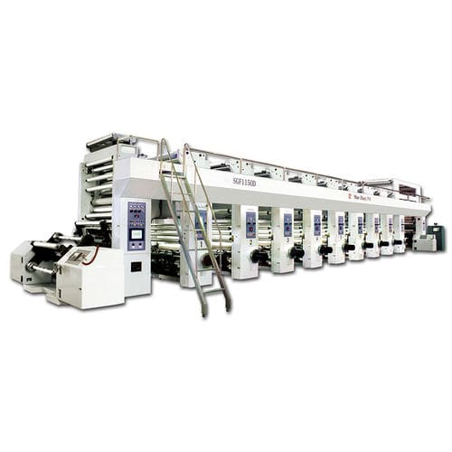
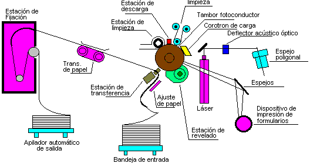

# Impresora de Rotograbado Digital (Industrial)

## 1. Referencia de Internet
- [Tecnología de rotograbado digital - Wikipedia](https://es.wikipedia.org/wiki/Rotograbado)
- [Impresoras de rotograbado industrial - BOBST](https://www.bobst.com/rotogravure-printing/)

## 2. Referencia a Impresora Comercial
- [Impresora BOBST RS 5002 - Página del fabricante](https://www.bobst.com/products/rotogravure-printing/rs-5002/)
- [Ejemplo de impresoras industriales de rotograbado - Amazon](https://www.amazon.com/industrial-rotogravure-printer)

## 3. Imagen Representativa

## 4. Diagrama Técnico

## 5. Descripción
La **impresora de rotograbado digital** es una solución industrial avanzada que utiliza cilindros grabados para transferir tinta directamente al material a imprimir. Es ampliamente utilizada en la producción de envases, etiquetas y revistas de alta calidad. 

En las versiones digitales, se combina la tecnología tradicional de rotograbado con sistemas de control informatizados, lo que permite mayor precisión y flexibilidad en la producción. Estas impresoras son ideales para tiradas largas debido a su velocidad y capacidad para manejar materiales como plástico, papel y aluminio.

## 6. Fecha de Invención
El rotograbado se desarrolló en el **siglo XIX**, mientras que las versiones digitales comenzaron a aparecer a finales del **siglo XX**.

## 7. Ventajas y Desventajas
### Ventajas
- Alta calidad y detalle en la impresión.
- Ideal para tiradas largas y materiales industriales.
- Capacidad de impresión a alta velocidad.
- Compatible con una amplia variedad de sustratos.

### Desventajas
- Coste inicial elevado debido a la complejidad de los equipos.
- Requiere personal especializado para su operación.
- No es eficiente para tiradas cortas debido a los tiempos de preparación.