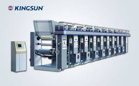
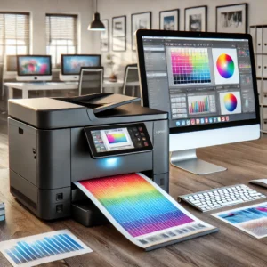
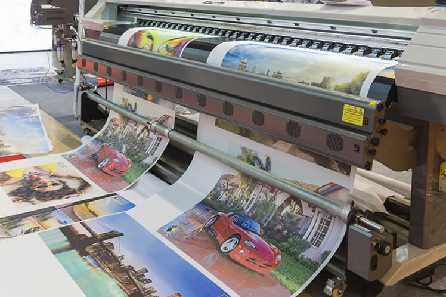

# impresora de rotograbado digital

Lugar de origen:
China
Nombre de la marca:
PRINTYOUNG
Certificación:
CE
Número de modelo:
HPRT-A
Cantidad de orden mínima:
1 fijado/sistemas
Precio:
Negociable
Detalles de empaquetado:
Embalado en cartón en primer lugar, y después reforzado con la caja de madera para el embalaje exter
Tiempo de entrega:
30 días laborables después de recibieron su pago
Condiciones de pago:
T / T o Western Union
Capacidad de la fuente:
30 conjuntos por mes

Existen varios tipos de impresión digital, cada uno con sus propias características y aplicaciones:

Impresión de inyección de tinta (Inkjet): Utiliza pequeñas gotas de tinta proyectadas sobre el papel. Es ideal para tiradas cortas y trabajos que requieren una gran precisión en los detalles y colores vivos.
Impresión láser: Utiliza un láser para formar una imagen cargada electrostáticamente en un tambor, que luego atrae y transfiere el tóner al papel. Es eficiente para impresiones rápidas y volúmenes moderados.
Impresión LED: Similar a la impresión láser, pero utiliza diodos emisores de luz en lugar de un láser. Es conocida por su durabilidad y calidad constante.
Impresión de sublimación de tinta: Utiliza calor para transferir la tinta de una cinta al papel, creando impresiones de alta calidad con transiciones de color suaves, comúnmente utilizada en textiles y fotografía.
Impresión UV: Utiliza tintas que se secan o curan con luz ultravioleta, lo que permite imprimir sobre una amplia gama de sustratos no porosos, incluidos plásticos, vidrio y metal.
Para más detalles sobre los tipos de impresión digital, visita Impresión Digital.

Impresión digital	Impresión offset
Tiradas pequeñas	Tiradas grandes/medianas
Arranque muy rápido, pero tiraje a una velocidad media-baja	 Arranque más costoso pero tiraje a alta velocidad
Secado rápido	Más tiempo de secado
Formato máximo: 50 x 70 mm	Formato máximo: 120 x 160 mm
Cada hoja puede ser distinta	Todas las hojas iguales
Impresión a través de inyección de tinta e impresión láser	Impresión a través de rodillos y planchas