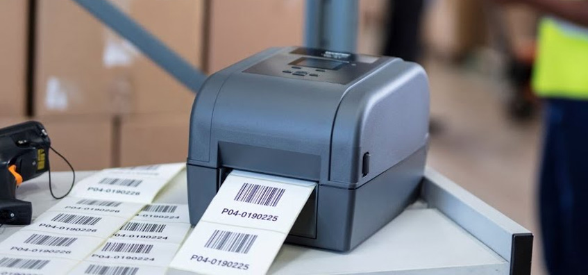
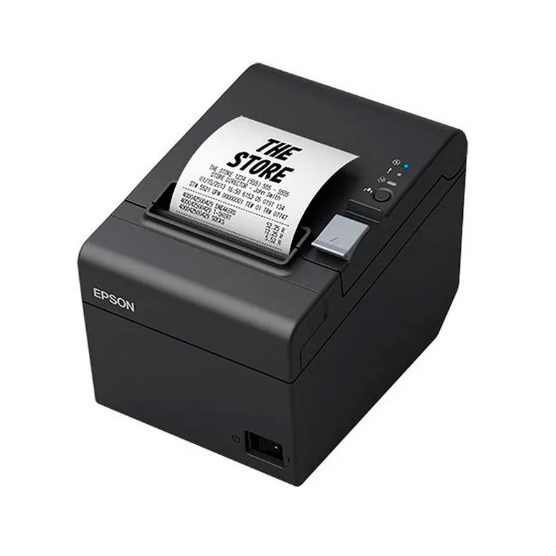
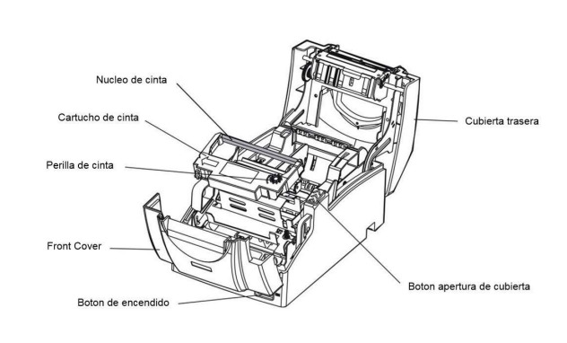

# Impresora POS (punto de venta, generalmente térmica)

###### Epson TM-T20III (RS232) 

---
## ¿Qué es una impresora térmica?

- Las impresoras térmicas son dispositivos electromecánicos que reciben información digital y la plasman físicamente en una hoja, sin hacer uso de tinta.  
  .

- Normalmente este tipo de impresoras imprime únicamente en negro. No obstante, hoy en día existen modelos más avanzados, que pueden imprimir en dos o tres colores.  

.
- Por norma general, el papel para impresoras térmicas se compra en rollos, y está disponible en diferentes medidas, siendo el tamaño estándar el de 40mm de ancho. Para conseguir la impresión deseada, este papel cuenta con una impregnación cerosa, que reacciona con el calor y se vuelve de color negro.
---

## Cómo funciona la impresora térmica 
Las impresoras térmicas funcionan gracias a un mecanismo sencillo. Este consiste en la acción de una serie de agujas calientes, que penetran en un tipo de papel termosensible.  

Este método de impresión no requiere de cartuchos de tinta o tóner, por lo que para hacer uso de estas impresoras tan solo es necesario contar con hojas térmicas.  

---

## Historia :
El término 'impresora térmica' surgió en la década de 1940, cuando el ingeniero eléctrico y físico estadounidense Jack St. Clair Kilby creó la primera de esta categoría a la que actualmente se le suman numerosas marcas y modelos reconocidos que veremos más adelante.

---
### Ventajas :
- Las impresoras por transmisión térmica permiten un ahorro de cartuchos de tinta o cintas.  
- Son muy sencillas de usar, pues no requieren software.  
- Resultan ideales para su uso en oficinas y ambientes tranquilos y libres de ruidos.  
- Están disponibles en distintos modelos y tamaños, por lo que ofrecen una gran versatilidad.  
- Ofrecen una larga vida útil, especialmente si las comparamos con otros tipos de impresoras.  
- Permiten una gran eficiencia y rapidez de impresión, algo que resulta especialmente importante en la caja de tiendas y otros negocios que trabajan de cara al público.

### desventajas :
- No imprimen a color.  
- Los cabezales pueden estropearse por un calor excesivo durante la impresión.  
- Algunos modelos ofrecen impresiones poco duraderas, que pueden desaparecer con el tiempo.  
La calidad de impresión puede resultar baja para otros usos.  

---
##### Pagína de interes :
https://www.antalis.es/inicio/nuestra-actividad/embalaje/blog/noticias-y-eventos/2024/07/impresora-termica.html

##### Pagína comercial :
https://www.amazon.es/Epson-TM-T20II-002-Terminal-Al%C3%A1mbrico/dp/B00KKT0M2C