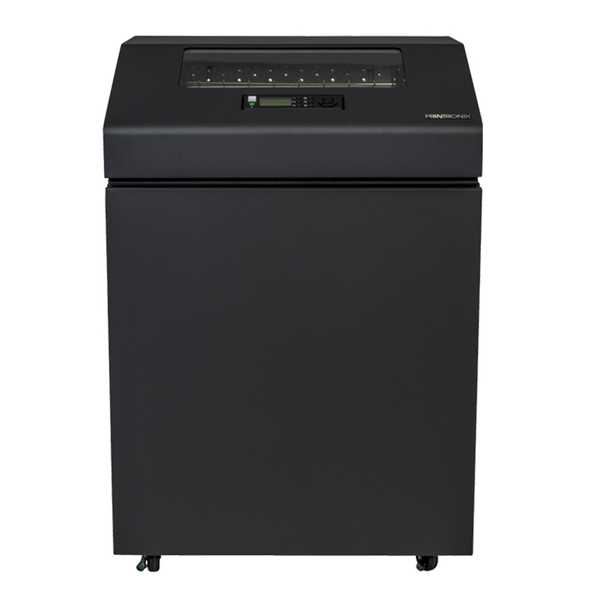
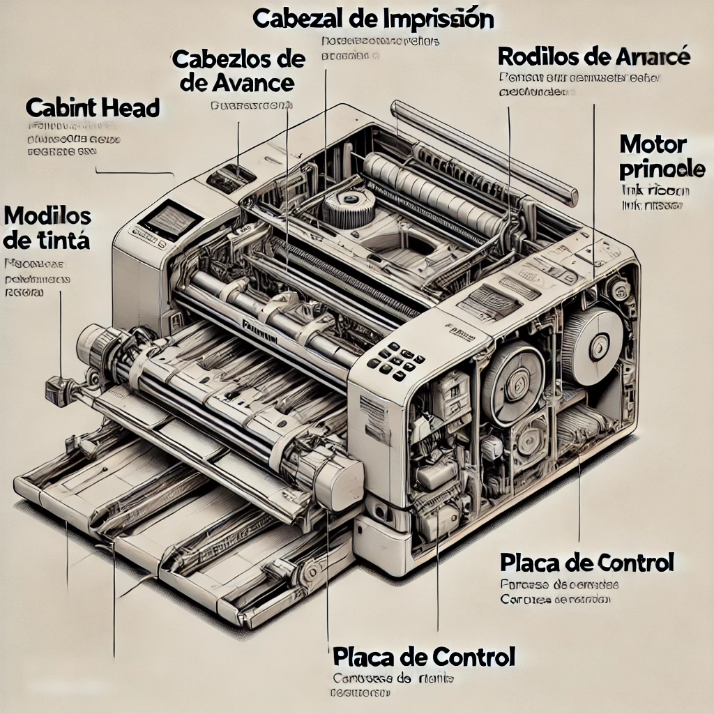

# IMPRESORA DE LINEA

https://es.wikipedia.org/wiki/Impresora_de_l%C3%ADnea

(https://printronix.com/es/impresoras-de-matriz-de-lineas/p8000-p8000-plus-de-gabinete/)

### Diagrama Técnico:

## Descripción:

La impresora de líneas es un tipo de impresora que imprime línea por línea; en oposición a las impresoras que imprimen carácter por carácter, como es el caso de las impresoras matriciales estándar, o bien página por página, como ocurre con las impresoras láser.

Son dispositivos de alta velocidad que a menudo se usan con grandes sistemas informáticos, minicomputadoras o equipos conectados en red, pero no con sistemas utilizados por un único usuario.

Entre los distintos tipos de impresoras de líneas se encuentran: las impresoras de cadena y las impresoras de banda.

La abreviatura LPT significaba originalmente line printer o impresora de líneas. En microcomputadoras se usa a menudo la misma abreviatura para referirse al puerto o puertos paralelos de la computadora.1​
grama

 ### Fecha de Invención:

En 1959 se inventan los equipos de impresión por líneas.
Finalmente, en 1969 un ingeniero norteamericano llamado Gary Starkweather creó la primera impresora láser. Que 2 años después se hizo realidad en el centro de investigaciones Xerox. No obstante, no llegó al mercado hasta 1977.

### Ventajas de Impresoras de Linea
#### 1- Alta velocidad de impresión:
Pueden imprimir cientos de líneas por minuto, lo que las hace ideales para entornos con grandes volúmenes de datos a imprimir, como reportes o registros continuos.

#### 2- Durabilidad y robustez:
Son altamente resistentes al uso intensivo y funcionan bien en ambientes industriales o lugares con condiciones adversas.

#### 3- Costo por página bajo:
Su costo operativo es bajo, ya que utilizan consumibles económicos como cintas de tinta duraderas.

#### 4- Capacidad de impresión en múltiples capas:
Pueden imprimir en formularios de papel multicopias (original y copias carbónicas) en una sola pasada.

#### 5- Confiabilidad en aplicaciones especializadas:
Son ideales para sistemas empresariales antiguos, como sistemas ERP legacy, que a menudo tienen soporte limitado para impresoras modernas.

#### 6- Simples en mantenimiento mecánico:
Su diseño es robusto y permite reparaciones sencillas en comparación con otros tipos de impresoras más sofisticados.

### Desventajas de las impresoras de línea

#### 1- Calidad de impresión limitada:
La calidad de impresión es baja, ya que están diseñadas principalmente para texto y no para gráficos o imágenes.

#### 2- Ruido elevado:
Pueden ser bastante ruidosas durante la operación, lo que puede ser molesto en ambientes de oficina silenciosos.

#### 3- Tamaño y peso:
Son voluminosas y pesadas, ocupando más espacio en comparación con impresoras modernas.

#### 4- Tecnología obsoleta:
Su tecnología está basada en sistemas antiguos, lo que puede hacerlas incompatibles con aplicaciones modernas o redes actuales.

### 5- Opciones de personalización limitadas:
No ofrecen muchas opciones avanzadas como impresión a color o conectividad inalámbrica.

### 6- Requieren papel especializado:
A menudo necesitan papel continuo o formularios específicos, lo que puede limitar la flexibilidad en los trabajos de impresión.

### En resumen:
 las impresoras de línea son herramientas altamente eficientes para aplicaciones específicas, pero no son ideales para necesidades de impresión modernas que requieren alta resolución, gráficos, o flexibilidad en los formatos de impresión.