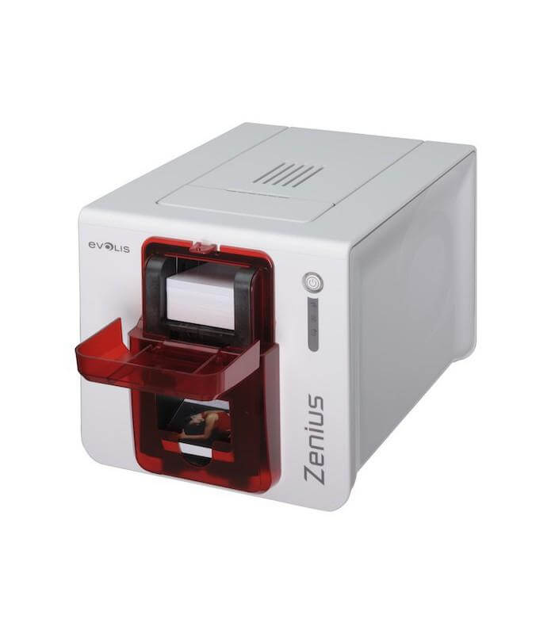
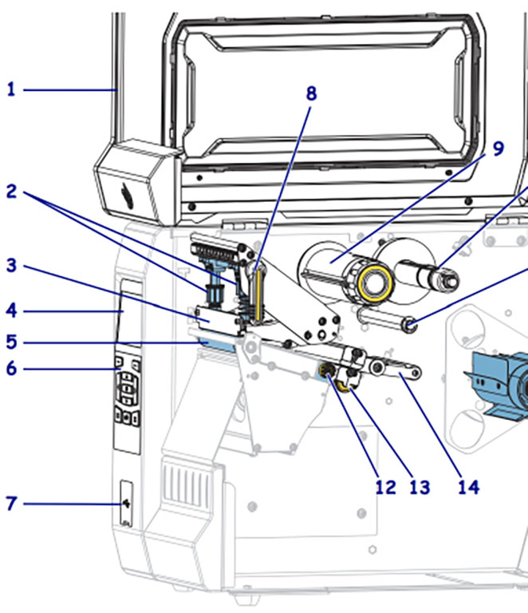

# 💳 Impresora para Tarjetas Plásticas (PVC)

## 🌐 Referencia de Interés
- [Tecnología de Impresión de Tarjetas](https://www.sipcards.es/impresoras-entrust?gad_source=1&gclid=CjwKCAiAjeW6BhBAEiwAdKltMpgyL0yBgbkQ-sB-tZ8VTpZ4bKNcl4SQwXIJ8wWBzkP0Zs-dUx952hoC3_kQAvD_BwE)

## 🛒 Referencia Comercial
- [Impresora para Tarjetas Plásticas (PVC ](https://evolisprint.com/impresoras-de-tarjetas/10-evolis-zenius-expert-5712505462300.html?gad_source=1&gclid=CjwKCAiAjeW6BhBAEiwAdKltMsGRHQGLq9QBS_fHx45VvzhMux_8hs1CXFge0tIMplHq2mFjnph3uhoCJYAQAvD_BwE0)

## 🖼️ Imagen Representativa
Impresora de Tarjetas()

## 📐 Diagrama Técnico
Diagrama Técnico Impresora de Tarjetas)

## 📝 Descripción
La impresora para tarjetas plásticas es un dispositivo especializado en la impresión de tarjetas de identificación, credenciales, tarjetas de membresía, y otros tipos de tarjetas de PVC o materiales similares. Diseñada para imprimir con alta calidad y durabilidad en superficies rígidas.

## 📅 Fecha de Invención
- 🕰️ Desarrollo inicial: Década de 1990
- 🚀 Comercialización masiva: Principios de 2000

## 📊 Ventajas y Desventajas

### 👍 Ventajas
- Impresión de alta calidad en tarjetas plásticas 💯
- Capacidad de imprimir en color o monocromático 🌈
- Opciones de personalización 🎨
- Útil para credenciales, tarjetas de acceso, identificaciones 🔑
- Tecnologías de impresión térmica o transferencia térmica 🔥

### 👎 Desventajas
- Alto costo inicial de equipamiento 💸
- Consumibles costosos 💳
- Mantenimiento especializado 🔧
- Limitaciones de tamaño de impresión 📏
- Requiere entrenamiento específico 📚
