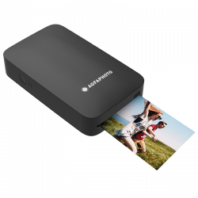

# Impresora portátil o móvil (impresora de bolsillo)

*[Página de interés](https://tintascompatibles.com/blog/impresoras-portatiles-ventajas-y-desventajas)*

*[Comercial](https://www.amazon.es/Kodak-Mini-Pintar-sublimaci%C3%B3n-Impresora/dp/B077BFDT2V?source=ps-sl-shoppingads-lpcontext&ref_=fplfs&psc=1&smid=A13P6277X44WWB)*

## Descripción

Las impresoras portátiles son dispositivos compactos y convenientes que permiten a los usuarios imprimir documentos en cualquier lugar. No precisan de cables y la conexión con el resto de los aparatos se realiza a través de Wi-Fi o Bluetooth.

## Fecha de lanzamiento

En 2008, Polaroid lanzó la Polaroid PoGo, una de las primeras impresoras de bolsillo para uso general.

## Ventajas y Desventajas

### Ventajas 

1. Tamaño(Portabilidad)

2. Conectividad (Wif, Bluetooth)

### Desventajas

1. Calidad de impresión (Resolución)

2. Velocidad de impresión

3. Costo y mantenimiento 