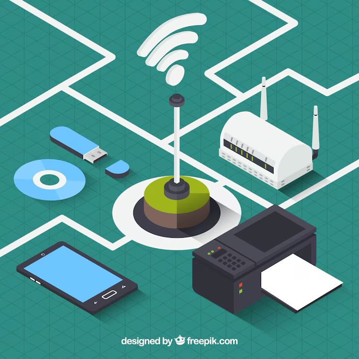

# Impresora con conectividad (Wi-Fi, Bluetooth, impresión en la nube)
## Referencia de interés
[Tipos de impresoras según su conectividad](https://quecartucho.es/blog/impresoras/tipos-de-impresoras-segun-su-conectividad/?srsltid=AfmBOoo3PwbtYbFHEK7vRxfFbClpcuC1J92QFaZt_TypBpdO14tN9SE9)   
### Referencia Comercial
[Descubre las mejores impresoras de la marca Epson.](https://www.tiendacartucho.es/analisis-impresoras/epson/)
#### Imagene representativa

###### Descripción y fecha de invención
Con la llegada de la computación en la nube y la Internet de las cosas, las impresoras ahora pueden conectarse a una amplia variedad de dispositivos y redes. En este artículo, exploraremos las distintas opciones de conectividad de impresoras disponibles, como USB, Ethernet, Wi-Fi y Bluetooth. Analizaremos las ventajas y desventajas de cada una y cómo se pueden usar en diferentes situaciones.
La capacidad de conectarse a distintos dispositivos permite a los usuarios acceder a sus documentos, fotografías y otros contenidos desde cualquier lugar. También permite una mejor colaboración entre varios usuarios y puede reducir la cantidad de tiempo necesario para imprimir documentos.
###### Ventajas y desventajas
Ventajas
Conveniencia y flexibilidad
Permiten imprimir desde cualquier dispositivo conectado a la red (PC, smartphone, tablet) sin necesidad de cables.
Posibilidad de imprimir desde cualquier lugar mediante servicios de impresión en la nube (como Google Cloud Print o Apple AirPrint).
Colaboración Mejorada
Las aplicaciones móviles específicas facilitan compartir archivos e imprimir directamente desde plataformas como correo electrónico 
Ahorro de Espacio y Reducción de Cableado
No es necesario estar conectado básicamente a un dispositivo, lo que reduce el desorden de cables y permite una ubicación más flexible en el espacio.
Desventajas
Dependencia de la Conectividad
Requieren una red
Costo Inicial y de Mantenimiento
Suelen ser más caras que las impresoras básicas debido a las características
El mantenimiento puede incluir la actualización de firmware o la solución de problemas 
Complejidad de configuración
La configuración inicial puede ser complicada para personas con poca experiencia técnica.
Algunos problemas de conexión (como conflictos de IP o firewalls) pueden ser di
Compatibilidad limitada en algunos casos
Aunque soportan múltiples dispositivos, no todas las funciones avanzadas están disponibles en todas las plataformas (por ejemplo, algunas características exclusivas de iOS o Android).
Mayor Consumo Energético
Debido a la necesidad de estar conectadas constantemente, algunas impresoras pueden consumir más energía