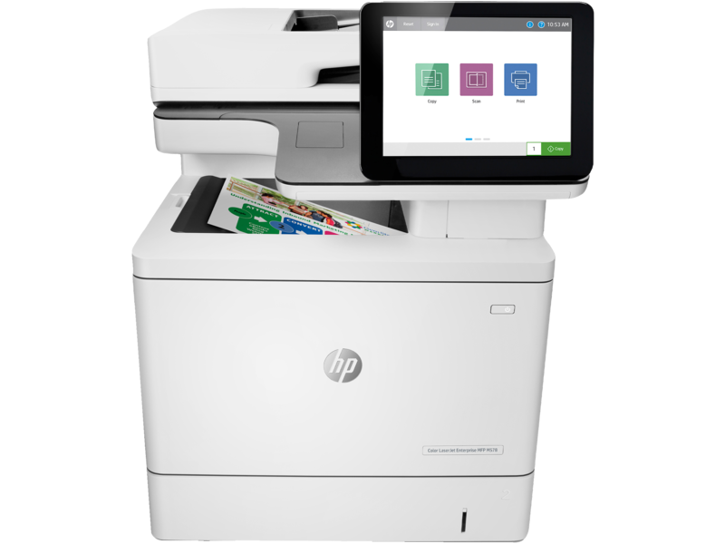

# Impresora con funciones de seguridad y gestión avanzada (cifrado, autenticación)
Las impresoras modernas han evolucionado más allá de la impresión básica, integrando funciones avanzadas de seguridad y gestión. Estas impresoras son fundamentales en entornos empresariales donde la confidencialidad y el control de acceso a la información son prioritarios. Incorporan tecnologías como cifrado de datos, autenticación de usuarios, y gestión centralizada, ofreciendo una solución robusta para proteger datos sensibles y optimizar el flujo de trabajo.

Para explorar más sobre impresoras con funciones de seguridad avanzada, puedes visitar [HP Secure Printing](https://www.hp.com/es-es/security/enterprise-print-security/hp-secure-print-modal.html) y [Canon's Office Security Solutions](https://www.canon.es/business/solutions/office-security/).

Un ejemplo destacado es la HP Color LaserJet Enterprise MFP M578dn, diseñada específicamente para entornos empresariales con alta demanda de seguridad y gestión avanzada. Puedes encontrar más información en su [página oficial.](https://www.hp.com/py-es/products/printers/product-details/32885672)

### Diagrama técnico
Me ha resultado imposible encontrar un diagrama técnico de estas impresoras pero de existir incluiria módulos adicionales para el manejo de la seguridad, como tarjetas inteligentes para autenticación, módulos de encriptación y software para gestión remota.

### Descripción

Las impresoras con funciones de seguridad y gestión avanzada están diseñadas para proteger la información sensible de la empresa. Ofrecen características como:

Cifrado de datos: Asegura la transferencia y almacenamiento de información.
Autenticación de usuarios: Mediante contraseñas, tarjetas inteligentes o datos biométricos.
Gestión centralizada: Permite a los administradores controlar el acceso, configurar permisos y monitorear actividades de impresión.
Eliminación segura de datos: Borra datos confidenciales de trabajos completados.

Las funciones avanzadas de seguridad comenzaron a implementarse en impresoras empresariales a principios de los años 2000, con avances significativos en la última década debido a las crecientes amenazas de ciberseguridad.

### Ventajas y desventajas
- **Ventajas:**
    - Protección contra fugas de datos y accesos no autorizados.
    - Control centralizado que simplifica la gestión en grandes oficinas.
    - Cumplimiento de normativas de privacidad como GDPR.
    - Integración con soluciones de seguridad existentes.
- **Desventajas:**
    - Costos iniciales elevados.
    - Requiere capacitación para la configuración y uso óptimo.
    - Necesidad de actualizaciones frecuentes para mantenerse al día con las amenazas emergentes.
---
[⬅️ Volver al inicio](#impresora-con-funciones-de-seguridad-y-gestión-avanzada-cifrado-autenticación)