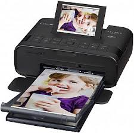
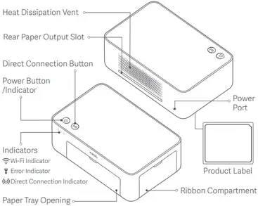

# Impresora Fotográfica Mini (Formato Reducido, ej. 10x15 cm)

## 1. Referencia de Internet
- [Impresoras fotográficas portátiles - Wikipedia](https://es.wikipedia.org/wiki/Impresora_fotogr%C3%A1fica)
- [Impresoras mini para fotos - HP](https://www.hp.com/es-es/shop/hp-sprocket-portable-printers.html)

## 2. Referencia a Impresora Comercial
- [HP Sprocket Select - Amazon](https://www.amazon.es/dp/B07XLWF7N1)
- [Canon SELPHY Square QX10 - Página del fabricante](https://www.canon.es/cameras/canon-selphy-square-qx10/)

## 3. Imagen Representativa

## 4. Diagrama Técnico

## 5. Descripción
Las **impresoras fotográficas mini** están diseñadas para imprimir fotografías de tamaño reducido (por ejemplo, 10x15 cm o más pequeñas) de manera rápida y portátil. Estas impresoras suelen ser compactas, inalámbricas y funcionan a través de aplicaciones móviles, permitiendo imprimir directamente desde smartphones o cámaras digitales.

Pueden usar tecnologías como sublimación térmica o tinta ZINK (Zero Ink), eliminando la necesidad de cartuchos tradicionales. Estas impresoras son ideales para uso recreativo y personal.

## 6. Fecha de Invención
Las impresoras fotográficas portátiles comenzaron a popularizarse en los **años 2010**, con avances significativos en tecnologías inalámbricas y formatos compactos.

## 7. Ventajas y Desventajas
### Ventajas
- Portabilidad y facilidad de uso.
- Compatibilidad con dispositivos móviles.
- Impresión rápida y directa.
- Sin necesidad de consumibles voluminosos en tecnologías como ZINK.

### Desventajas
- Limitadas a tamaños de impresión pequeños.
- Coste por impresión elevado en comparación con otros métodos.
- Calidad de impresión inferior a impresoras fotográficas profesionales.
- Dependen de dispositivos móviles o aplicaciones específicas para funcionar.