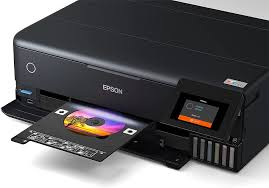
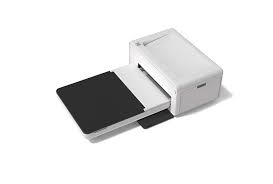
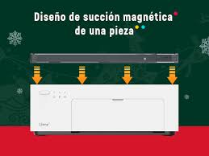

## Impresora Fotográfica Mini (Formato Reducido, Ej. 10x15 cm)

## Referencia de Internet:
 Puedes consultar detalles técnicos y opciones disponibles en esta categoría en sitios como Xataka, donde se analizan modelos de mini impresoras fotográficas portátiles de varias marcas【28】【29】.

Referencia a impresora comercial:

## Modelo destacado:  
Canon Zoemini o la Kodak Mini 2 Retro, disponibles en Amazon o tiendas como FNAC y MediaMarkt. Estos modelos imprimen fotos de alta calidad con tecnología ZINK y Bluetooth para conexión móvil【29】【30】.
Imagen Representativa: Incluye una imagen de impresoras como la Xiaomi Mi Portable Photo Printer o la HP Sprocket, que destacan por su diseño compacto y portabilidad【29】.

##Diagrama Técnico
: Generalmente, estas impresoras utilizan tecnología ZINK (Zero Ink), donde el papel contiene capas de químicos que reaccionan térmicamente para generar colores sin usar cartuchos tradicionales【29】.

## Descripción:

Estas impresoras portátiles están diseñadas para imprimir fotos en formato reducido (como 2x3 pulgadas). Utilizan conexiones inalámbricas (Bluetooth o NFC) y apps móviles para operar. Son ideales para usos personales y momentos sociales debido a su tamaño compacto y facilidad de uso.
Fecha de Invención: Aunque las impresoras ZINK comenzaron a ganar popularidad en la última década, su tecnología fue desarrollada alrededor del año 2005, con comercialización más amplia a partir de 2010【29】.

## Ventajas y Desventajas:

## Ventajas:
Portabilidad extrema y diseño compacto.
Eliminación de tinta gracias a la tecnología ZINK.
Facilidad de uso mediante apps móviles.
Desventajas:
Tamaño de impresión limitado.
Costo del papel fotográfico específico puede ser elevado.