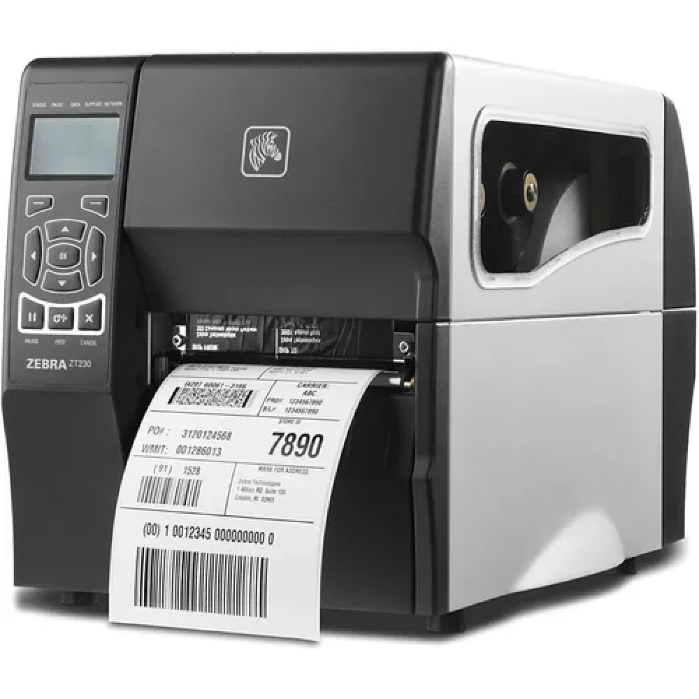
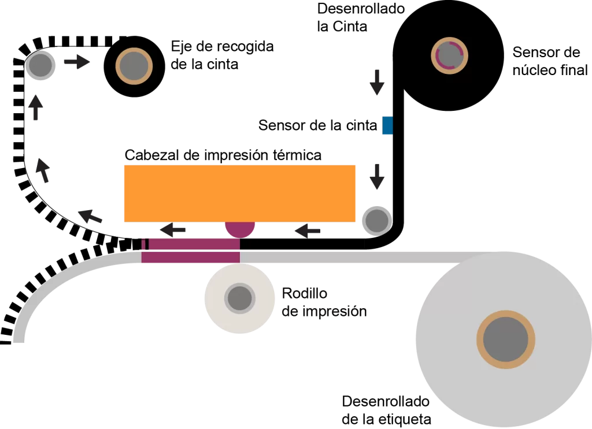

# Impresora de etiquetas y códigos de barras

*[Página de interes](https://www.logiscenter.com/blog/caracteristicas-impresoras-etiquetas)*

*[Comercial](https://identiplus.es/4-impresoras-de-etiquetas?gad_source=1&gclid=CjwKCAiA6t-6BhA3EiwAltRFGGPlMuduzQ8hsEpqQTdVesEfW3uhZbxSnM0M5N9Xu5OzPNa_EwB99xoCLBgQAvD_BwE)*

## Descripción 

Las impresoras de códigos de barras imprimen de forma rápida etiquetas, recibos y tickets, en alta calidad para etiquetar cajas, pulseras, pallets u otros bultos y elementos para su identificación.

## Diagrama Técnico

## Fecha de lanzamiento 

Se acredita a SATO Corporation, una empresa japonesa, como la creadora de la primera impresora de etiquetas de transferencia térmica en 1974.

## Ventajas y Desventajas

### Ventajas

1. Automatización de procesos

2. Precisión

3. Costo reducido por unidad

### Desventajas

1. Mantenimiento y durabilidad

2. Dependencia de consumibles específicos

3. Limitaciones en aplicaciones