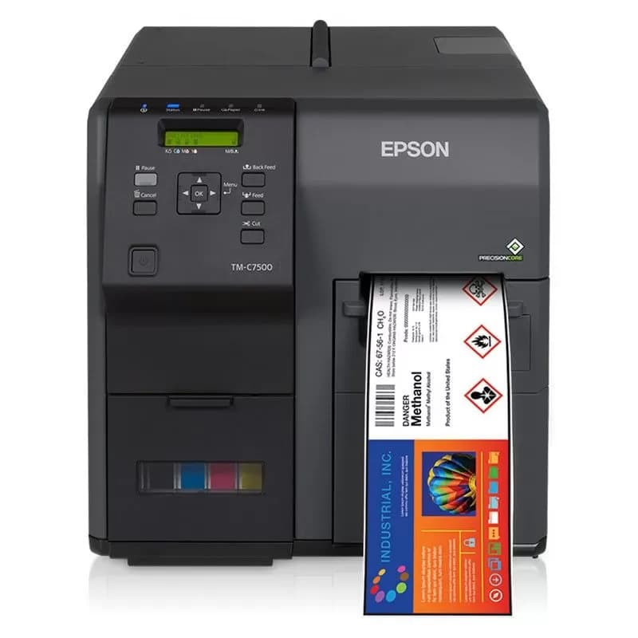
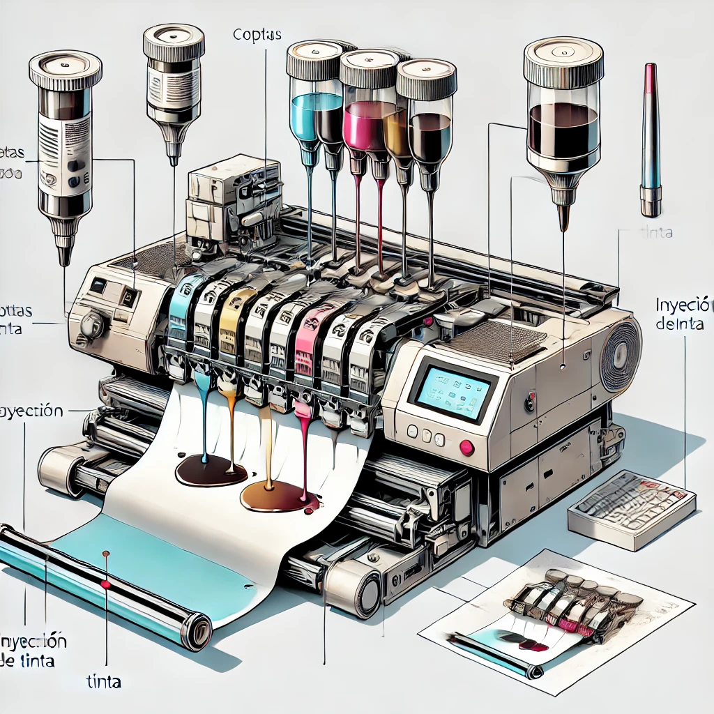
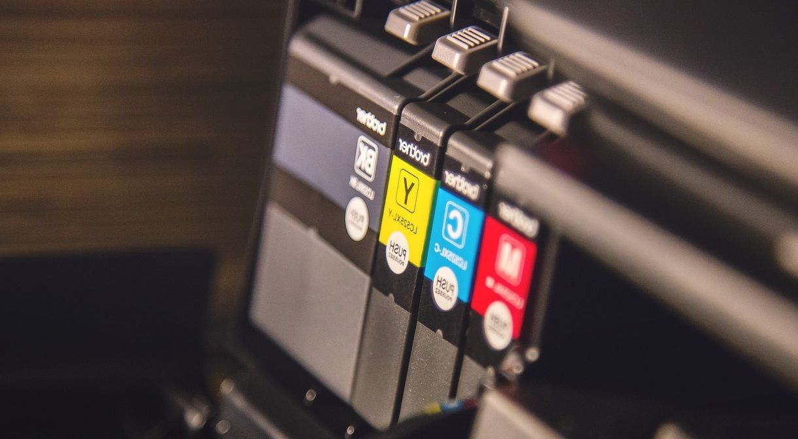
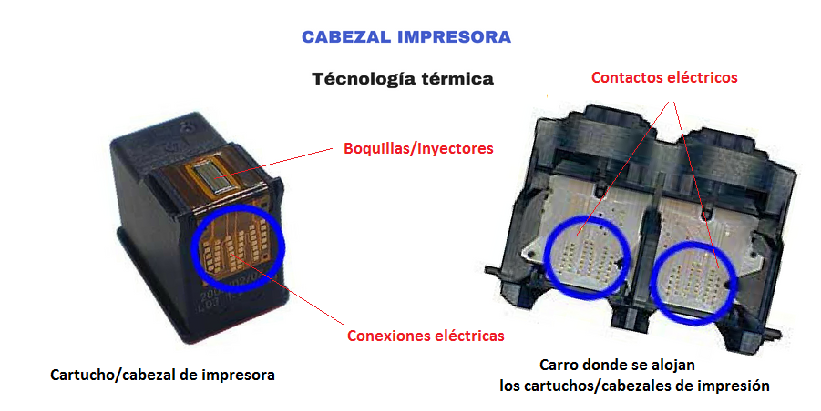
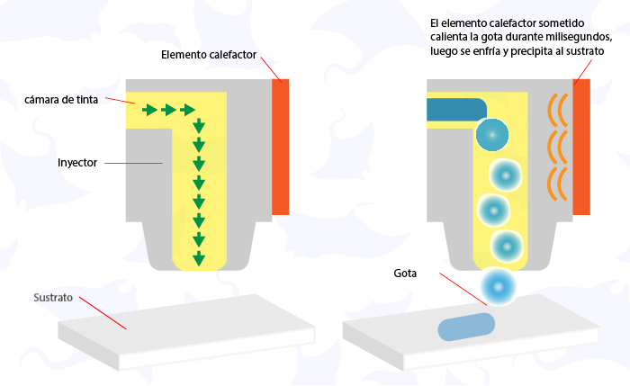

# impresora de inyección de tinta con cabezales termicos 

 
######  Epson ColorWorks C7500G

.
.
.
.
.

La impresora de inyección de tinta con cabezales térmicos fue desarrollada a finales de la década de 1970 y comercializada por primera vez a principios de la década de 1980. Hewlett-Packard (HP) y Canon son las empresas principales asociadas con el desarrollo y la introducción de esta tecnología.

## Tecnología de impresión térmica de inyección de tinta 

La impresión térmica de inyección de tinta es una tecnología de impresión digital que utiliza pequeñas gotas de tinta para crear imágenes o texto en un sustrato. La tinta se emite desde un cabezal de impresión que normalmente consta de cientos de boquillas o cámaras que pueden liberar tinta a través de un mecanismo térmico o piezoeléctrico

El método térmico se basa en el calor generado por diminutas resistencias dentro de las boquillas para vaporizar la tinta y crear burbujas que expulsan la tinta sobre el papel. El método piezoeléctrico utiliza cargas eléctricas para deformar las cámaras y expulsar la tinta.

## defirencias entre las impresoras de inyección de tinta térmica y las impresoras de inyección de tinta piezeoléctricas 

 En general, las impresoras de inyección de tinta térmica son más rápidas, económicas y precisas que las impresoras de inyección de tinta piezoeléctricas, pero pueden requerir formulaciones de tinta especiales que puedan soportar altas temperaturas o secarse rápidamente.

 

 ## Aplicaciones de la impresión térmica de inyección de tinta

  Impresión de documentos, informes y presentaciones.

- Impresión de fotografías, gráficos e ilustraciones.

- Impresión de etiquetas, códigos de barras y embalajes

- Impresión de textiles, cerámica y otros materiales.

.
.
 La impresión térmica de inyección de tinta también puede admitir varios tipos de medios, como papel normal, papel brillante, sobres, transparencias y más. Además, la impresión térmica de inyección de tinta puede ofrecer alta resolución, colores vivos, secado rápido y bajo nivel de ruido, lo que la hace adecuada para diversas necesidades de impresión.

 
## Variaciones de las impresoras térmicas de inyección de tinta

- Impresoras térmicas de inyección de tinta multifunción
-  Impresoras térmicas de inyección de tinta de gran formato
-  Impresoras térmicas de inyección de tinta portátiles o compactas
-   Impresoras térmicas de inyección de tinta especiales
  

  ## Mantenimiento de Impresoras Térmicas

- ##### Para garantizar un rendimiento y una vida útil óptimos de las impresoras térmicas de inyección de tinta, se recomiendan algunas tareas de mantenimiento, como:

- Limpiar periódicamente el cabezal de impresión y los cartuchos para eliminar cualquier residuo u obstrucción que pueda afectar la calidad o el flujo de la tinta.

- Almacenar la impresora y los cartuchos en un lugar fresco, seco y sin polvo para evitar la evaporación o contaminación de la tinta.

- Reemplazar los cartuchos o el cabezal de impresión cuando estén agotados o desgastados, ya que el uso de tinta vencida o dañada puede causar mala calidad, atascos o daños en el hardware.

- Actualizar el firmware o el controlador de la impresora para garantizar la compatibilidad con los últimos sistemas operativos o aplicaciones.

## Ventajas de las impresoras de impresión térmica de inyección de tinta

##### Alta resolución:
Producen impresiones detalladas con calidad fotográfica.

##### Velocidad:

Las impresoras térmicas suelen ser rápidas, ideales para aplicaciones como etiquetas y tickets.

##### Costo inicial bajo:

Comparadas con otros tipos de impresoras, suelen ser más accesibles.

##### Versatilidad:

Capaces de imprimir en una variedad de materiales, desde papel hasta etiquetas adhesivas y plásticos.

##### Bajo mantenimiento:

Tienen menos piezas móviles que las impresoras mecánicas tradicionales, lo que reduce la probabilidad de fallos.

##### Secado rápido:

La tinta térmica se seca rápidamente gracias al calor aplicado, lo que previene manchas.

## Desventajas de las impresoras de impresión térmica de inyección de tinta

##### Costo operativo:

Los cartuchos de tinta pueden ser caros, especialmente si no se optimiza su uso.

##### Dependencia del papel adecuado:

Algunas versiones necesitan papel térmico especializado, que puede ser más costoso y no siempre fácil de encontrar.

##### Durabilidad de las impresiones:

Las impresiones térmicas pueden desvanecerse con el tiempo, especialmente cuando están expuestas a la luz o al calor.

##### Limitaciones en volúmenes grandes:

No son ideales para entornos de impresión masiva, donde impresoras láser o industriales son más eficientes.

##### Sensibilidad al calor:

El papel térmico puede reaccionar a temperaturas altas, lo que afecta la calidad de las impresiones almacenadas.

##### Desgaste del cabezal de impresión:

Con el tiempo, el cabezal puede requerir reemplazo debido a su exposición constante al calor.

### paginá  de interes :
https://www.correct-pack.com/es/a-news-what-is-an-inkjet-thermal-printer

### Referencia comercial :
https://adnid.com/impresoras-de-etiquetas-tecnologia-color/impresoras-de-etiquetas-color-epson-colorworks/epson-colorworks-c7500g?utm_term=&utm_campaign=SB+-+Shopping&utm_source=adwords&utm_medium=ppc&hsa_acc=6715475934&hsa_cam=21779296476&hsa_grp=169395634718&hsa_ad=716117472874&hsa_src=g&hsa_tgt=pla-2296119726685&hsa_kw=&hsa_mt=&hsa_net=adwords&hsa_ver=3&gad_source=1&gclid=CjwKCAiA6t-6BhA3EiwAltRFGC2G6GPJ8g0KW3OrrLlockho4fRo2Dz3lLzr6tVdWE3cT9TqGpnBHhoCxRsQAvD_BwE
