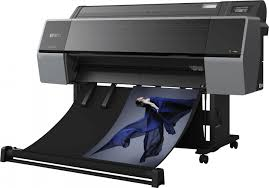
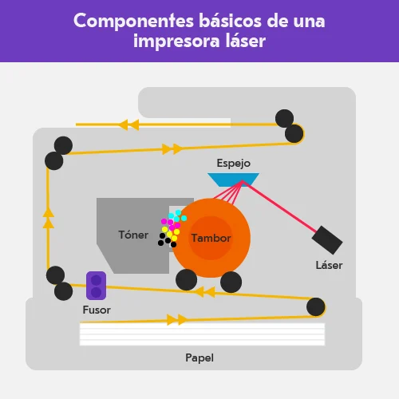

Documento para Impresora de Inyección de Tinta con Cabezales Piezoeléctricos
1. Referencia a página de interés
Información técnica sobre los cabezales piezoeléctricos y su funcionamiento: Arkiplot【12】.
2. Referencia a impresora comercial
Ejemplo comercial: Impresoras de Roland DG como la serie VersaSTUDIO BN2, que incluye cabezales piezoeléctricos para impresión de alta calidad y versatilidad. Más detalles en Roland DG.
3. Imagen representativa
Archivo sugerido: 01_inyeccion_piezoelectricos.jpg
Fuente recomendada: Captura de una impresora Epson o Roland DG que incluya esta tecnología.
4. Diagrama técnico
Representación técnica del funcionamiento de los cabezales piezoeléctricos: Disponible en la página de Arkiplot sobre tecnologías de impresión【12】.
5. Descripción de la impresora
Las impresoras con cabezales piezoeléctricos funcionan mediante la vibración controlada de cristales piezoeléctricos. Este método permite expeler gotas de tinta con precisión, pudiendo ajustar su tamaño para lograr gradientes suaves y detalles finos. Estas impresoras son ideales para aplicaciones industriales y artísticas debido a su capacidad de trabajar con tintas solventes, curadas por UV y ecosolventes. Ofrecen una calidad de impresión excepcional y son muy utilizadas en la creación de carteles, etiquetas y productos gráficos avanzados【11】【12】【13】.

6. Fecha de invención/aparición
Los cabezales piezoeléctricos comenzaron a implementarse en impresoras digitales de gran formato durante la década de 1990, marcando una revolución en la impresión industrial【12】.

7. Ventajas y desventajas
Ventajas:

Gotas de tinta de tamaño variable para una mayor calidad en degradados.
Compatibilidad con una amplia variedad de tintas y superficies.
Durabilidad y alta velocidad de impresión【12】【13】.
Desventajas:

Costo inicial elevado en comparación con otras tecnologías.
Mantenimiento más especializado requerido debido a la complejidad de los cabezales【12】.