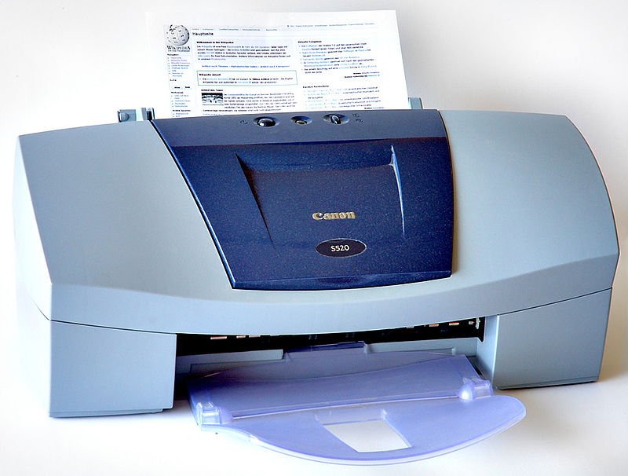
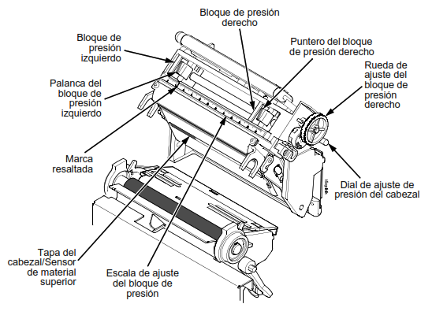
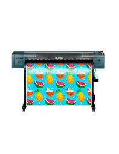

Muchos cabezales piezoeléctricos se conocen como cabezales de "goteo por demanda". Los cabezales de goteo por demanda son el tipo que se encuentra con más frecuencia en las impresoras modernas de formato ancho. Goteo por demanda significa que las boquillas de inyección de tinta generan y proyectan gotas de tinta cuando y donde se necesitan para producir una marca en los materiales.

Los cabezales piezoeléctricos también pueden generar gotas de tamaño variable a partir de la misma cámara y boquilla, brindando diferentes densidades de tinta en el material. La mayoría puede producir gotas de tinta tan pequeñas como 1,3 picolitros. Esta tecnología proporciona al usuario la máxima precisión de tinta para trabajos detallados como fotografía, obras de artes y texto pequeño, ya que las gotas de tinta proporcionan una impresión más nítida y sin granos, con transiciones de tonalidad más suaves. Se llaman cabezas de escala de grises.

Ventajas de cabezales piezoeléctricos en comparación con cabezales de impresión térmicos
No se utiliza calor para expulsar las gotas. El calor puede cambiar la composición mecánica de la tinta.

Los cabezales piezoeléctricos son compatibles con una variedad más amplia de tipos de tinta e ingredientes de tinta

El usuario tiene acceso a un número más amplio de aplicaciones

Los cabezales son más duraderos que los cabezales térmicos y deben intercambiarse solo con poca frecuencia. A veces incluso pueden durar la vida útil de la impresora, si se mantienen bien.

Brinda gotas precisas y variables, ahorra desechos de tinta.

 
Epson Micro Piezo
Epson es pionera en esta tecnología, con cabezales de impresión que ofrecen alta calidad, precisión y durabilidad. Su tecnología Micro Piezo permite trabajar con una variedad de tintas y tamaños de gotas para aplicaciones fotográficas, industriales y comerciales.
Puedes explorar más en su página oficial: Epson España - Tecnología Micro Piezo​
EPSON ESPA&NTILDE;A | HOME

.

Tipos de impresoras y sus tecnologías
Este artículo explica las diferencias entre cabezales piezoeléctricos y térmicos, destacando sus ventajas y aplicaciones en impresión industrial y fotográfica.
Consulta el contenido en WikiDiferencias - Cabezal Piezoeléctrico vs. Térmico​
WIKIDIFERENCIAS.COM

.

DirectIndustry - Impresoras Piezoeléctricas Industriales
Información técnica y ejemplos de impresoras industriales que utilizan esta tecnología, como la Mutoh ValueJet 1638X, ideal para gran formato.
Más detalles en DirectIndustry - Impresoras Piezoeléctricas